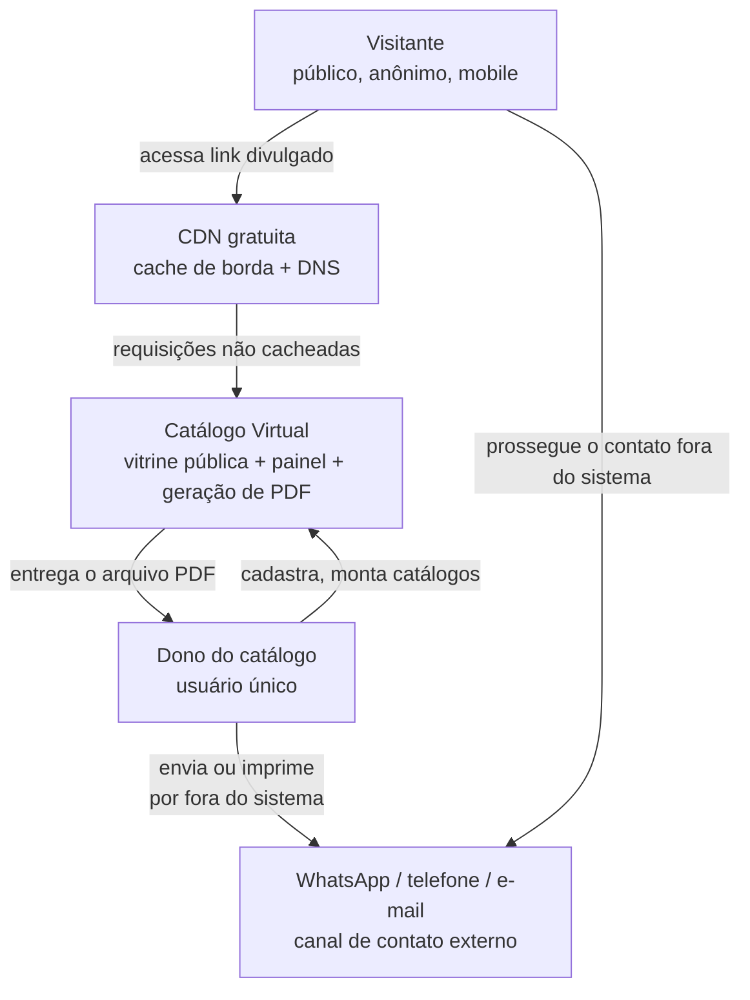
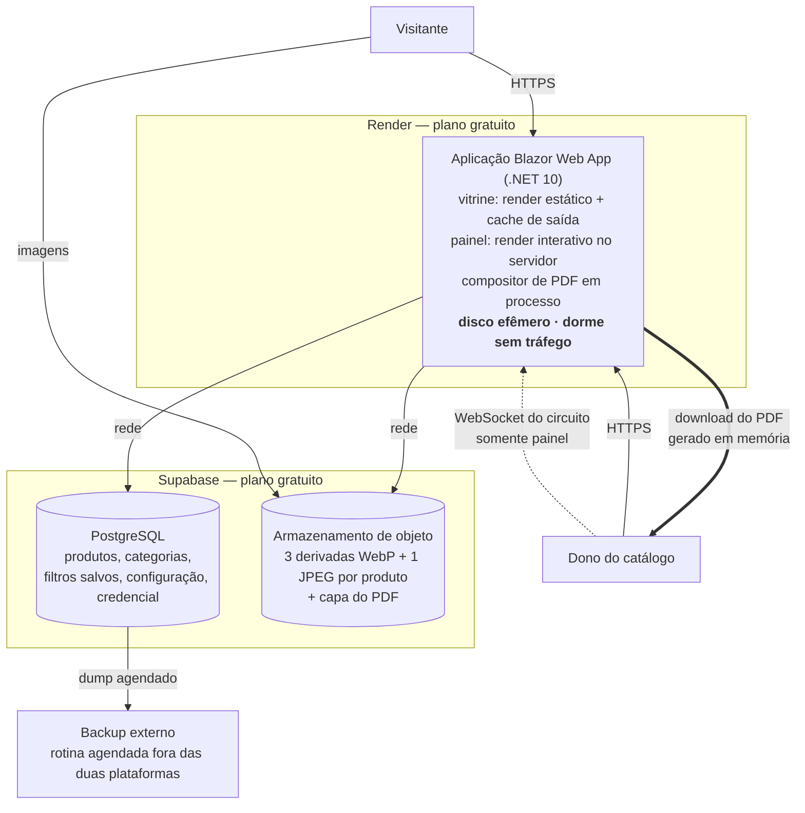
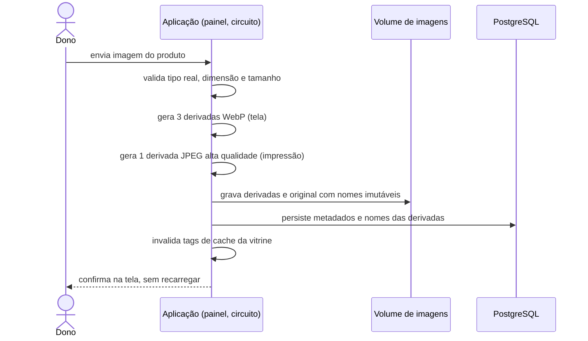

# Proposta Arquitetural — Catálogo Virtual

> Cliente: interno · Documento gerado em 2026-09-14 · Versão 0.7

## 0. Histórico de versões

| Versão | Mudança |
|---|---|
| 0.1 | Proposta inicial: vitrine pública + painel admin, .NET no backend e Angular no frontend |
| 0.2 | Restrição de stack passou a **somente .NET, interface em Blazor**. Revogou a ADR-002; reescreveu as ADR-001, 003, 006 e 008; acrescentou a ADR-010 (modo de renderização por área) e a ADR-011 (provedor de hospedagem). A dívida "ausência de renderização no servidor" deixou de existir |
| 0.3 | **Geração de catálogo em PDF passou a ser objetivo de primeira classe**, ao lado da vitrine. Reescreveu a seção 2 (o problema não era o formato PDF, era o PDF feito à mão); reescreveu as ADR-005 (derivada para impressão) e 006 (usuário único); acrescentou as ADR-012 (QuestPDF), 013 (geração síncrona com teto) e 014 (catálogo salvo, PDF não armazenado) |
| 0.4 | **O layout do PDF deixou de ser incógnita**: o cliente forneceu um catálogo real como gabarito, analisado em [`../prototype/referencia-layout-pdf.md`](../prototype/referencia-layout-pdf.md). Isso removeu a maior incerteza da ADR-012, deu dimensão concreta à derivada de impressão da ADR-005 e converteu o risco de "arquivo grande demais" em medição real |
| 0.7 | **A infraestrutura mudou de host próprio para plataformas gerenciadas**: aplicação no Render, banco e arquivos no Supabase (ADR-018). Revogou as ADR-007 e ADR-011, revisou as ADR-004, 005 e 008, e reescreveu a meta de performance — o plano gratuito do Render dorme por inatividade. Em contrapartida, **duas dívidas técnicas deixaram de existir** |
| 0.6 | **A capa do PDF deixou de ser composta em código**: passa a ser um arquivo que o dono envia nas configurações, concatenado ao miolo (ADR-017). Isso revogou a RN-38 — o índice de categorias deixa de existir — e acrescentou uma dependência de manipulação de PDF |
| 0.5 | **O catálogo salvo passou a ser um filtro, não uma lista de itens.** Reescreveu a ADR-014, que agora persiste o critério e não a seleção — o que eliminou uma tabela do modelo, tornou a pré-visualização um requisito de segurança e transferiu a ordenação para o produto (ADR-015). O conteúdo da capa foi fixado como constante |

## 1. Sumário executivo

Estamos construindo um sistema com **uma fonte de verdade e dois canais de distribuição**. A fonte de verdade é o cadastro de produtos, mantido pelo dono do catálogo em um painel privado. Os canais são: uma **vitrine pública** — um link que qualquer pessoa abre, navega e filtra — e um **catálogo em PDF**, que o dono monta selecionando produtos e gera sob demanda para enviar por WhatsApp, anexar em e-mail ou imprimir.

A frase que justifica toda a arquitetura: **o problema é conhecido, o volume é pequeno e o dinheiro é curto — então a arquitetura correta é a mais simples que funciona bem.** Uma única aplicação Blazor em .NET, rodando ao lado de um PostgreSQL em um único host de camada gratuita. Sem microsserviços, sem fila, sem serviço gerenciado pago, sem cloud com fatura variável, sem cadeia de build JavaScript.

Duas decisões definem o resultado. A primeira é o **modo de renderização por área**: a vitrine pública é renderizada no servidor, em HTML pronto, sem interatividade e sem conexão persistente — é o que a torna rápida no celular, cacheável por inteiro e barata de servir em pico. O painel, usado por uma única pessoa, roda em modo interativo no servidor. A segunda é **não armazenar o PDF gerado**: guarda-se a seleção que o produz, não o arquivo. Um PDF salvo envelhece, e material desatualizado é exatamente a dor que o sistema existe para eliminar.

Os riscos concretos são quatro: **perda de dados** (mitigado por backup diário fora do host), **indisponibilidade por falha do host único** (aceita conscientemente), **o catálogo virar e-commerce** (mitigado por não-objetivos explícitos) e **o custo de manter duas representações visuais do mesmo catálogo** — a da tela e a da página impressa —, que é o preço consciente da ADR-012.

Restrições declaradas: desenvolvimento exclusivamente em .NET, com interface em Blazor; custo de infraestrutura no menor patamar possível; e ausência de licença paga de software. Ver seção 4. Esta proposta não estima esforço nem cronograma — ver seção 12.

---

## 2. Contexto e objetivos de negócio

### 2.1 Problema

Hoje o catálogo de produtos circula em formatos que não foram feitos para isso: PDF montado à mão, foto solta no WhatsApp, planilha compartilhada.

É importante nomear a dor com precisão, porque a versão anterior desta proposta a nomeava mal. **O problema nunca foi o formato PDF** — o PDF é, na verdade, um ótimo veículo para o que o dono precisa fazer: mandar um material completo para alguém que talvez esteja sem internet boa, que vai imprimir, rabiscar e levar para uma reunião. O problema é que esse PDF é **montado manualmente e envelhece no instante seguinte**:

- **Para quem monta**: cada atualização de preço ou de linha de produto significa refazer o documento inteiro, reposicionar imagens e reexportar. O custo do trabalho manual faz com que a atualização seja adiada
- **Para quem recebe**: recebe um material que pode estar desatualizado sem nenhum sinal disso. Não há como saber se o preço ainda vale
- **Para quem compra sozinho**: não tem um lugar onde consultar o que existe hoje sem pedir um arquivo a alguém

Não resolver significa manter o atrito nos dois extremos: no trabalho repetitivo de quem mantém o material e na desconfiança de quem recebe.

### 2.2 Objetivos de negócio

- **Eliminar a montagem manual do catálogo**: o dono seleciona produtos e o documento sai pronto, paginado e com preço atual
- **Reduzir o tempo entre "mudei um preço" e "o material reflete o preço novo" a zero**, porque o material passa a ser gerado a partir da fonte da verdade, e não copiado dela
- Ter um link único, sempre atualizado, para quem prefere consultar online a pedir um arquivo
- Permitir que o interessado navegue, busque e filtre o catálogo sozinho, chegando ao contato já sabendo o que quer
- Permitir recortes de catálogo sob medida — por categoria, por linha, por cliente — sem que cada recorte vire um documento a manter

### 2.3 Não-objetivos

Estes pontos estão **explicitamente fora** desta entrega. Nenhuma decisão arquitetural deve ser tomada para atendê-los:

- **Não é e-commerce**: não há carrinho, pedido, pagamento, frete ou acompanhamento de pedido
- **Não há controle nem exibição de estoque**: nenhuma quantidade disponível aparece na vitrine ou no PDF, e o sistema não movimenta saldo
- **Não é multi-lojista nem multiusuário**: há **um único catálogo e um único usuário** — o dono. Não há convite, papéis, permissões ou trilha de auditoria por autor
- **O sistema não envia nada**: ele gera o arquivo e entrega ao dono. Quem envia por WhatsApp, e-mail ou imprime é ele, pelas ferramentas dele. Não há disparo de e-mail, integração com mensageria nem link rastreável de envio
- **Não é editor de design**: o dono escolhe **o que** entra no catálogo, não como ele é diagramado. Não há arrastar elementos, escolher fonte ou compor página livremente
- **Não há área logada para o consumidor**: nenhum cadastro, favorito, histórico ou preço diferenciado por cliente
- **Não há conteúdo fiscal ou de compra pública**: nada de NCM, dispensa de licitação, cadastro de fornecedor ou condição faturada
- **Não há integração com ERP ou sistema legado**: o cadastro nasce e vive no próprio sistema
- **Não perseguimos escalabilidade horizontal agora**: a arquitetura assume uma única instância da aplicação

> Os itens de carrinho, estoque e compra pública merecem destaque porque o protótipo existente (seção 2.5) os exibe. Eles foram **descartados** do escopo por decisão explícita.

Indexação por buscadores **não é meta**, mas também não é mais impedida: virou efeito colateral gratuito da ADR-010.

### 2.4 Usuários e cargas esperadas

| Perfil | Quantidade | Padrão de uso |
|---|---|---|
| Visitante público | milhares de visitas/mês | Leitura anônima, sem login, majoritariamente mobile, tráfego em picos após divulgação |
| Dono do catálogo | **um** | Único usuário autenticado. Cadastro em rajadas, ajuste de preços, montagem e geração de catálogos em PDF. Desktop |

Volume de dados: **centenas de produtos**, distribuídos em cerca de oito categorias. Esse número é a premissa central de várias decisões — ele permite que busca, filtro e paginação sejam resolvidos direto no banco relacional, e que a geração do PDF caiba em uma operação síncrona (ADR-013).

A assimetria entre os dois perfis é o fato mais importante desta seção, e a versão 0.3 a torna extrema: **milhares de leituras anônimas e idênticas contra um único usuário que escreve**. É ela que justifica tratar vitrine e painel como áreas tecnicamente diferentes (ADR-010), dimensionar o painel sem nenhuma preocupação com concorrência (ADR-013) e reduzir a autenticação ao mínimo (ADR-006).

### 2.5 Protótipo existente e o que ele determina

Existe um protótipo de interface entregue como canvas de design, intitulado **"Catálogo Corporativo — Versão para Impressão"**, com **dois artboards estáticos**: a listagem em desktop (1440px) e a listagem em mobile (412px). Ele não é navegável e não cobre todas as telas.

O título, que na versão 0.2 parecia um detalhe, é na verdade a pista de que a saída impressa sempre foi parte do produto. A interface desenhada, porém, é a da **tela** — o protótipo não traz nenhuma página de PDF.

O que o protótipo **confirma** como requisito da vitrine, e que esta arquitetura precisa sustentar:

- Busca textual por nome do produto e por marca, com campo destacado no cabeçalho
- Filtro por categoria, por faixa de preço e por marca, **com contagem de itens por faceta** ("Escrita · 118")
- Ordenação por relevância e por preço
- Paginação numerada sobre o conjunto completo
- Alternância entre visualização em grade e em lista
- Cartão de produto com imagem, marca, nome, preço e selo de destaque
- Rodapé de contato com WhatsApp, telefone e e-mail — o ponto onde o visitante sai do sistema

O que o protótipo **mostra mas está fora do escopo** (seção 2.3), e portanto sai da interface: carrinho, seletor de quantidade, botão "Adicionar", indicador de pedido em formação, acompanhamento de pedido, segunda via de nota fiscal, exibição de estoque, código NCM, preço por embalagem e todo o bloco de dispensa de licitação.

O que o protótipo **não cobre** e continua em aberto: a tela de detalhe do produto e o painel inteiro (cadastro, montagem de catálogo, geração).

### 2.6 Catálogo de referência do documento impresso

O layout da página impressa **não é um artefato a inventar**. O cliente forneceu um catálogo real em uso — seis páginas, sete categorias, trinta e seis produtos — como gabarito do que o sistema deve produzir. A análise está em [`../prototype/referencia-layout-pdf.md`](../prototype/referencia-layout-pdf.md), com o arquivo original preservado ao lado.

O que o gabarito determina e que a arquitetura precisa sustentar:

- **Capa com conteúdo fixo** — título, texto institucional, selos e dados de contato são constantes, não editáveis — exceto pelo **índice de categorias numerado, que reflete o recorte**: um catálogo com duas categorias numera de `01` a `02`, e não repete os números do catálogo completo
- **Grade de três colunas**, com células de altura variável conforme o comprimento do nome do produto
- **Categorias em fluxo contínuo**, sem quebra de página forçada: uma página pode conter o fim de uma categoria e o início de outra, e uma categoria pode atravessar páginas sem repetir o título
- **Cabeçalho e rodapé repetidos** em todas as páginas de conteúdo, com numeração
- **Rótulo de preço variável** por produto (`PREÇO`, `PREÇO/UND`)

Três consequências arquitetônicas saem daí.

A primeira é que **o documento é sempre composto, nunca preenchido.** A quantidade de páginas, o conteúdo do índice e o ponto onde cada categoria começa mudam a cada recorte — nada disso cabe em um arquivo de tamanho fixo com campos sobrepostos. Isso confirma a ADR-012 e elimina a alternativa de tratar o PDF de referência como template preenchível.

A segunda é que **o fluxo contínuo com células de altura variável é exatamente o caso em que o controle de paginação decide a qualidade do resultado.** É o argumento central da ADR-012, agora apoiado em evidência e não em suposição.

A terceira é que **o gabarito permitiu dimensionar a imagem de impressão** a partir da área real que ela ocupa na página, em vez de por estimativa genérica. Ver ADR-005.

O gabarito também deixou perguntas em aberto — o que da capa é fixo e o que é editável, como se ordenam categorias e produtos, o que fazer com produto sem imagem. Elas estão listadas no documento de referência e são matéria do PRD, não desta proposta.

Duas observações com consequência técnica:

**Contagem por faceta** é o único requisito da lista com impacto arquitetural real — ela exige agregação a cada combinação de filtro. Em centenas de produtos isso é trivial no banco, e o resultado é idêntico para todos os visitantes, o que o torna candidato natural ao cache (ADR-008).

**Filtro, ordenação e paginação são estado de navegação, não estado de sessão.** Isso é o que permite representá-los inteiramente na URL e servir a página inteira de cache (ADR-010).

> O rodapé do protótipo traz a inscrição "construído para Blazor Server". Ela converge com a stack decidida, mas apenas em parte: a vitrine **não** usa Blazor Server interativo, e sim renderização estática no servidor. Ver ADR-010.

---

## 3. Atributos de qualidade prioritários

Quatro atributos dirigem as decisões. Os demais são atendidos pelo padrão da plataforma escolhida e não influenciaram o desenho.

### 3.1 Custo operacional

- **Meta concreta**: a solução inteira roda em um único host de camada permanentemente gratuita, sem nenhum serviço gerenciado pago e **sem nenhuma licença de software paga**
- **Por quê é prioritário**: restrição declarada pelo cliente. É um MVP de validação — a infraestrutura não pode consumir o orçamento antes de a hipótese ser testada
- **Como a arquitetura atende**: um processo de aplicação + um banco no mesmo host, sobre Oracle Cloud Always Free; CDN e TLS por camadas gratuitas; gerador de PDF sob licença gratuita para o porte da empresa (ADR-007, ADR-011, ADR-012)

### 3.2 Time-to-market

- **Meta concreta**: nenhuma decisão de arquitetura deve exigir aprendizado de tecnologia nova ou infraestrutura que o time ainda não sabe operar
- **Por quê é prioritário**: o objetivo do MVP é validar comportamento de usuário. Cada semana gasta em infraestrutura é uma semana sem aprendizado
- **Como a arquitetura atende**: uma linguagem, um projeto, um deploy, sem cadeia de build JavaScript e sem contrato REST a manter entre duas bases de código (ADR-001, ADR-003, ADR-010)

### 3.3 Performance percebida

- **Meta concreta na vitrine, com o serviço ativo**: p95 abaixo de 300 ms para a listagem paginada com filtro aplicado; LCP abaixo de 2,5 s em conexão 4G
- **Primeiro acesso após inatividade**: cerca de **um minuto**, enquanto o serviço volta a subir. Não é meta — é a consequência aceita da ADR-018, e vale para o visitante que chega depois de 15 minutos sem tráfego
- **Meta concreta na geração de PDF**: um catálogo de até 100 produtos gerado em menos de 15 segundos, com indicação visível de progresso durante a espera
- **Por quê é prioritário**: na vitrine, o visitante chega pelo celular, sem compromisso — vitrine lenta é vitrine fechada. Na geração, a espera é de um usuário que sabe que pediu algo pesado e está disposto a esperar, desde que veja que está acontecendo. São duas tolerâncias muito diferentes, e a arquitetura trata cada uma do seu jeito
- **Como a arquitetura atende**: na vitrine, HTML pronto sem runtime a baixar, imagens leves e cache de página inteira; na geração, composição direta em memória, sem fila nem infraestrutura assíncrona, com o progresso reportado pelo circuito já existente do painel (ADR-005, ADR-008, ADR-010, ADR-013)

> **O adormecimento do serviço é o maior risco de produto desta arquitetura**, e não tem solução dentro da restrição de custo. A vitrine existe para receber tráfego esporádico vindo de divulgação — exatamente o padrão que mais sofre com serviço que dorme. Um minuto de tela branca no primeiro clique perde o visitante que o catálogo inteiro foi feito para atender.
>
> Há três saídas, todas fora do desenho atual: plano pago no Render, um serviço externo que mantenha o site acordado com requisições periódicas, ou voltar a um servidor sempre ativo. A primeira custa dinheiro; a segunda consome a cota mensal de horas e é frágil; a terceira reverte a ADR-018. **Nenhuma foi adotada** — a decisão é revisitar quando houver evidência de perda real de visitante.

### 3.4 Simplicidade operacional

- **Meta concreta**: um desenvolvedor publica uma nova versão com um comando, e a recuperação completa a partir do backup é um procedimento escrito e testado
- **Por quê é prioritário**: não há time de operação nem SRE. Quem desenvolve é quem opera
- **Como a arquitetura atende**: unidade única de deploy, configuração declarativa em um arquivo, TLS automático, backup por rotina agendada. Não armazenar PDFs mantém o volume de dados pequeno e previsível (ADR-007, ADR-014)

**Disponibilidade não é atributo prioritário.** Uma vitrine fora do ar por uma hora não interrompe operação nem gera prejuízo direto — o contato continua acontecendo pelos canais atuais, e o dono ainda tem em mãos os PDFs que já baixou. Pagar por redundância nesse cenário seria otimizar o atributo errado. Registrado como trade-off na seção 8 e risco aceito na seção 10.

---

## 4. Restrições

| Categoria | Restrição | Origem |
|---|---|---|
| Stack | Desenvolvimento exclusivamente em .NET; interface em Blazor. Sem framework de frontend em JavaScript | Imposição do time |
| Financeira | Custo de infraestrutura no menor patamar possível; sem serviços gerenciados pagos e sem licença de software paga | Declarada pelo cliente |
| Escopo funcional | Vitrine sem carrinho, sem pedido, sem pagamento e sem estoque | Declarada pelo cliente |
| Acesso | **Um único usuário autenticado** — o dono do catálogo. Sem multiusuário, sem papéis | Declarada pelo cliente |
| Tenancy | Catálogo único, sem multi-tenancy | Declarada pelo cliente |
| Aquisição | O catálogo não depende de busca orgânica; o link é divulgado diretamente | Declarada pelo cliente |
| Porte | Receita anual abaixo de US$ 1 milhão — o que habilita a licença gratuita do gerador de PDF (ADR-012) | Declarada pelo cliente |
| Interface | A listagem segue o protótipo existente, descontados os elementos fora de escopo (seção 2.5) | Protótipo entregue |

A primeira linha é restrição, **não decisão arquitetural**. Não foram avaliadas alternativas de linguagem nem de framework de interface — a stack é dado de entrada. Registrar isso importa porque, se a restrição cair, a ADR-010 é a primeira a ser revisitada.

Vale separar o que é imposto do que foi escolhido: a restrição diz "Blazor". Ela **não** diz qual modo de renderização usar, e essa é a decisão arquitetural de verdade (ADR-010).

A restrição de porte merece atenção especial por ser a única **que pode deixar de valer por sucesso do negócio**. Ela está registrada como risco na seção 10.

---

## 5. Decisões arquiteturais (ADRs resumidos)

### ADR-001: Aplicação única, monolítica e deployável como um artefato

- **Contexto**: o sistema tem dois consumidores (vitrine pública e painel do dono) e três responsabilidades (servir a vitrine, manter o cadastro, gerar documentos) sobre um mesmo domínio pequeno. As restrições de custo e simplicidade operacional pesam mais do que qualquer necessidade de escala independente.
- **Decisão**: uma única aplicação Blazor Web App em .NET 10 (LTS) atende a vitrine, o painel e a geração de PDF. Um processo, uma imagem de container, um deploy. Não há API REST separada, não há projeto de frontend, não há serviço dedicado de documentos, não há cadeia de build de JavaScript no pipeline.
- **Justificativa**: com interface e dados no mesmo processo, a vitrine consulta o banco diretamente ao renderizar — desaparecem o contrato REST, a serialização JSON, a camada de cliente HTTP e a duplicação de modelos. A geração de PDF, pelo mesmo motivo, lê o catálogo direto do banco e os arquivos direto do disco, sem atravessar rede. Atende time-to-market (3.2), custo operacional (3.1) e simplicidade operacional (3.4).
- **Alternativas consideradas**:
  - **Serviço separado para geração de documentos** — descartada porque a geração é acionada por **um** usuário, algumas vezes por semana. Um serviço dedicado significaria um segundo artefato, um contrato entre eles e acesso compartilhado ao volume de imagens, para isolar uma carga que não existe
  - **API REST + frontend separado (Blazor WebAssembly standalone)** — descartada porque reintroduz a fronteira e a duplicação que a decisão elimina, além de impor o download do runtime no cliente, contra 3.3
  - **Serviços independentes por domínio (microsserviços)** — descartada por ausência total de isomorfismo: não há domínios independentes, não há times separados, não há requisito de escala diferenciada
- **Consequências**:
  - Positivas: uma linguagem, um artefato, um deploy; nenhuma serialização entre interface e dados; sem `npm` no caminho crítico da publicação
  - Negativas: vitrine, painel e geração sobem e caem juntos. **A geração de PDF compete por CPU e memória com a vitrine no mesmo processo** — aceitável porque acontece raramente e a rota quente da vitrine é servida de cache (ADR-008), mas é a razão de existir o teto da ADR-013

### ~~ADR-002: Angular como SPA pura, sem renderização no servidor~~ (revogada pela ADR-010)

Revogada na versão 0.2. A decisão pressupunha a restrição de frontend em Angular, que deixou de existir. A dívida técnica que ela plantava — ausência de renderização no servidor, e portanto ausência de indexação e de preview rico de link — **deixa de existir** com a ADR-010. Número não reutilizado.

### ADR-003: Organização do backend por funcionalidade, sem camadas de Clean Architecture

- **Contexto**: o domínio é um CRUD de produtos e categorias, mais a montagem e a geração de catálogos, mantido por um time pequeno, em um MVP cujo objetivo é validar hipótese. A pergunta é quanta estrutura o projeto comporta antes de a estrutura virar custo.
- **Decisão**: um único projeto organizado por funcionalidade (`Features/Storefront`, `Features/Products`, `Features/Categories`, `Features/Media`, `Features/CatalogBuilder`, `Features/PdfExport`), com os componentes Razor de cada assunto ao lado da lógica que os alimenta. O `DbContext` do EF Core é consumido diretamente, sem repositório genérico e sem uma camada de aplicação separada por cima.
- **Justificativa**: Clean Architecture paga pelo isolamento do domínio com indireção — interfaces, mapeamentos, projetos separados. Esse preço se justifica quando há regra de negócio densa, múltiplas fontes de dados ou necessidade real de trocar infraestrutura. Nenhuma dessas condições existe aqui. O `DbContext` já é Unit of Work e o `DbSet` já é repositório. A organização por funcionalidade preserva o benefício que importa nesta escala — encontrar tudo de um assunto em um lugar — sem o custo da cerimônia.
- **Alternativas consideradas**:
  - **Clean Architecture com quatro projetos (Domain, Application, Infrastructure, Web)** — descartada por desproporção: mais arquivos de infraestrutura de código do que de regra de negócio, contra time-to-market (3.2)
  - **Camadas tradicionais (Pages / Services / Repositories)** — descartada porque distribui uma mesma funcionalidade por três pastas, sem ganhar isolamento que a organização por funcionalidade não dê
- **Consequências**:
  - Positivas: caminho curto entre requisito e código; menos indireção para navegar e entender
  - Negativas: regra de negócio nasce colada ao acesso a dados e próxima do componente de interface. **Há um risco específico nesta versão**: a regra que decide o que aparece de um produto (nome, preço, imagem, o que fazer quando falta foto) passa a existir em dois lugares — o componente Razor da vitrine e o compositor do PDF. Essa é a primeira regra que deve ser extraída para um ponto comum quando a duplicação aparecer, e é o gatilho mais provável da dívida registrada na seção 9

### ADR-004: PostgreSQL com EF Core como único armazenamento de dados

- **Contexto**: centenas de produtos, escrita esporádica de um só usuário, leitura dominante e anônima. O protótipo exige busca textual, filtro combinado e contagem por faceta (2.5). A montagem de catálogos acrescenta uma entidade de seleção (ADR-014). A restrição de custo impede banco gerenciado pago.
- **Decisão**: PostgreSQL **gerenciado no Supabase** *(ADR-018)*, acessado via EF Core com migrations versionadas no repositório. A busca textual usa `unaccent` com índice trigrama (`pg_trgm`); as contagens por faceta são agregações na mesma consulta filtrada.
- **Justificativa**: o modelo é relacional por natureza — produto pertence a categoria, produto e categoria carregam posição de ordenação (ADR-015). O produto tem **nome, descrição, preço e uma única foto**; a foto ser uma só, e não uma galeria, elimina uma tabela de imagens e torna o registro do produto uma linha única com os nomes das derivadas (ADR-005). O catálogo salvo também não acrescenta relacionamento algum: é um nome com um critério de filtro (ADR-014). O volume é trivial para qualquer banco relacional. O PostgreSQL é gratuito no plano adotado, resolve busca tolerante a acento e a erro de digitação sem motor de busca dedicado, e as extensões necessárias podem ser habilitadas na instância gerenciada.

  > **Revisão da versão 0.7:** o banco deixou de ser local e passou a ser acessado pela rede *(ADR-018)*. A latência por consulta cresce, o que torna o cache da ADR-008 mais importante do que era — e torna a leitura em lote da geração de PDF um ponto a medir.
- **Alternativas consideradas**:
  - **SQL Server** — descartada pelo modelo de licenciamento e pelo consumo de recursos em host modesto
  - **SQLite** — descartada apesar de caber tecnicamente: dificulta backup a quente consistente e cria um caminho de migração obrigatório assim que houver mais de uma instância
  - **Postgres gerenciado em camada gratuita (Neon, Supabase)** — descartada para o MVP por adicionar latência de rede a cada consulta e uma dependência externa com política de suspensão por inatividade. Permanece como alternativa se a ADR-011 cair
  - **Motor de busca dedicado (Elasticsearch, Meilisearch)** — descartada por desproporção absoluta
- **Consequências**:
  - Positivas: um único armazenamento, backup simples, busca e facetas sem componente extra, latência mínima
  - Negativas: banco compete por CPU e memória com a aplicação no mesmo host. Aceitável no volume previsto; vira gatilho de revisão se a carga crescer

### ADR-005: Imagens processadas no upload em derivadas para tela e para impressão

> Revisada na versão 0.3. A decisão original gerava apenas derivadas WebP para a web — o que **não serve para PDF**, formato que não suporta WebP e que exige resolução adequada à impressão.

- **Contexto**: a imagem é o conteúdo, tanto na vitrine quanto no catálogo impresso, e é o maior peso da página em ambos. Os dois destinos, porém, têm exigências opostas: a tela quer o menor arquivo possível em formato moderno; a página impressa quer resolução alta em formato que o PDF aceite. Armazenamento de objeto gerenciado é custo recorrente, contra 3.1.
- **Decisão**: cada produto tem **uma única foto**. No upload dela, a aplicação gera quatro derivadas a partir do original, que é preservado:
  - três em **WebP** para a tela — miniatura, cartão e ampliada —, servidas com nome imutável e `Cache-Control` longo
  - uma em **JPEG de alta qualidade** dedicada à impressão, com lado maior em torno de **800 px**, consumida apenas pelo gerador de PDF e **nunca exposta publicamente**

  O valor de 800 px não é arbitrário: na grade de três colunas do gabarito (2.6), cada coluna ocupa cerca de 55 mm em retrato A4, o que exige aproximadamente 430 px para 200 DPI e 650 px para 300 DPI. Oitocentos cobre o pior caso com folga. **Confirmado em T-04**, por medição do gabarito em vez de impressão: as fotos do catálogo do cliente ocupam **51,3 mm** de largura, onde 800 px dão **396 DPI** — acima dos **177 a 267 DPI** das imagens que ele já usa e aceita. O cálculo original estimava 640 DPI, mas partia de uma caixa de 31,75 mm que era escolha do spike, não medida do gabarito; a caixa real é 62% maior.
- **Justificativa**: processar uma vez na escrita e usar muitas vezes é o inverso do custo de converter a cada leitura ou a cada geração. Fazer a conversão no momento de gerar o PDF multiplicaria o tempo de geração pelo número de produtos do catálogo, colidindo com a meta de 3.3. Usar a imagem original diretamente no PDF produziria arquivos grandes demais para enviar por WhatsApp — que é o principal canal de distribuição pretendido. O nome imutável permite cache agressivo sem risco de servir conteúdo velho.
- **Alternativas consideradas**:
  - **Converter para JPEG no momento da geração** — descartada por transformar uma operação de escrita rara em custo repetido a cada PDF, contra a meta de tempo de geração
  - **Usar a imagem original no PDF** — descartada por gerar arquivos impraticáveis para envio, anulando o propósito do documento
  - **Servir uma única derivada para os dois fins** — descartada porque otimizar para impressão pesa a vitrine e otimizar para vitrine estraga a impressão. São requisitos genuinamente conflitantes
  - **Manter a resolução original no PDF, como faz o catálogo de referência** — descartada por evidência direta: o gabarito pesa 7,3 MB para 36 produtos, cerca de 200 KB por item, muitas vezes mais do que a área impressa justifica. Dimensionar pela área real é o que mantém o arquivo enviável conforme o catálogo cresce
  - **Armazenamento de objeto gerenciado (S3, Blob Storage, R2)** — descartada agora pelo custo recorrente ou dependência externa. É o destino natural quando houver mais de uma instância (seção 9)
- **Consequências**:
  - Positivas: vitrine leve e PDF nítido, cada um com o arquivo certo; nenhuma conversão no caminho quente; custo zero de armazenamento
  - Negativas: mais espaço ocupado e upload mais demorado por produto

  > **Revisão da versão 0.7:** os arquivos deixaram de ficar em volume local e passaram para o **armazenamento de objeto do Supabase** *(ADR-018)*, porque o disco da aplicação é efêmero. A consequência negativa original — imagens como estado em disco, aplicação stateful, impedida de rodar em mais de uma instância — **deixou de existir**.
  >
  > Em troca, cada leitura de imagem atravessa a rede, e o isolamento da derivada de impressão *(RN-12)* passa a depender da **política de acesso do bucket**, não de um diretório fora do que é servido. É uma configuração, e configuração pode ser afrouxada por engano — o que torna o cenário CA-28 mais importante de testar, não menos.
  - Negativas: a derivada de impressão é decidida no upload. **Se o layout do PDF mudar de tamanho de imagem no futuro, o acervo inteiro precisa ser reprocessado** — uma rotina de reprocessamento em lote deve existir desde cedo, ainda que só seja executada raramente

### ADR-006: Autenticação por cookie para um único usuário, com Identity mínimo

> Revisada na versão 0.3, quando o acesso passou a ser explicitamente de um único usuário.

- **Contexto**: a vitrine é totalmente anônima. O painel é usado por **uma pessoa** — o dono do catálogo. Não há convite, cadastro público, papéis, nem previsão de segundo usuário (seção 2.3).
- **Decisão**: autenticação por cookie `HttpOnly`, `Secure`, `SameSite=Strict`, com ASP.NET Core Identity usado **apenas** para armazenamento da credencial, hash de senha e bloqueio por tentativa. A conta é semeada na primeira subida, com troca de senha obrigatória. Não há tela de registro, não há convite, não há papéis — a autorização de todo o painel é "estar autenticado". Recuperação de senha é procedimento operacional do administrador do servidor, não funcionalidade do sistema.
- **Justificativa**: com um único usuário, todo o aparato de gestão de identidade é código que nunca será exercido. O que **não** se deve improvisar é o armazenamento da senha e a resistência a força bruta — e é exatamente isso, e só isso, que o Identity entrega aqui. Um provedor externo custaria dinheiro e uma dependência para autenticar uma pessoa. Autenticação caseira economizaria uma dependência e introduziria a classe de bug mais perigosa do sistema. O cookie é o mecanismo nativo e o único que atravessa corretamente tanto a renderização estática quanto o estabelecimento do circuito interativo do painel (ADR-010).
- **Alternativas consideradas**:
  - **Provedor de identidade externo (Auth0, Entra ID)** — descartada por custo e por desproporção absoluta para um usuário
  - **Autenticação caseira** — descartada porque hash de senha e política de tentativa são exatamente o que não se deve reescrever
  - **JWT em armazenamento do navegador** — descartada por ampliar a superfície de XSS sem resolver problema algum neste desenho, e por não atravessar naturalmente a negociação do circuito
  - **Proteção apenas por rede (VPN, IP permitido, autenticação do proxy)** — descartada porque o dono precisa acessar de onde estiver, e porque empurraria a segurança do sistema para fora da aplicação, onde ela deixa de ser versionada e testável
- **Consequências**:
  - Positivas: superfície de autenticação mínima, sem tela de registro para atacar, sem fluxo de recuperação para explorar; compatível com os dois modos de renderização
  - Negativas: **perder a senha é um incidente operacional**, resolvido por acesso ao servidor — precisa estar escrito no procedimento de operação. Admitir um segundo usuário depois exigirá introduzir papéis e revisar a autorização, hoje binária. O Identity traz tabelas que o sistema não usa

### ~~ADR-007: Host único com Docker Compose e proxy reverso com TLS automático~~ (revogada pela ADR-018)

> Revogada na versão 0.7. A aplicação deixou de rodar em servidor próprio: passou para plataforma gerenciada, e com ela sumiram o Compose, o proxy reverso e o disco local. O texto original fica abaixo porque as alternativas que ele descartou continuam informando a ADR-018.


- **Contexto**: restrição financeira explícita e ausência de time de operação. Disponibilidade não é atributo prioritário (seção 3 e seção 8).
- **Decisão**: todo o sistema roda em um único servidor, orquestrado por Docker Compose com três serviços: aplicação, PostgreSQL e proxy reverso com emissão e renovação automática de certificado TLS. Backup do banco e do volume de imagens por rotina agendada diária, com cópia para armazenamento externo de camada gratuita. Publicação por reconstrução da imagem e subida do compose.
- **Justificativa**: é a configuração de menor custo e menor superfície operacional que ainda entrega TLS válido, backup automatizado e publicação repetível. Um servidor próprio, com disco próprio, é o que viabiliza a ADR-004 (banco local) e a ADR-005 (quatro derivadas em volume) sem pagar por serviço gerenciado.
- **Alternativas consideradas**:
  - **PaaS gerenciado (App Service, Container Apps)** — descartada pelo custo recorrente e por fatura variável. Detalhes de cada camada gratuita avaliada na ADR-011
  - **Serverless (Azure Functions, Lambda)** — descartada por má aderência: o armazenamento de imagem em disco (ADR-005) é incompatível com execução efêmera, o circuito do painel (ADR-010) não sobrevive a um processo que desliga, e a geração de PDF estouraria limites de tempo de execução
  - **Kubernetes** — descartada por desproporção completa
- **Consequências**:
  - Positivas: custo previsível e mínimo, operação inteira descrita em um arquivo versionado, recuperação por procedimento simples
  - Negativas: **ponto único de falha assumido** e indisponibilidade durante a publicação. Aceito conscientemente na seção 10

### ADR-008: Cache de saída da página inteira, invalidado na escrita

- **Contexto**: o catálogo é lido milhares de vezes e escrito por uma pessoa, poucas vezes por semana. A página da vitrine é idêntica para todos os visitantes (2.3) e todo o estado de navegação está na URL (2.5). O protótipo acrescenta as contagens por faceta, que são agregações repetidas a cada carregamento.
- **Decisão**: as rotas da vitrine usam cache de saída em memória, com chave derivada da URL completa — busca, filtros, ordenação e página — e marcado por tag. O que é cacheado é o **HTML renderizado**, contagens por faceta incluídas. As operações de escrita do painel invalidam as tags afetadas, tornando a alteração visível imediatamente.
- **Justificativa**: é a forma mais barata de sustentar a meta de p95 (3.3) e de proteger o banco durante o pico após uma divulgação. Cachear HTML pronto é estritamente melhor do que cachear dados: além da consulta, elimina-se a renderização. Isso só é possível porque a ADR-010 mantém a vitrine sem estado por visitante. Há um benefício adicional nesta versão: como a geração de PDF disputa recursos no mesmo processo (ADR-001), manter a vitrine fora do banco reduz o impacto de uma geração pesada sobre quem está navegando.
- **Alternativas consideradas**:
  - **Cache distribuído (Redis)** — descartada por adicionar um componente e um custo para uma única instância
  - **Cachear apenas os dados, renderizando sempre** — descartada por deixar na mesa a metade mais cara do trabalho
  - **Sem cache** — descartada por desperdiçar a característica mais favorável da carga: conteúdo idêntico para todos
- **Consequências**:
  - Positivas: latência baixa e pico absorvido sem componente extra; a rota mais quente não toca o banco; isola a vitrine do custo da geração de PDF
  - Negativas: o cache é perdido a cada publicação, e **deixa de funcionar corretamente com mais de uma instância**. Amarra a vitrine à ausência de personalização: qualquer conteúdo que varie por visitante quebra a premissa

### ADR-009: Catálogo explicitamente single-tenant

- **Contexto**: multi-tenancy é a decisão mais cara de adiar e a mais cara de antecipar sem necessidade. O cliente declarou catálogo único e usuário único.
- **Decisão**: não há conceito de lojista, tenant ou organização no modelo de dados. Nenhuma tabela carrega identificador de tenant, nenhuma consulta é filtrada por tenant.
- **Justificativa**: carregar uma coluna de tenant em todas as tabelas, um filtro global em todas as consultas e uma resolução de tenant por requisição é custo permanente pago contra um requisito que é não-objetivo declarado (2.3). Decidir pelo "por via das dúvidas" é decidir por medo.
- **Alternativas consideradas**:
  - **Preparar o modelo para multi-tenancy desde já** — descartada por ser otimização para requisito inexistente, contra time-to-market (3.2)
- **Consequências**:
  - Positivas: modelo de dados e consultas mais simples; nenhuma classe de bug de vazamento entre tenants
  - Negativas: transformar isto em produto multi-lojista depois é **reescrita do modelo de dados com migração**. É a dívida mais cara desta proposta (seção 9)

### ADR-010: Modo de renderização definido por área — vitrine estática no servidor, painel interativo no servidor

- **Contexto**: "usar Blazor" é restrição; **escolher o modo de renderização é a decisão arquitetural**, e ela determina praticamente todos os atributos de qualidade. A carga é extremamente assimétrica (2.4): milhares de leituras anônimas e idênticas contra um único usuário que escreve. Aplicar o mesmo modo às duas áreas obrigaria a sacrificar uma delas.
- **Decisão**: a aplicação não adota um modo global. A **vitrine pública usa renderização estática no servidor** (Static SSR) — HTML pronto, sem estado por visitante, sem conexão persistente, sem runtime de aplicação no cliente; a navegação entre filtros e páginas é aprimorada pelo script leve do próprio Blazor, que substitui apenas o trecho alterado do documento. O **painel usa renderização interativa no servidor** (Interactive Server), com circuito persistente.
- **Justificativa**: os dois lados da assimetria pedem coisas opostas, e cada modo atende exatamente um deles.
  - Na vitrine, o que importa é a primeira pintura no celular (3.3), o custo por visitante (3.1) e o comportamento sob pico. Renderização estática entrega HTML na primeira resposta, sem espera por download de runtime nem por estabelecimento de conexão; **é o único modo compatível com cachear a página inteira** (ADR-008), porque não há estado por visitante. Sob divulgação, o custo marginal de um visitante a mais tende a zero
  - No painel, o que importa é produtividade de formulário para um usuário, onde um circuito é irrelevante em custo e elimina a necessidade de escrever JavaScript ou endpoints só para dar interatividade a um CRUD. Há um segundo ganho, específico desta versão: **o circuito é o que permite reportar o progresso da geração do PDF** sem inventar mecanismo nenhum (ADR-013)
  - Todo o estado de navegação da vitrine cabe na URL (2.5): filtrar é navegar
  - Efeito colateral gratuito: a vitrine passa a ser indexável e a produzir preview rico ao ter o link compartilhado
- **Alternativas consideradas**:
  - **Interactive Server em toda a aplicação** — descartada por ser a escolha errada exatamente onde a carga está. Abriria um WebSocket e alocaria estado de servidor **para cada visitante anônimo**, transformando um pico de divulgação em pressão de memória num host de camada gratuita; tornaria a experiência refém da instabilidade da rede móvel; e inviabilizaria o cache da ADR-008. É também o que a inscrição do protótipo sugeria — e é por isso que a distinção precisa estar escrita
  - **Interactive WebAssembly** — descartada por impor o download do runtime .NET antes da primeira tela útil, colidindo com a meta de LCP em 4G. Teria ainda um efeito perverso nesta versão: a geração de PDF precisa de acesso ao banco e ao disco, e só faz sentido no servidor
  - **Interactive Auto** — descartada por herdar o pior dos dois no cenário da vitrine
  - **Renderização estática também no painel** — descartada por empurrar para recargas completas um CRUD que se beneficia de interatividade, e por deixar a geração de PDF sem canal natural de progresso
- **Consequências**:
  - Positivas: a área de maior carga é a mais barata de servir e a única cacheável por inteiro; nenhuma linha de JavaScript próprio; a vitrine funciona bem em rede móvel ruim; indexação e preview vêm de graça; o painel ganha progresso em tempo real sem infraestrutura adicional
  - Negativas: **a vitrine não tem interatividade instantânea no cliente.** Filtrar é navegar, e cada mudança de filtro é uma requisição (servida do cache na maioria das vezes). Reverter isso custa mais do que parece: leva junto a ADR-008
  - Negativas: o painel carrega estado em memória por conexão, o que **reforça a limitação de instância única** (ADR-007) e faz com que toda publicação derrube a sessão aberta do painel — inclusive uma geração de PDF em andamento

### ~~ADR-011: Oracle Cloud Always Free como host de produção~~ (revogada pela ADR-018)

> Revogada na versão 0.7 por decisão do cliente, antes de ser executada. A avaliação das camadas gratuitas registrada abaixo continua válida como pesquisa e explica por que as alternativas foram descartadas na época.


- **Contexto**: a ADR-007 define um host único com Docker Compose, banco local e volume de disco. A restrição financeira (3.1) exige que esse host não gere fatura. Isso reduz drasticamente o conjunto de provedores viáveis, porque a maioria das camadas gratuitas não oferece disco persistente nem processo sempre ativo.
- **Decisão**: produção roda em uma instância ARM (Ampere A1) do Oracle Cloud Always Free, com Docker Compose, Caddy para TLS automático e Cloudflare na camada gratuita como CDN e DNS. O backup diário é enviado para armazenamento externo de camada gratuita, fora do provedor.
- **Justificativa**: é o único provedor avaliado cuja camada gratuita é **permanente** (não um crédito de avaliação) e que entrega os três requisitos da ADR-007: processo continuamente ativo, disco persistente e liberdade para rodar containers arbitrários. Após a redução de 15/06/2026, a cota Always Free passou de 4 OCPU / 24 GB para **2 OCPU / 12 GB** — suficiente para a aplicação, o Postgres e picos de geração de PDF, ainda mais com a rota quente servida de cache (ADR-008).
- **Alternativas consideradas**:
  - **Azure App Service, plano gratuito F1** — descartada de forma conclusiva: não suporta domínio personalizado nem TLS próprio, e limita a **60 minutos de CPU por dia**. A geração de PDF sozinha consumiria essa cota
  - **Azure Container Apps / Google Cloud Run (camada gratuita)** — descartadas porque escalam a zero e têm sistema de arquivos efêmero. Quebram a ADR-005, quebram o circuito do painel (ADR-010) e introduzem partida a frio no primeiro acesso vindo da divulgação
  - **Azure Static Web Apps** — descartada por incompatibilidade: serve conteúdo estático, e a ADR-010 exige renderização no servidor
  - **Camadas gratuitas com suspensão por inatividade (Render e similares)** — descartadas porque despertar do sono acontece exatamente quando alguém clica no link divulgado
  - **Fly.io, Railway e afins** — descartadas por já não oferecerem camada permanentemente gratuita, apenas crédito inicial
  - **VPS pago de baixo custo (Hetzner, Contabo)** — tecnicamente a melhor opção em previsibilidade, descartada **apenas** pela restrição de custo. É o plano B imediato da seção 10, a um custo mensal de poucos euros
- **Consequências**:
  - Positivas: custo zero permanente, controle total da máquina, compatibilidade integral com as ADR-004, 005, 007, 010 e 013
  - Negativas: **sem SLA e sem suporte** — o provedor pode reduzir a cota outra vez, como fez em junho de 2026. A capacidade ARM é notoriamente escassa em certas regiões. Exige cartão de crédito para verificação. Arquitetura ARM64 obriga a publicar imagem para essa arquitetura — irrelevante para .NET e para o gerador de PDF escolhido (ADR-012), que são gerenciados, mas relevante para qualquer dependência nativa futura

### ADR-012: Geração de PDF por composição em código com QuestPDF

- **Contexto**: o catálogo em PDF é objetivo de primeira classe (2.2), não um recurso acessório. Ele será impresso, anotado e lido em papel, o que impõe exigências que a tela não tem: quebra de página controlada, cabeçalho e rodapé repetidos, numeração, índice, e nenhum item de produto partido ao meio. O cliente forneceu um gabarito real (2.6), o que torna essas exigências observadas e não hipotéticas — a grade de três colunas com células de altura variável e categorias em fluxo contínuo é precisamente o cenário em que a paginação decide se o documento sai bom ou remendado. A restrição financeira proíbe licença paga (seção 4).
- **Decisão**: o PDF é composto programaticamente em C# com a biblioteca QuestPDF, sob a licença Community, habilitada pelo porte da empresa (seção 4). O gabarito do cliente é **reproduzido em código como template fixo com dados variáveis**, e não convertido do HTML da vitrine nem preenchido sobre o arquivo existente. A composição em código cobre **apenas as páginas de conteúdo**. A capa é fornecida pelo dono como arquivo e concatenada ao resultado — ver ADR-017, que revisa este ponto.
- **Justificativa**: documento paginado é um problema diferente de documento que rola. A ferramenta precisa saber dizer "este bloco não pode ser dividido entre páginas", "esta faixa se repete no topo de cada página", "aqui vai o número da página" — e é exatamente isso que uma biblioteca de composição de documentos oferece e um conversor de HTML aproxima mal. Como o layout impresso será diferente do de tela de qualquer forma (a grade da vitrine não é a grade do papel), o suposto ganho de reaproveitar a marcação existente é menor do que parece.
- **Alternativas consideradas**:
  - **Preencher o PDF de referência como formulário ou por sobreposição** — a leitura mais imediata de "já tenho o layout, só insere os produtos", e inviável: a quantidade de páginas, o conteúdo do índice e o ponto em que cada categoria começa mudam a cada recorte (2.6). Um arquivo de tamanho fixo não acomoda um documento de tamanho variável
  - **Renderizar Razor com navegador headless (Playwright, PuppeteerSharp)** — a alternativa séria, e descartada por três motivos somados: adiciona algumas centenas de megabytes de navegador à imagem do container e um consumo de memória por processo que compete com o banco no mesmo host (ADR-011); o controle de paginação por CSS é frágil justamente nos casos que mais importam; e o ganho de reaproveitar o HTML se dissolve quando o layout impresso é próprio. **É o plano B se a licença deixar de valer** (seção 10)
  - **iText** — descartada pelo licenciamento: AGPL ou comercial, ambos incompatíveis com a restrição de custo e com um produto fechado
  - **wkhtmltopdf** — descartada por estar descontinuada, sem manutenção nem correções de segurança
  - **PDFsharp / MigraDoc** — descartada por ser de nível baixo demais para um catálogo ilustrado: entregaria a paginação, mas ao custo de construir à mão o que a alternativa escolhida já dá pronto
  - **Serviço externo de geração** — descartada por custo recorrente e por enviar o catálogo inteiro, imagens inclusive, para fora
- **Consequências**:
  - Positivas: controle real de paginação, cabeçalho, rodapé e numeração; nenhuma dependência nativa pesada no container; geração rápida e previsível em memória
  - Negativas: **o catálogo passa a ter duas representações visuais independentes** — a da tela, em Razor, e a do papel, em código de composição. Uma mudança de identidade visual precisa ser feita duas vezes, e as duas podem divergir sem que nada quebre. Esse é o custo consciente da decisão, e a razão do alerta na ADR-003 sobre extrair para um ponto comum as regras de **o que** exibir, mantendo separado apenas **como** exibir
  - Negativas: **a licença é condicionada ao porte da empresa.** Crescer além do limite transforma uma dependência gratuita em custo ou em migração. Registrado como risco na seção 10

### ADR-013: Geração síncrona no circuito do painel, com teto explícito de itens

- **Contexto**: gerar um catálogo ilustrado consome CPU e memória proporcionalmente ao número de produtos e de imagens. Isso acontece no mesmo processo que serve a vitrine (ADR-001), em um host de 2 OCPU (ADR-011). Por outro lado, quem aciona é **um único usuário**, algumas vezes por semana, que sabe que pediu algo pesado.
- **Decisão**: a geração é **síncrona**, executada durante a interação do painel, com progresso reportado pelo circuito já existente (ADR-010) e o arquivo entregue como download ao final. Não há fila, worker, agendador nem armazenamento intermediário. Um **teto explícito de produtos por catálogo** é imposto e validado antes de iniciar, fixado em **250 produtos** por T-04 e dimensionado para caber na meta de tempo de 3.3. O valor é conservador: o spike de T-03 mediu 18 ms por produto em máquina de desenvolvimento, o que daria folga muito maior, mas a plataforma gratuita é sensivelmente mais lenta e a medição no ambiente real só acontece em T-25. A geração é serializada: uma de cada vez.
- **Justificativa**: fila e worker existem para desacoplar produtor e consumidor quando há concorrência, picos ou execuções longas demais para uma requisição. **Nenhuma dessas condições existe com um usuário e centenas de produtos.** Introduzir infraestrutura assíncrona aqui significaria um componente a mais, um estado a mais e uma tela de acompanhamento a mais, para resolver um problema que o circuito já resolve de graça. O teto não é limitação arbitrária: é o que impede que uma seleção acidental de "todos os produtos" degrade a vitrine de quem está navegando, transformando um risco silencioso em uma mensagem clara.
- **Alternativas consideradas**:
  - **Fila com worker em processo separado** — descartada por desproporção. Vira a decisão correta no dia em que houver mais de um usuário gerando ao mesmo tempo, ou catálogos grandes o bastante para levar minutos
  - **Geração em segundo plano no mesmo processo, com notificação ao terminar** — descartada por resolver o mesmo problema com mais estado, sem eliminar a disputa de recursos, que é o risco real
  - **Sem teto, confiando no bom senso do usuário** — descartada porque o custo do erro recai sobre a vitrine, que é a parte do sistema que o usuário não está olhando na hora
- **Consequências**:
  - Positivas: nenhuma infraestrutura assíncrona; progresso em tempo real sem mecanismo próprio; caminho de código curto e fácil de testar
  - Negativas: **a geração ocupa o circuito** — o dono espera sem poder usar outra parte do painel, e uma publicação ou queda de conexão durante a geração perde o trabalho, obrigando a repetir. Aceitável porque repetir custa segundos
  - Negativas: o teto é um número que precisa ser calibrado com medição real (seção 11) e revisitado se o acervo crescer

### ADR-014: Persistir o filtro que define o catálogo, nunca a lista de itens nem o PDF gerado

> Reescrita na versão 0.5. A decisão original persistia a seleção de itens; passou a persistir o critério que os seleciona.

- **Contexto**: o dono monta recortes do catálogo — por categoria, por faixa de preço, para um cliente específico — e quer reabrir e gerar de novo sem remontar do zero. Há três coisas que se poderia guardar, em ordem crescente de acoplamento ao passado: o critério que escolhe os produtos, a lista de produtos escolhidos, ou o documento pronto. A pergunta arquitetural é onde parar.
- **Decisão**: persiste-se apenas o **catálogo como filtro nomeado** — título e as categorias selecionadas. O critério é **exclusivamente por categoria**: não há faixa de preço nem busca textual na montagem de catálogo (PRD-001, RN-26). **Não se persiste a lista de produtos resultante**, e **não se persiste o arquivo PDF**, que é produzido sob demanda, entregue como download e descartado do servidor. Guarda-se, no máximo, o registro de quando cada catálogo foi gerado pela última vez. Como contrapartida obrigatória, **a geração é precedida de pré-visualização** dos itens que o filtro resolveu, com a contagem, para que o dono veja o que vai sair antes de sair.
- **Justificativa**: este é o ponto em que a arquitetura protege o objetivo de negócio. A dor de origem (2.1) **não é a inexistência de um PDF — é a existência de um PDF que envelheceu.** Cada nível de coisa guardada é um nível a mais de envelhecimento:
  - guardar o **arquivo** congela preço, conjunto e aparência, recriando dentro do sistema exatamente a dor que ele veio eliminar — uma biblioteca de documentos antigos, indistinguíveis dos atuais, prontos para serem reenviados por engano
  - guardar a **lista de itens** congela o conjunto: o preço sairia atualizado, mas um produto novo cadastrado na categoria continuaria fora do catálogo "Impressoras" até alguém lembrar de incluí-lo à mão. É exatamente o trabalho manual que o sistema existe para eliminar (2.2)
  - guardar o **filtro** não congela nada: tanto os preços quanto o conjunto de produtos são resolvidos no instante da geração

  Há dois benefícios secundários relevantes. O modelo de dados perde uma tabela inteira — não existe entidade de item de catálogo, apenas um critério associado a um nome. E nada de pesado se acumula no disco do host (3.4, ADR-011).

  A pré-visualização não é conveniência de interface: é a mitigação estrutural do único risco que esta decisão cria. Com o conjunto resolvido dinamicamente, um produto mal cadastrado ou ainda incompleto pode entrar em um catálogo sem que ninguém tenha decidido isso. Ver o resultado antes de gerar é o que devolve ao dono o controle que a lista congelada daria.
- **Alternativas consideradas**:
  - **Persistir a lista de itens resolvida (catálogo congelado)** — a alternativa séria, descartada porque transfere ao dono a manutenção de cada recorte a cada produto novo. Dá mais controle, mas cobra em trabalho recorrente justamente onde o projeto prometeu eliminá-lo
  - **Persistir o filtro com lista de exceções** — descartada por desproporção no MVP: acrescenta um segundo conceito na interface ("está no filtro, mas foi removido") para resolver um caso que a pré-visualização e o ajuste do próprio filtro cobrem na maior parte das vezes. É a evolução natural se o dono passar a precisar disso com frequência
  - **Armazenar cada PDF gerado, com histórico e versões** — descartada por reintroduzir a dor de origem e por consumir disco de forma crescente em um host de camada gratuita
  - **Não persistir nada, só filtro descartável** — descartada porque obrigaria a refazer o critério a cada geração de recortes recorrentes
  - **Armazenar o último PDF de cada catálogo como cache** — descartada porque a economia é irrelevante (a geração é rara) e o risco de servir um arquivo desatualizado é o mesmo da terceira alternativa
- **Consequências**:
  - Positivas: preço **e** conjunto sempre atuais por construção; um catálogo salvo nunca precisa de manutenção; disco previsível; o modelo de dados perde uma tabela
  - Negativas: **o sistema não sabe, e nunca saberá, o que havia em um catálogo gerado no passado.** Não é só o arquivo que não se recupera — a lista de itens daquele momento também não existe em lugar nenhum. Quem precisar dessa prova deve guardar o PDF que baixou, e essa limitação precisa estar explícita na interface, não descoberta no uso
  - Negativas: **um produto entra em catálogos existentes no momento em que é cadastrado**, sem nenhuma ação sobre eles. É o comportamento desejado, mas é surpreendente para quem não o espera — a pré-visualização existe para que a surpresa aconteça na tela e não no cliente
  - Negativas: a ordem dos produtos deixa de ter onde morar dentro do catálogo, já que não há lista para ordenar. Isso força a decisão da ADR-015

### ADR-015: Ordenação manual como atributo do produto e da categoria, não do catálogo

- **Contexto**: o gabarito ordena os produtos dentro de cada categoria por um critério que não é alfabético nem por preço — é curadoria do dono, que põe primeiro o que quer destacar. A numeração das categorias (`01`, `02`, …) também segue uma ordem deliberada, não o alfabeto. A ADR-014, porém, eliminou a lista de itens do catálogo: **não há mais onde registrar uma ordem específica por recorte.**
- **Decisão**: a ordem é um atributo de posição do **produto dentro da sua categoria** e da **categoria dentro do catálogo geral**, definido uma vez no cadastro e reutilizado por toda geração e pela vitrine. Um catálogo não define ordem própria — ele filtra, e o que sobra sai na ordem global. A numeração impressa das categorias (`01`…`07`) é **posicional dentro do recorte gerado**, atribuída na composição a partir dessa ordem global, e não um identificador armazenado.
- **Justificativa**: é a única forma de ter ordem curada sem reintroduzir a lista de itens que a ADR-014 removeu. E é coerente com o que o dono realmente quer: a decisão de que "a impressora topo de linha vem antes da básica" é uma verdade sobre o produto, não sobre um recorte específico — ela vale em qualquer catálogo onde os dois apareçam, e mantê-la em um lugar só evita definir a mesma coisa várias vezes. Há um ganho adicional: a mesma ordem resolve o critério padrão da vitrine, que o protótipo chama de "mais relevantes" (2.5) e que sem isso não teria definição.
- **Alternativas consideradas**:
  - **Ordenação automática (alfabética, por preço, por data)** — descartada por contrariar o gabarito, que evidencia curadoria. Permanecem disponíveis como opções de ordenação da vitrine, mas não como a ordem do documento
  - **Ordem definida por catálogo** — descartada por exigir a lista de itens persistida, revertendo a ADR-014 pela porta dos fundos
  - **Ordem de cadastro como proxy** — descartada porque amarra curadoria a um acidente histórico e torna impossível reposicionar um item sem recadastrá-lo
- **Consequências**:
  - Positivas: uma única fonte de ordem, coerente entre vitrine e papel; nenhuma tabela adicional; a numeração das categorias sai correta em qualquer recorte
  - Negativas: **não é possível ter o mesmo produto em posições diferentes em catálogos diferentes.** Se o dono quiser destacar um item apenas no catálogo de um cliente, a arquitetura não permite — ele teria de mudar a ordem global. É o preço de não ter lista por catálogo, e deve ser conhecido antes de virar frustração
  - Negativas: manter a ordem manual exige uma interface de reposicionamento no painel e um valor de posição a gerenciar em cada inserção. Em centenas de produtos é trabalho real do dono, e a vitrine precisa de um critério de desempate estável para itens sem posição definida

### ADR-016: Texto do produto dividido por destino, sem truncamento automático

- **Contexto**: o mesmo produto é descrito em três lugares com tolerâncias radicalmente diferentes. A célula do PDF, na grade de três colunas do gabarito, comporta cerca de três linhas. O card da listagem comporta uma ou duas. A tela de detalhe não tem limite. O cliente informou que há produtos cuja descrição é **um parágrafo inteiro** — bem além do que o gabarito exibe.
- **Decisão**: o produto tem três campos de texto, cada um com destino declarado:
  - **nome** — em todos os lugares, sempre em destaque
  - **resumo** — texto curto, com limite de comprimento, consumido pela **célula do PDF e pelo card da listagem**
  - **descrição** — texto livre, sem limite, consumido **apenas pela tela de detalhe**

  Nenhum é derivado do outro, e **não há truncamento automático em lugar nenhum**.
- **Justificativa**: truncar por código corta no meio de uma especificação — "Core i5-1335U, 16GB, SSD 512GB, 16\" IPS WU…" — e entrega ao cliente um dado mutilado justamente no material impresso, que é o produto principal (2.2). Um resumo escrito por quem conhece a peça escolhe o que é essencial; um algoritmo escolhe o que vem primeiro. A decisão transfere um julgamento editorial para o dono, em vez de fingir que a máquina pode tomá-lo.

  Há um ganho secundário relevante: como a listagem e o PDF nunca leem o campo grande, a consulta da rota mais quente não o carrega, o que mantém pequeno o que entra no cache (ADR-008).
- **Alternativas consideradas**:
  - **Campo único com célula elástica no PDF** — descartada por quebrar o ritmo visual do gabarito: linhas de alturas diferentes, mais páginas, e um parágrafo ainda assim não caberia em uma coluna de 55 mm
  - **Campo único truncado na célula** — descartada pelo motivo central da justificativa: entrega especificação pela metade no artefato que vai ao cliente
  - **Item longo ocupando célula dupla** — descartada por complicar a composição sem resolver o caso do parágrafo, que continuaria não cabendo
  - **Limite de comprimento no campo único** — descartada porque resolveria o PDF ao custo de empobrecer a tela de detalhe, onde o texto longo é justamente o que ajuda a decidir a compra
- **Consequências**:
  - Positivas: nada é cortado em lugar nenhum; a grade do PDF permanece previsível; a consulta da vitrine fica mais leve
  - Negativas: **o cadastro exige dois textos por produto**, e é trabalho real em centenas de itens. Os dois podem divergir com o tempo, sem que nada acuse
  - Negativas: falta definir o que acontece quando o resumo está vazio — cair para o nome, herdar o início da descrição, ou impedir a publicação. É regra de negócio, e vai para o PRD

### ADR-017: Capa fornecida como PDF pelo dono e mesclada ao miolo composto

- **Contexto**: a ADR-012 decidiu reproduzir o gabarito inteiro em código, capa incluída. Na prática isso significaria reconstruir em C# um material gráfico que o cliente já tem pronto — título, texto institucional, selos, diferenciais, identidade visual — e manter essa reprodução fiel ao longo do tempo. Qualquer ajuste de marketing na capa viraria alteração de código e publicação.
- **Decisão**: a capa deixa de ser composta pelo sistema. O dono **envia um PDF de uma única página** na tela de configurações, e o documento final é a **concatenação** desse arquivo com as páginas de produtos compostas pelo sistema. O miolo continua sendo composto em código, como a ADR-012 determina.

  Para concatenar, entra uma biblioteca de manipulação de PDF sob licença permissiva — PDFsharp (MIT) atende e não carrega a restrição de porte da ADR-012.
- **Justificativa**: a capa é material de marketing, não de produto: muda por motivos que nada têm a ver com o catálogo, e quem a altera não é quem mexe em código. Tirá-la do código elimina uma classe inteira de trabalho — reproduzir fielmente e manter sincronizado — e devolve o controle a quem de fato decide o conteúdo.

  Há um ganho de fidelidade que nenhuma reprodução alcançaria: a capa sai **exatamente** como foi desenhada, com as fontes, o espaçamento e os elementos gráficos originais. Reproduzir em código sempre produz uma aproximação, e a divergência só aparece no papel.
- **Alternativas consideradas**:
  - **Compor a capa em código, como previa a ADR-012** — descartada porque transforma decisão de marketing em ciclo de desenvolvimento, e porque a reprodução nunca é exata
  - **Capa como imagem em vez de PDF** — descartada por perder a nitidez do texto vetorial na impressão, justamente no elemento mais visível do documento
  - **Permitir várias páginas de abertura** — descartada por decisão do cliente: exatamente uma página, validada no envio. Aceitar um número variável tornaria o resultado imprevisível para quem envia o arquivo errado
- **Consequências**:
  - Positivas: capa trocável sem publicar versão nova; fidelidade total ao material original; menos código a escrever e manter
  - Negativas: **o índice de categorias deixa de existir** — o sistema não consegue escrever dentro de um PDF que recebe pronto, e gerar uma página de índice separada foi descartado pelo cliente. A RN-38 é revogada
  - Negativas: **sem capa configurada, não há geração.** O sistema passa a ter um pré-requisito de configuração que antes não existia, e um catálogo novo não gera até que a capa seja enviada
  - Negativas: uma dependência a mais, e a obrigação de validar o arquivo recebido — número de páginas, orientação e proporção. PDF de origem desconhecida é entrada não confiável como qualquer upload

### ADR-018: Aplicação no Render, banco e arquivos no Supabase

- **Contexto**: as ADR-007 e ADR-011 assumiam um servidor próprio, com Compose, Postgres local, disco para imagens e proxy com TLS. O cliente optou por plataformas gerenciadas, eliminando a administração de máquina. A decisão é dele; esta ADR registra o que ela implica.
- **Decisão**: a aplicação roda no **Render**, no plano gratuito. O **Supabase** fornece o PostgreSQL gerenciado e o armazenamento das imagens e da capa. TLS, domínio e publicação a partir do repositório ficam a cargo do Render.
- **Justificativa**: elimina por completo a administração de servidor — sem provisionar máquina, sem atualizar sistema, sem configurar proxy, sem gerenciar certificado. Some também o risco que era o de maior probabilidade na avaliação anterior: a indisponibilidade de capacidade ARM na camada gratuita. A publicação passa a ser disparada pelo repositório, em vez de reconstrução manual de imagem.

  Há um ganho estrutural que não era o objetivo, mas é real: **as imagens saem do disco local e vão para armazenamento de objeto**, que era exatamente a dívida técnica mais urgente registrada na seção 9. Ela deixa de existir, e com ela a barreira para rodar mais de uma instância no futuro.
- **Alternativas consideradas**:
  - **Servidor próprio em camada gratuita, como previam as ADR-007 e 011** — descartada por decisão do cliente. Entregaria processo sempre ativo e disco persistente, ao custo de administrar a máquina e de depender de capacidade escassa
  - **Render com plano pago** — resolveria o adormecimento e daria disco persistente, a partir de cerca de US$ 7 por mês. Descartada pela restrição de custo, mas é o caminho direto caso o adormecimento se mostre insuportável
  - **Banco gratuito do próprio Render** — descartada de forma conclusiva: **expira 30 dias após a criação** e os dados são apagados após a carência. Não é limitação de recurso, é perda programada
  - **Neon para o banco e Cloudflare R2 para os arquivos** — tecnicamente equivalente, com retomada automática após inatividade, mas exigiria duas plataformas em vez de uma. Descartada pela preferência do cliente por concentrar no Supabase
- **Consequências**:
  - Positivas: nenhuma administração de servidor; TLS e domínio resolvidos; publicação a partir do repositório; **a dívida das imagens em disco local desaparece**; o banco ganha backup e painel de administração próprios
  - Negativas: **o serviço adormece após 15 minutos sem tráfego e leva cerca de um minuto para voltar.** O primeiro visitante depois de um período parado espera esse tempo — e é justamente o visitante que veio do link divulgado. A meta de LCP da seção 3.3 precisou ser reescrita
  - Negativas: **o projeto gratuito do Supabase é pausado após uma semana sem atividade no banco**, e a retomada é manual. O intervalo entre terminar o sistema e começar a divulgar é o período de risco
  - Negativas: **o disco da aplicação é efêmero** — nada pode ser gravado localmente. Toda imagem e a capa passam obrigatoriamente pelo armazenamento de objeto, e o PDF continua existindo apenas em memória, como a ADR-014 já exigia
  - Negativas: cada consulta ao banco passa a atravessar a rede, em vez de acontecer na mesma máquina. Irrelevante no volume previsto, mas encarece consultas repetidas — o que aumenta a importância do cache da ADR-008
  - Negativas: a superfície operacional agora tem **duas plataformas e três contas** — Render, Supabase e o registrador do domínio. Menos administração de máquina, mais lugares onde algo pode mudar sem aviso

---

## 6. Visão arquitetural

> **Níveis utilizados**: Context (1) + Container (2). O Nível 3 foi omitido porque existe um único container de aplicação e sua organização interna já está descrita nas ADR-003, 010 e 012 — um diagrama de componentes repetiria a estrutura de pastas sem acrescentar informação.

### 6.1 Contexto (C4 — Nível 1)



O diagrama tem duas informações que valem mais do que parecem.

A primeira é o que **não** está nele: não há ERP, gateway de pagamento nem serviço de e-mail. O sistema não integra com nada — essa ausência de dependências externas é o que permite todo o resto das decisões serem tão simples.

A segunda é que **o PDF sai do sistema pelas mãos do dono**, e não por um canal do sistema. A seta de distribuição parte do dono, não da aplicação. Isso é decisão de escopo (2.3), e é o que dispensa integração com mensageria, gestão de destinatários e rastreamento de envio — um ramo inteiro de complexidade que fica de fora.

### 6.2 Containers (C4 — Nível 2)



**Proxy reverso** — termina TLS, emite e renova certificado automaticamente, encaminha para a aplicação e repassa a conexão persistente do painel. Tecnologia: Caddy, por resolver TLS automático com configuração de poucas linhas.

**Aplicação Blazor Web App** — o único artefato de código em produção, com três responsabilidades. Renderiza a vitrine como HTML no servidor, sem estado por visitante, servindo a maior parte das requisições do cache. Hospeda o painel em circuito interativo para o usuário autenticado. Compõe o PDF em memória, lendo o catálogo do banco e as derivadas de impressão do volume, e o entrega como download sem gravá-lo (ADR-014). Tecnologia: .NET 10 (LTS), organizada por funcionalidade (ADR-003), com modo de renderização por área (ADR-010) e composição de documento em código (ADR-012). Deploy como imagem de container ARM64.

**Supabase** — fornece o PostgreSQL gerenciado e o armazenamento de objeto. O banco guarda produtos, categorias, configuração e credencial; o armazenamento guarda as quatro derivadas por produto e a capa do PDF. As três derivadas de tela são públicas; a de impressão e a capa **não** *(RN-12, ADR-018)*.


Duas arestas do diagrama merecem leitura atenta. A **tracejada** é a única assimetria de protocolo do sistema, e resume a ADR-010: a vitrine fala HTTP simples e cacheável; o painel mantém uma conversa aberta. A **grossa**, do PDF, é deliberadamente uma seta que sai da aplicação direto para o usuário e **não passa por nenhum armazenamento** — é a ADR-014 desenhada.

---

## 7. Fluxos críticos

Fluxos de CRUD do painel não estão documentados — são óbvios e nada na arquitetura os torna interessantes. Os três abaixo concentram tudo o que há de não-trivial.

### 7.1 Upload de imagem de produto



O trabalho pesado acontece **uma vez, na escrita**, e serve aos dois destinos: a vitrine e o papel. É a inversão que sustenta tanto a meta de LCP quanto a meta de tempo de geração (3.3), sem gastar CPU repetidamente em um host modesto.

A validação antes do processamento importa: o upload é a única entrada de arquivo do sistema e, portanto, sua principal superfície de ataque. O nome imutável torna seguro o cache de longa duração.

O passo de invalidação é o elo entre as duas áreas da ADR-010: uma ação no painel interativo derruba o cache que serve a vitrine estática. É o único acoplamento entre elas, e é ele que cumpre o objetivo de reduzir a zero o intervalo entre alteração e visibilidade (2.2).

### 7.2 Listagem pública com filtro, cache e invalidação

```mermaid
sequenceDiagram
    actor V as Visitante
    participant CDN
    participant App as Aplicação (vitrine, estática)
    participant Cache as Cache de saída
    participant DB as PostgreSQL

    V->>CDN: GET /catalogo?busca=&categoria=&ordem=&pagina=
    CDN-->>V: imagens e estáticos do cache de borda
    CDN->>App: GET da página
    App->>Cache: consulta por URL completa
    alt cache válido
        Cache-->>App: HTML já renderizado
    else cache ausente ou invalidado
        App->>DB: consulta paginada + contagens por faceta
        DB-->>App: página de resultados e contagens
        App->>App: renderiza HTML
        App->>Cache: armazena com tag do catálogo
    end
    App-->>CDN: HTML
    CDN-->>V: HTML
    Note over V,App: trocar filtro = nova navegação;<br/>o script do Blazor substitui só o trecho alterado
```

São **duas camadas de cache com papéis distintos**: a CDN absorve o peso em bytes, o cache de saída absorve o peso em renderização e consulta. Página e contagens por faceta saem da mesma consulta e são cacheadas juntas.

O ponto a reter é que o caminho quente **não chega ao banco nem ao renderizador** — é uma resposta de memória indexada pela URL. Isso só funciona porque o estado de navegação está inteiramente na URL e não há nada de pessoal na página (ADR-010). Tem ainda uma função defensiva nesta versão: mantém a vitrine de pé enquanto uma geração de PDF consome recursos no mesmo processo.

### 7.3 Montagem e geração do catálogo em PDF

```mermaid
sequenceDiagram
    actor D as Dono
    participant App as Aplicação (painel, circuito)
    participant DB as PostgreSQL
    participant Vol as Volume de imagens

    D->>App: define os filtros (categorias, faixa de preço, busca)
    D->>App: nomeia e salva o catálogo
    App->>DB: persiste APENAS nome e critério
    Note over D,App: nenhuma lista de itens é guardada;<br/>o PDF ainda não existe

    D->>App: abre o catálogo salvo e pede o PDF
    App->>DB: resolve o filtro AGORA — itens, preços e ordem atuais
    DB-->>App: produtos, na ordem global de cada categoria
    App-->>D: pré-visualização com contagem
    D->>App: confere e confirma
    App->>App: valida teto de itens
    App->>App: numera as categorias presentes (01, 02, …) e monta o índice
    loop por produto
        App->>Vol: lê derivada JPEG de impressão
        App->>App: compõe página, controla quebra
        App-->>D: atualiza progresso pelo circuito
    end
    App->>DB: registra data da última geração
    App-->>D: entrega o arquivo como download
    Note over App: nada é gravado em disco —<br/>o documento existe só em memória
```

Este fluxo é onde as decisões das versões 0.3 a 0.5 se encontram, e a ordem dos passos carrega a intenção do desenho.

**O que se salva é o critério, não o resultado** (ADR-014). Montar um recorte é uma decisão editorial duradoura — "este catálogo é o de impressoras" —, enquanto o conjunto de impressoras existentes é um fato que muda sozinho. Separar os dois é o que permite reabrir "Catálogo Setembro" em dezembro e obter as impressoras de dezembro, com os preços de dezembro, sem ter tocado em nada.

**O filtro é resolvido no instante da geração**, nunca na montagem. Se o conjunto fosse congelado junto com o nome, o sistema teria reproduzido internamente a dor que veio resolver (2.1) — em uma versão mais sutil e mais perigosa, porque o preço estaria certo e só o conjunto estaria velho.

**A pré-visualização é passo obrigatório, não conveniência.** Ela é a contrapartida do conjunto dinâmico: como produtos entram em catálogos existentes só por serem cadastrados, é aqui que o dono confirma que o que vai sair é o que ele espera. Tirar este passo do fluxo transforma a ADR-014 de decisão em armadilha.

**A numeração das categorias é atribuída na composição**, a partir da ordem global (ADR-015), e não lida do banco. É o que faz um catálogo de duas categorias sair numerado `01` e `02`, e não com os números que essas categorias teriam no catálogo completo.

**O progresso trafega pelo circuito que já existe** por causa da ADR-010. Não há mecanismo de notificação, fila ou polling — a decisão de renderização tomada por outro motivo pagou este requisito de graça.

**O documento nunca toca o disco.** Ele é composto em memória e entregue. É a ADR-014 em execução, e é também o que mantém previsível o consumo de disco do host gratuito.

---

## 8. Trade-offs assumidos

- **Alcance de carga × Interatividade na vitrine** — priorizamos carga. A ADR-010 escolhe renderização estática onde estão milhares de visitantes, o que entrega primeira pintura rápida e cache de página inteira, ao custo de não haver interação instantânea no cliente. Filtrar é navegar. É o trade-off que mais define o produto e o mais caro de reverter, porque leva a ADR-008 junto.

- **Qualidade do documento impresso × Fonte visual única** — priorizamos a qualidade do documento. A ADR-012 aceita manter **duas representações visuais do mesmo catálogo** — a da tela e a do papel — em troca de controle real de paginação. A alternativa preservaria uma fonte só, mas entregaria um documento pior justamente no artefato que o cliente vai imprimir e levar para a mesa.

- **Material sempre atual × Controle sobre o que sai** — priorizamos estar atual, e a versão 0.5 levou isso ao limite. A ADR-014 não guarda nem o PDF nem a lista de itens, só o filtro: toda geração traz preço **e** conjunto de hoje, e um catálogo salvo nunca precisa de manutenção. O custo é que produtos entram em catálogos existentes sem nenhuma decisão sobre eles, e que o sistema não sabe o que havia em um documento gerado no passado. A pré-visualização obrigatória é o que compensa o primeiro; o segundo é perda assumida.

- **Curadoria única × Curadoria por recorte** — priorizamos a única. A ADR-015 guarda a ordem no produto, o que dá coerência entre vitrine e papel e evita redefinir a mesma coisa em cada catálogo, ao custo de não permitir destacar um item apenas em um recorte específico.

- **Simplicidade × Robustez da geração** — priorizamos simplicidade. A ADR-013 gera de forma síncrona, sem fila: uma queda de conexão no meio perde o trabalho. Aceito porque refazer custa segundos e porque há um único usuário.

- **Simplicidade operacional × Disponibilidade** — priorizamos simplicidade. Um host único significa ponto único de falha e indisponibilidade durante a publicação. Aceito porque vitrine fora do ar não gera prejuízo direto.

- **Custo de infraestrutura × Previsibilidade e suporte** — priorizamos custo. A ADR-011 escolhe uma camada gratuita sem SLA, sujeita a redução de cota (já ocorrida em junho de 2026) e a indisponibilidade de capacidade. Um VPS pago de poucos euros removeria esses riscos. A troca é reversível sem mudar uma linha de código.

- **Custo de infraestrutura × Elasticidade** — priorizamos custo. Escalar horizontalmente exigiria antes resolver três dependências de estado local: imagens em disco (ADR-005), cache em memória (ADR-008) e circuito do painel (ADR-010).

- **Time-to-market × Isolamento do domínio** — priorizamos time-to-market. A ADR-003 aproxima regra de negócio, acesso a dados e interface. O gatilho de pagamento está na seção 9, e nesta versão ele ficou mais próximo: a duplicação entre vitrine e PDF.

- **Velocidade de entrega × Portabilidade futura para produto** — priorizamos velocidade. A ADR-009 exclui multi-tenancy, e virar produto multi-lojista depois custa reescrita de modelo com migração.

- **Fidelidade ao protótipo × Escopo declarado** — priorizamos o escopo declarado. Carrinho, estoque e conteúdo de compra pública foram removidos da interface em vez de acomodados na arquitetura (2.5).

---

## 9. Dívidas técnicas conscientes

- **Regra de exibição duplicada entre vitrine e PDF** (ADR-003, ADR-012)
  - **Quando vira problema**: cedo, e provavelmente antes de todas as outras. Basta a primeira regra que decida o que mostrar de um produto — como formatar o preço, o que fazer quando não há foto, como abreviar um nome longo — para que ela precise valer nos dois lugares. A divergência é silenciosa: nada quebra, o PDF só sai diferente da tela
  - **Como pagar**: extrair para um ponto comum as regras de **o que** exibir, mantendo deliberadamente separado **como** exibir. A separação entre conteúdo e apresentação é o que torna a duplicação da ADR-012 sustentável em vez de perigosa

- **Reprocessamento do acervo de imagens** (ADR-005)
  - **Quando vira problema**: quando o layout do PDF mudar as dimensões da imagem, ou quando a vitrine adotar um novo tamanho de cartão. As derivadas foram decididas no upload e não acompanham a mudança
  - **Como pagar**: uma rotina de reprocessamento em lote, que deve existir desde cedo mesmo sendo executada raramente. Construí-la depois, sob pressão de um layout já mudado, é pior

- **Imagens acopladas ao disco do host** (ADR-005)
  - **Quando vira problema**: quando for necessária uma segunda instância, quando o volume pressionar o disco, ou quando a recuperação precisar ser mais rápida do que restaurar um volume inteiro
  - **Como pagar**: migrar para armazenamento de objeto. O nome imutável torna a migração uma cópia seguida de troca de prefixo de URL — com o cuidado de manter a derivada de impressão fora do acesso público

- **Cache em memória, preso ao processo** (ADR-008)
  - **Quando vira problema**: simultaneamente à dívida anterior — na segunda instância, cada processo teria seu cache e a invalidação não cruzaria
  - **Como pagar**: cache distribuído mantendo a mesma abstração de tags, o que limita a mudança à configuração

- **Circuito do painel preso à instância** (ADR-010, ADR-013)
  - **Quando vira problema**: junto com as duas anteriores. O estado interativo e a geração em andamento vivem na memória do processo
  - **Como pagar**: afinidade de sessão no proxy resolve o caso simples; um backplane resolve o caso geral. Menos urgente, porque há um usuário e a reconexão é tolerada

- **Geração síncrona sem fila** (ADR-013)
  - **Quando vira problema**: no dia em que houver mais de uma pessoa gerando ao mesmo tempo, ou catálogos grandes o bastante para levar minutos, ou necessidade de agendar geração recorrente
  - **Como pagar**: extrair a composição para um trabalho em segundo plano com estado persistido. O teto explícito de itens é o sinal de alarme: quando ele começar a incomodar, é hora de pagar

- **Ausência de curadoria por recorte** (ADR-014, ADR-015)
  - **Quando vira problema**: quando o dono quiser um catálogo que não seja exprimível como filtro — "essas doze peças específicas para este cliente" — ou quiser ordem diferente da global em um recorte
  - **Como pagar**: introduzir a lista de exceções já considerada na ADR-014, ou um tipo de catálogo de seleção manual convivendo com o de filtro. O sinal de que chegou a hora é o dono criando filtros cada vez mais contorcidos para chegar a um conjunto específico

- **Autorização binária, para um usuário só** (ADR-006)
  - **Quando vira problema**: ao admitir um segundo usuário com alcance diferente — um assistente que cadastra mas não altera preço, por exemplo
  - **Como pagar**: introduzir papéis e substituir "estar autenticado" por autorização por política. Mudança mecânica, mas espalhada por todo o painel

- **Ausência de multi-tenancy** (ADR-009)
  - **Quando vira problema**: se o catálogo virar produto vendido a outros lojistas
  - **Como pagar**: reescrita do modelo com identificador de tenant, filtro global, resolução por requisição e migração dos dados. **É a dívida mais cara desta proposta.** Se deixar de ser hipotética, revisitar a ADR-009 antes de escrever a primeira linha

- **Vitrine sem capacidade de interação no cliente** (ADR-010)
  - **Quando vira problema**: quando o produto exigir algo que não caiba em "filtrar é navegar" — comparador, modal com estado, ajuste contínuo de faixa de preço
  - **Como pagar**: promover a interativo apenas os componentes que precisam. Cada componente promovido sai do guarda-chuva do cache — o custo real não é o componente, é o cache que ele leva junto

- **Observabilidade mínima**
  - **Quando vira problema**: no primeiro incidente que não se explique pelo log, ou quando for preciso saber se as metas de 3.3 estão sendo cumpridas em produção
  - **Como pagar**: instrumentação por OpenTelemetry com exportação para camada gratuita. O MVP entra com log estruturado e endpoint de saúde

---

## 10. Riscos e mitigações

| Risco | Impacto | Probabilidade | Mitigação |
|---|---|---|---|
| **Visitante desiste durante o adormecimento** | **Alto** | **Alta** | Consequência direta da ADR-018: um minuto de espera no primeiro clique vindo da divulgação. Sem mitigação dentro da restrição de custo. Sinal de alarme: relatos de "o link não abre". As três saídas estão na seção 3.3 |
| **Projeto do banco pausado por inatividade** | Alto | Média | O plano gratuito do Supabase pausa após uma semana sem atividade, e a retomada é manual. O período de risco é entre terminar o sistema e começar a divulgar. Mitigação: verificar o sistema pelo menos uma vez por semana nesse intervalo |
| **Backup depende de rotina externa** | Alto | Média | Não há mais servidor onde agendar tarefa, e o plano gratuito não garante retenção. Mitigação: rotina agendada fora das duas plataformas, guardando o dump em terceiro lugar |
| Perda de dados por falha do host único | Alto | Baixa | Backup diário automatizado do banco e do volume de imagens para armazenamento externo **fora do provedor**, com restauração testada antes de ir ao ar — backup nunca verificado não é backup |
| Escopo migrar para e-commerce durante a construção | Alto | **Alta** | O protótipo mostra carrinho, estoque e compra pública — a pressão é concreta. Mitigação: não-objetivos explícitos (2.3), ADRs que os referenciam nominalmente, e o registro em 2.5 do que foi removido e por quê |
| Capacidade ARM indisponível na região ao criar a instância | Médio | **Alta** | Sintoma conhecido da camada gratuita. Tentar outra região ou domínio de disponibilidade; plano B é VPS pago de poucos euros, sem mudança de código ou configuração |
| Empresa ultrapassar o limite de receita da licença do gerador de PDF | Médio | Média | É um risco **causado por sucesso**, e por isso fácil de esquecer. Mitigação: manter a composição do documento isolada atrás de uma fronteira estreita no código, de modo que trocar o motor por navegador headless (a alternativa da ADR-012) seja substituição localizada, não reescrita. Revisar a condição de licença a cada virada de exercício |
| Geração de PDF degradar a vitrine durante um pico | Médio | Média | Teto explícito de itens e geração serializada (ADR-013); cache de saída mantém a vitrine fora do banco (ADR-008). Sinal de alerta: p95 da vitrine subindo em horários de uso do painel |
| Produto entrar em um catálogo sem o dono perceber | Médio | **Alta** | Consequência direta da ADR-014: cadastrar um produto o insere em todo catálogo cujo filtro ele satisfaz. Um item incompleto, com preço provisório ou foto ruim pode sair para um cliente. Mitigação: **pré-visualização obrigatória com contagem antes de gerar** — é requisito, não tela opcional; e um estado de rascunho no produto, que o mantenha fora de qualquer filtro até ser liberado |
| Necessidade de provar o que foi enviado a um cliente | Baixo | Média | A ADR-014 torna isso impossível pelo sistema: nem o arquivo nem a lista de itens daquele momento existem. Mitigação: deixar explícito na interface, no momento do download, que aquele arquivo é o único registro — e orientar o dono a guardá-lo quando o envio for sensível |
| PDF gerado grande demais para enviar por WhatsApp | Médio | Média | **Evidência concreta**: o catálogo de referência pesa 7,3 MB para 36 produtos (2.6) — passa hoje, mas cresce proporcionalmente ao acervo. Mitigação: a derivada de impressão é dimensionada pela área real na página, não pela resolução máxima (ADR-005); medir o tamanho final já no piloto (seção 11) |
| Indisponibilidade por falha do host único | Médio | Média | **Risco aceito** (seção 8). Mitigação parcial: a CDN continua servindo o que está cacheado, e o dono ainda tem os PDFs que baixou |
| Provedor reduzir de novo a cota gratuita ou desativar a instância | Médio | Média | Já ocorreu em junho de 2026. Backup fora do provedor e infraestrutura inteira em Compose versionado, de modo que migrar de host seja uma operação de uma tarde |
| Upload de imagem como vetor de ataque | Alto | Média | Validação do tipo real do arquivo (não da extensão), limite de dimensão e tamanho, reprocessamento obrigatório que descarta o binário original, e servir o diretório de imagens sem execução |
| Perda da senha do usuário único | Baixo | Média | Sem fluxo de recuperação por decisão (ADR-006). Mitigação: procedimento operacional escrito de redefinição via acesso ao servidor, testado junto com o de restauração |
| Requisito de interatividade surgir na vitrine depois de pronta | Médio | Média | A ADR-010 documenta o custo real da reversão, que inclui a perda do cache. Tratar qualquer pedido desse tipo como decisão arquitetural, não ajuste de tela |
| Divergência visual entre vitrine e PDF passar despercebida | Baixo | **Alta** | Consequência direta da ADR-012. Mitigação: extrair cedo as regras de conteúdo (seção 9) e incluir conferência visual dos dois formatos no fechamento de qualquer tarefa que mexa em apresentação de produto |
| Catálogo crescer muito além de centenas de produtos | Médio | Baixa | Índice trigrama e paginação sustentam bem além do previsto; o gatilho de revisão é a degradação medida do p95, não o número absoluto |
| Sessão do painel comprometida por CSRF | Médio | Baixa | `SameSite=Strict` cobre a maior parte do vetor; o antiforgery dos formulários fecha o restante |

---

## 11. Próximos passos

1. **Criar a instância no provedor antes de qualquer código.** É o passo com maior chance de falhar por motivo externo (capacidade ARM), e descobrir isso com o sistema pronto seria a pior ordem possível. Se falhar, a decisão sobre o VPS pago precisa ser tomada logo
2. **Provar o caminho completo da imagem, do upload ao papel** — subir a menor fatia possível que faça upload, gere as quatro derivadas, sirva a vitrine pela CDN **e** produza um PDF reproduzindo o gabarito (2.6) com algumas dezenas de produtos. Medir três números de uma vez: LCP em 4G real, tempo de geração e **tamanho do arquivo final**, este último comparado aos 7,3 MB do catálogo de referência. É onde se concentram as metas de qualidade que podem não se confirmar, e o resultado calibra o teto da ADR-013 e os 800 px da ADR-005
3. **Imprimir esse PDF piloto em papel e compará-lo ao catálogo de referência, lado a lado.** Nenhuma medição de tela substitui olhar a página impressa — é o artefato que o cliente vai receber, e problemas de resolução, contraste e quebra só aparecem ali. Ter o gabarito impresso ao lado transforma "está bom?" em uma comparação objetiva
4. **Escrever e testar os procedimentos operacionais** de restauração de backup e de redefinição da senha única, antes do primeiro dado real entrar
5. **Validar as premissas de volume e origem do tráfego** — a proposta assume centenas de produtos e tráfego por link divulgado. Se qualquer uma estiver errada, as ADR-004, 008 e 010 mudam
6. **Fechar o modelo de dados** — produto, categoria, imagens por produto, catálogo salvo com itens e ordem, e o que significa "produto inativo" na vitrine e no PDF. É insumo direto do PRD
7. **Elaborar o PRD** com as regras de negócio numeradas e os critérios de aceite, referenciando as ADRs desta proposta
8. **Completar a especificação de interface** — o protótipo cobre só a listagem pública, em dois tamanhos de tela. Faltam o detalhe do produto e o painel inteiro (cadastro, montagem, geração). Para a página impressa, o gabarito já existe (2.6): o que falta é extrair dele tipografia, cores e medidas exatas, com o arquivo aberto lado a lado, e responder às perguntas em aberto do documento de referência. A especificação precisa deixar explícito, por tela, o modo de renderização, porque isso determina o que pode ser interativo
9. **Preparar o scaffolding e o pipeline de publicação** — repositório, solução, Docker Compose, imagem ARM64 e o comando único de deploy

---

## 12. Apêndice — Aspectos não cobertos

- **Estimativa de esforço, cronograma e alocação** → fora do escopo de arquitetura; plano de execução
- **Regras de negócio detalhadas e critérios de aceite** → PRD
- **Modelo de dados em nível de campo** → PRD e plano de execução
- **Design visual da tela e da página impressa** → especificação de interface (fase de protótipo do pipeline). Para a impressa, o insumo é [`../prototype/referencia-layout-pdf.md`](../prototype/referencia-layout-pdf.md), que descreve a estrutura observada mas **não** cores, fontes, pesos e medidas exatas
- **Conteúdo editorial da capa** (subtítulo, selos, lista de diferenciais) e ordenação de categorias e produtos → perguntas em aberto listadas no documento de referência, respondidas no PRD
- **Quais campos podem compor o filtro de um catálogo** (categoria, faixa de preço, texto, combinações) → decisão de produto, tratada no PRD. A arquitetura apenas garante que o critério seja persistido e resolvido na geração (ADR-014)
- **Comportamento de produto sem imagem** na grade de três colunas → PRD. Nenhum caso observado no gabarito
- **Threat modeling completo** → não realizado. A seção 10 cobre os vetores evidentes: upload de arquivo, sessão do painel e exposição do painel
- **Política de privacidade e adequação à LGPD** → o sistema não coleta dado pessoal de visitante no escopo atual. Se analytics ou formulário de contato entrarem, reabrir o tema
- **Estratégia de testes** → plano de execução
- **Internacionalização e múltiplas moedas** → não considerado
