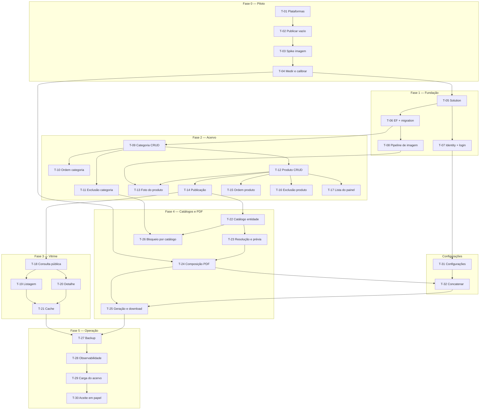

# Plano de Execução: Catálogo Virtual

**PRD de referência:** [`../prds/PRD-001-catalogo-virtual.md`](../prds/PRD-001-catalogo-virtual.md)
**SPEC-UI de referência:** [`../prototype/SPEC-UI-001-catalogo-virtual.md`](../prototype/SPEC-UI-001-catalogo-virtual.md)
**Arquitetura de referência:** [`../architecture/proposta-arquitetural.md`](../architecture/proposta-arquitetural.md)
**Cliente/Produto:** Distribuidora de suprimentos e informática (interno)
**Stack:** .NET 10 (LTS), Blazor Web App, EF Core, PostgreSQL e armazenamento de objeto no Supabase, QuestPDF, hospedagem no Render
**Autor:** Leanwork
**Data:** 2026-09-14
**Status:** Rascunho

---

## 1. Resumo executivo

Construção greenfield de um sistema com uma fonte de verdade — o cadastro de produtos — alimentando dois canais: uma vitrine pública renderizada no servidor e um catálogo em PDF gerado sob demanda.

A quebra é **horizontal por camada**, com uma exceção deliberada no início: a **Fase 0 é uma fatia vertical descartável** que atravessa upload, processamento de imagem e composição de PDF até o papel. Ela existe porque três números que o projeto inteiro assume hoje são premissas não verificadas — a resolução da imagem de impressão, o teto de produtos por catálogo e o limite de caracteres do resumo. Descobrir que 800 px não bastam depois de a Feature 3 estar pronta significaria reprocessar o acervo e refazer o layout.

Fora dessa fase, a ordem é convencional: fundação, acervo, vitrine, catálogos e operação. A entrega é única — o sistema não tem valor pela metade, já que sem acervo não há vitrine nem PDF.

## 2. Estratégia de entrega

**Modelo de entrega:** única release. Nada vai a produção antes de o conjunto estar completo.

A escolha decorre do produto, não de preferência: a vitrine sem acervo é uma página vazia, e o PDF sem acervo não gera. Não há fatia que entregue valor isolado ao usuário final, e portanto não há feature flag nem dark launch neste plano.

**Ordem de execução:** as fases são sequenciais, com uma folga real — a **Fase 3 (vitrine)** e a **Fase 4 (catálogos e PDF)** dependem ambas da Fase 2 mas não uma da outra. Podem ser executadas em qualquer ordem, ou em paralelo se houver mais de um executor.

**Critério geral de "pronto":**

- Os 33 cenários do PRD verificáveis na aplicação rodando
- Suíte de integração verde contra banco real
- Instância de produção provisionada, com TLS válido e domínio apontado
- Backup diário funcionando **e restauração testada**
- Os 36 produtos do catálogo de referência cadastrados e publicados
- Um PDF gerado pelo sistema, impresso em papel, aprovado lado a lado com o catálogo de referência

## 3. Premissas e decisões

> ⚠️ **Premissa:** a plataforma de hospedagem suporta a **conexão persistente** que o painel exige *(ADR-010)*. **T-02 existe para confirmar isso antes de qualquer funcionalidade.** Se não suportar, a ADR-010 precisa ser revisitada e o painel inteiro muda de modo de renderização — impacto grande, descoberto cedo.

> ⚠️ **Premissa:** o adormecimento do serviço após 15 minutos sem tráfego é **aceito** como trade-off da ADR-018. O primeiro visitante depois de um período parado espera cerca de um minuto. Se isso se mostrar insuportável na prática, as saídas estão na seção 3.3 da arquitetura — todas fora da restrição de custo atual.

> ⚠️ **Premissa:** o projeto gratuito do banco não será pausado por inatividade durante a construção. A pausa ocorre após uma semana sem atividade e a retomada é manual.

> ⚠️ **Premissa:** a derivada de impressão de 800 px produz qualidade aceitável em papel. Verificada em **T-04**; se falhar, o valor sobe e **T-08** muda.

> ⚠️ **Premissa:** o teto de produtos por catálogo e o limite de caracteres do resumo serão definidos por medição em **T-04**, não por escolha de negócio. Até lá, nenhuma tarefa depende do número exato.

> ⚠️ **Premissa:** a licença Community do gerador de PDF permanece válida — depende de a receita anual seguir abaixo de US$ 1 milhão *(PRD seção 4)*. Se mudar, **T-22** troca de motor sem afetar as demais tarefas.

> ⚠️ **Premissa:** o conteúdo editorial fixo da capa *(RN-37)* será confirmado com o cliente antes de **T-23**. O texto do catálogo de referência serve de base.

Decisões técnicas já tomadas, consumidas por este plano:

- **Aplicação única, sem API separada** — *ADR-001*
- **Organização por funcionalidade, sem Clean Architecture em camadas** — *ADR-003*
- **PostgreSQL com EF Core; busca por índice trigrama** — *ADR-004*
- **Quatro derivadas por foto: três WebP para tela, uma JPEG para impressão** — *ADR-005*
- **Cookie de sessão com Identity mínimo, usuário único** — *ADR-006*
- **Aplicação no Render, banco e arquivos no Supabase** — *ADR-018*
- **Cache de saída da página inteira, invalidado na escrita** — *ADR-008*
- **Renderização estática na vitrine, interativa no painel** — *ADR-010*
- **QuestPDF, com o gabarito reproduzido em código** — *ADR-012*
- **Geração síncrona no circuito, com teto de itens** — *ADR-013*
- **Persistir o filtro, nunca a lista nem o PDF** — *ADR-014*
- **Ordenação manual no produto e na categoria** — *ADR-015*
- **Três campos de texto com destino declarado** — *ADR-016*

**Padrão de testes:** xUnit com ênfase em **testes de integração** exercitando o comportamento externo contra PostgreSQL real em container. A costura preferida é a página ou o endpoint renderizado, não o método interno — isso mantém o teste vivo através de refactor. Testes unitários ficam reservados a lógica com ramificação real: resolução de filtro, regras de publicação, composição de página do PDF. Sem meta numérica de cobertura.

## 4. Mapa de dependências

A folga real do plano está entre **T-18 e T-22**: vitrine e catálogos partem do mesmo ponto (acervo publicável) e não se tocam. **T-26** é a única costura entre as fases 2 e 4 — o bloqueio de exclusão de categoria só pode ser implementado depois que catálogos existem.

---

## 5. Fases

### Fase 0 — Piloto de imagem e impressão

**Objetivo da fase:** transformar em medição as três premissas numéricas do projeto, antes que qualquer decisão dependa delas.

**Critério de conclusão da fase:** existe um PDF impresso em papel, comparado ao catálogo de referência, e os três números estão definidos com base em observação.

> **Esta fase é descartável.** O código do spike não entra no sistema final — o que sobrevive são os números e o aprendizado. Resistir à tentação de aproveitá-lo é o que impede que decisões de spike virem arquitetura por inércia.

---

#### T-01 — Criar os projetos nas plataformas

- **Status:** Concluído
- **Complexidade:** Baixa
- **Depende de:** nenhuma
- **Implementa:** —
- **Valida:** —
- **Decisões base:** ADR-018
- **Camadas/arquivos afetados:**
  - nenhum — tarefa de infraestrutura

**Descrição:**
Criar o projeto no Supabase — banco e bucket de armazenamento — e o serviço no Render, ligado ao repositório. Habilitar no banco as extensões `unaccent` e `pg_trgm`, exigidas pela busca *(ADR-004)*.

Configurar dois buckets com políticas distintas: um **público**, para as três derivadas de tela, e um **privado**, para a derivada de impressão e a capa do PDF *(RN-12)*.

**Critério de aceite (testável):**
- [x] Projeto do Supabase criado, com string de conexão em mãos
- [x] Extensões `unaccent` e `pg_trgm` habilitadas
- [x] Bucket público criado e acessível por URL
- [x] Bucket privado criado e **comprovadamente inacessível** sem credencial
- [x] Serviço criado no Render, ligado ao repositório
- [x] TLS válido no endereço público do serviço — **subdomínio `*.onrender.com` adotado como endereço inicial** *(decidido em T-01)*; domínio próprio adiado, ver seção 10

**Testes a escrever:** *Não aplicável* — tarefa de infraestrutura.

**Riscos / pontos de atenção:**
- **A política do bucket privado é a defesa do RN-12.** Testar de fato, com uma requisição anônima, que o arquivo não é servido. Não confiar na configuração da tela
- Guardar as credenciais fora do repositório desde o início
- **O projeto gratuito do Supabase pausa após uma semana sem atividade no banco.** Entre esta tarefa e o primeiro uso real pode passar mais que isso — se o painel não responder, verificar se o projeto está pausado antes de procurar bug

---

#### T-02 — Publicar a aplicação vazia

- **Status:** Concluído
- **Complexidade:** Média
- **Depende de:** T-01
- **Implementa:** —
- **Valida:** —
- **Decisões base:** ADR-018
- **Camadas/arquivos afetados:**
  - `Dockerfile` ou configuração de build do Render *(novo)*
  - `render.yaml` *(novo, opcional)*

**Descrição:**
Provar o caminho de publicação antes de existir funcionalidade: um projeto mínimo que sobe pelo repositório, responde em HTTPS no domínio e **conecta no banco do Supabase**. Variáveis de ambiente configuradas na plataforma, nunca no código.

**Critério de aceite (testável):**
- [x] Um push no repositório dispara a publicação
- [x] A aplicação responde em HTTPS no domínio, com certificado válido
- [x] A aplicação conecta no banco do Supabase e uma consulta trivial funciona
- [x] Credenciais vêm de variáveis de ambiente da plataforma
- [x] Nenhum segredo está versionado

**Testes a escrever:** *Não aplicável* — validação por inspeção.

**Riscos / pontos de atenção:**
- **Confirmar que a plataforma suporta a conexão persistente** que o painel exige *(ADR-010)*. Se não suportar, a ADR-010 precisa ser revisitada **antes** da Fase 2 — é o ponto de maior risco técnico desta mudança de infraestrutura
- Medir quanto tempo o serviço leva para voltar depois de adormecido. O número entra na documentação como expectativa real, não estimativa

---

#### T-03 — Spike: da foto ao PDF impresso

- **Status:** Concluído
- **Complexidade:** Alta
- **Depende de:** T-02
- **Implementa:** —
- **Valida:** —
- **Decisões base:** ADR-005, ADR-012
- **Camadas/arquivos afetados:**
  - `spike/` *(novo, descartável)*

**Descrição:**
Programa mínimo que recebe um punhado de fotos reais de produto, gera a derivada JPEG de impressão em 800 px, e compõe um PDF de uma ou duas páginas reproduzindo a grade de três colunas do gabarito — com nome, resumo e o par rótulo + preço. Não precisa de banco, painel, nem interface: dados vêm de um arquivo fixo no código.

O que este spike responde: a biblioteca de composição dá conta do layout do gabarito? Quanto pesa o arquivo final? Quanto tempo leva por produto? Quantos caracteres de resumo cabem na célula sem quebrar?

**Critério de aceite (testável):**
- [x] PDF gerado com ao menos 12 produtos na grade de três colunas
- [x] Nenhuma célula partida entre páginas
- [x] Cabeçalho e rodapé repetidos, com numeração de página
- [x] Tamanho do arquivo e tempo de geração registrados

**Testes a escrever:** *Não aplicável* — spike descartável, validado por inspeção do artefato.

**Riscos / pontos de atenção:**
- Usar **fotos reais de produto**, não imagens sintéticas: fundo branco de catálogo comprime muito melhor que foto texturizada, e medir com o material errado invalida a conclusão
- Se a biblioteca não der conta da paginação do gabarito, é aqui que se descobre — e a ADR-012 precisa ser revisitada antes de a Fase 4 começar

---

#### T-04 — Imprimir, medir e fixar os três números

- **Status:** Concluído
- **Complexidade:** Média
- **Depende de:** T-03
- **Implementa:** —
- **Valida:** —
- **Decisões base:** ADR-005, ADR-013, ADR-016
- **Camadas/arquivos afetados:**
  - `../architecture/proposta-arquitetural.md` *(atualização)*
  - `../prds/PRD-001-catalogo-virtual.md` *(atualização de premissas)*

**Descrição:**
Imprimir o PDF do spike em papel e compará-lo ao catálogo de referência, lado a lado. Dessa comparação saem três definições que hoje são premissa: a resolução da derivada de impressão, o teto de produtos por catálogo e o limite de caracteres do resumo. As três viram valor fixo nos documentos.

**Critério de aceite (testável):**
- [~] PDF impresso em papel e comparado ao gabarito — substituído por medição dos arquivos, ver histórico
- [x] Resolução da derivada de impressão definida, com a razão registrada
- [x] Teto de produtos por catálogo definido, derivado do tempo medido e da meta de 15 segundos
- [x] Limite de caracteres do resumo definido, derivado do espaço real da célula
- [x] Premissas correspondentes atualizadas no PRD e na proposta arquitetural

**Testes a escrever:** *Não aplicável.*

**Riscos / pontos de atenção:**
- **Ponto de validação humana.** Julgamento de qualidade de impressão não é automatizável e não deve ser delegado a agente. **Parar e apresentar o resultado ao cliente**
- Se a qualidade em 800 px for insuficiente, o valor sobe e o tamanho do arquivo cresce — pode colidir com o limite prático de envio por WhatsApp. O trade-off é do cliente

---

### Fase 1 — Fundação

**Objetivo da fase:** ter a aplicação de pé, com persistência, autenticação e o pipeline de imagem funcionando — sem nenhuma regra de negócio ainda.

**Critério de conclusão da fase:** é possível autenticar no painel vazio, e uma imagem enviada gera as quatro derivadas corretamente.

---

#### T-05 — Criar solution e projeto Blazor

- **Status:** Concluído
- **Complexidade:** Baixa
- **Depende de:** T-04
- **Implementa:** —
- **Valida:** —
- **Decisões base:** ADR-001, ADR-003, ADR-010
- **Camadas/arquivos afetados:**
  - `Catalogo.sln` *(novo)*
  - `src/Catalogo/` *(novo)*
  - `src/Catalogo/Features/` *(novo)*
  - `tests/Catalogo.Tests/` *(novo)*

**Descrição:**
Projeto único Blazor Web App, organizado por funcionalidade conforme a ADR-003 — pastas `Features/Storefront`, `Features/Products`, `Features/Categories`, `Features/Media`, `Features/CatalogBuilder`, `Features/PdfExport`. Configurar os dois modos de renderização da ADR-010: estático como padrão, interativo no servidor apenas sob o prefixo do painel.

**Critério de aceite (testável):**
- [x] Aplicação sobe e responde em `/`
- [x] Uma página sob `/painel` responde com interatividade de servidor ativa
- [x] Uma página pública responde **sem** abrir conexão persistente
- [x] Projeto de testes referencia a aplicação e executa

**Testes a escrever:**
- *Integration:* teste de fumaça que sobe a aplicação e verifica resposta em `/`

**Riscos / pontos de atenção:**
- O modo de renderização por área é a decisão mais fácil de configurar errado no começo e a mais cara de corrigir depois. **Verificar na prática** que a página pública não abre WebSocket — inspecionar a aba de rede do navegador, não confiar na configuração

---

#### T-06 — Modelar e migrar o esquema

- **Status:** Concluído
- **Complexidade:** Média
- **Depende de:** T-05
- **Implementa:** RN-01, RN-08, RN-23
- **Valida:** —
- **Decisões base:** ADR-004, ADR-009, ADR-015, ADR-016
- **Camadas/arquivos afetados:**
  - `Features/Catalog/Category` *(novo)*
  - `Features/Catalog/Product` *(novo)*
  - `Data/CatalogDbContext` *(novo)*
  - `Data/Migrations/` *(novo)*

**Descrição:**
Entidades de categoria e produto com os campos do PRD, incluindo as três colunas de texto da ADR-016, o rótulo de preço, a situação e as posições de ordenação da ADR-015. Migration inicial aplicada na subida da aplicação. Habilitar as extensões `unaccent` e `pg_trgm` e criar o índice trigrama sobre o nome do produto.

Sem identificador de tenant em tabela alguma — a ADR-009 é explícita e a ausência precisa ser deliberada, não esquecimento.

**Critério de aceite (testável):**
- [x] Migration cria as tabelas de categoria e produto com todos os campos do PRD
- [x] Nome de categoria tem restrição de unicidade *(RN-23)*
- [x] Extensões `unaccent` e `pg_trgm` habilitadas, com índice sobre o nome
- [x] Nenhuma tabela tem coluna de tenant
- [x] Migration aplica em banco limpo e é idempotente na subida

**Testes a escrever:**
- *Integration:* subir banco em container, aplicar migration, verificar esquema
- *Integration:* inserir duas categorias de mesmo nome e verificar que a segunda é recusada *(RN-23)*

**Riscos / pontos de atenção:**
- **Ponto de validação humana:** revisar o SQL gerado antes de aplicar em ambiente compartilhado
- Habilitar extensão no PostgreSQL exige privilégio — confirmar que o usuário da aplicação tem, ou fazer no script de inicialização do container

---

#### T-07 — Autenticação do usuário único

- **Status:** Concluído
- **Complexidade:** Média
- **Depende de:** T-05
- **Implementa:** RN-57, RN-58, RN-59, RN-60
- **Valida:** CA-26, CA-27
- **Decisões base:** ADR-006
- **Telas:** UI-03 (default, erroCredencial, bloqueado, enviando)
- **Camadas/arquivos afetados:**
  - `Features/Account/` *(novo)*
  - `Data/CatalogDbContext` *(alteração)*

**Descrição:**
Identity configurado apenas para armazenar a credencial, com hash de senha e bloqueio por tentativas. Conta semeada na primeira subida, com senha vinda de configuração e troca obrigatória. Todo o prefixo do painel exige autenticação; a vitrine permanece anônima.

Sem tela de registro, sem convite, sem fluxo de recuperação — as três ausências são regra, não omissão *(RN-57, RN-59)*.

**Critério de aceite (testável):**
- [x] Acesso anônimo a qualquer rota do painel é redirecionado ao login *(CA-26)*
- [x] Rota pública permanece acessível sem autenticação
- [x] Credencial incorreta exibe mensagem genérica, sem indicar qual campo falhou
- [x] Tentativas sucessivas malsucedidas bloqueiam temporariamente *(CA-27)*
- [x] Não existe rota de registro nem de recuperação de senha
- [x] A tela informa que a redefinição exige acesso ao servidor *(RN-59)*

**Testes a escrever:**
- *Integration:* requisição anônima a rota do painel resulta em redirecionamento *(CA-26)*
- *Integration:* autenticação com senha correta dá acesso; com incorreta, não
- *Integration:* N tentativas malsucedidas resultam em bloqueio *(CA-27)*

**Riscos / pontos de atenção:**
- A senha semeada **não pode ser fixa no código**. Vem de configuração ou variável de ambiente
- A mensagem genérica de erro é decisão de segurança *(SPEC-UI, UI-03)* — não "melhorar" para dizer qual campo falhou

---

#### T-08 — Pipeline de processamento de imagem

- **Status:** Concluído
- **Complexidade:** Alta
- **Depende de:** T-06
- **Implementa:** RN-10, RN-11, RN-12, RN-13
- **Valida:** CA-06, CA-28
- **Decisões base:** ADR-005
- **Camadas/arquivos afetados:**
  - `Features/Media/` *(novo)*

**Descrição:**
Serviço que recebe um arquivo, valida o **tipo real pelo conteúdo** — não pela extensão —, rejeita o que não for imagem válida, e gera quatro derivadas: três WebP para tela e uma JPEG na resolução definida em T-04. Nomes imutáveis, gravados no **armazenamento de objeto** *(ADR-018)* — as três de tela no bucket público, a de impressão no privado.

O disco da aplicação é efêmero: **nada pode ser gravado localmente**, nem como passo intermediário que sobreviva à requisição.

**Critério de aceite (testável):**
- [x] Arquivo com extensão de imagem mas conteúdo inválido é recusado *(CA-06)*
- [x] Upload válido gera exatamente quatro derivadas com nomes imutáveis
- [x] As três derivadas de tela são acessíveis por URL pública
- [x] A derivada de impressão **não** é acessível sem credencial, testado por requisição anônima ao bucket privado *(CA-28)*
- [x] Reenviar gera nomes novos, sem sobrescrever os anteriores *(RN-13)*
- [x] Arquivo acima do limite de tamanho ou dimensão é recusado

**Testes a escrever:**
- *Unit:* validação de tipo real rejeita arquivo mascarado por extensão *(CA-06)*
- *Integration:* upload gera as quatro derivadas nos caminhos esperados
- *Integration:* requisição HTTP à derivada de impressão retorna não encontrado ou proibido *(CA-28)*

**Riscos / pontos de atenção:**
- **CA-28 é regra de segurança, e agora depende de configuração de bucket** *(ADR-018)*. Política afrouxada por engano expõe o arquivo sem que nada quebre. O teste precisa bater no armazenamento real, não em simulação
- Processamento de imagem é a operação mais pesada do sistema, e o plano gratuito tem memória limitada. Medir com foto grande

---

### Fase 2 — Acervo

**Objetivo da fase:** o painel completo de manutenção — categorias, produtos, fotos, publicação e ordenação.

**Critério de conclusão da fase:** é possível cadastrar uma categoria, um produto com foto, publicá-lo, reordená-lo e excluí-lo, com todas as regras valendo.

---

#### T-09 — CRUD de categoria

- **Status:** Concluído
- **Complexidade:** Baixa
- **Depende de:** T-06
- **Implementa:** RN-23
- **Valida:** —
- **Decisões base:** ADR-003
- **Telas:** UI-06 (default, vazio, nomeDuplicado)
- **Camadas/arquivos afetados:**
  - `Features/Categories/` *(novo)*

**Descrição:**
Listagem, criação e renomeação de categoria, com nome obrigatório e único. Estado vazio convidando a criar a primeira — pré-requisito de qualquer produto.

**Critério de aceite (testável):**
- [x] Criar categoria com nome válido persiste e aparece na lista
- [x] Nome duplicado é recusado com erro junto ao campo
- [x] Nome vazio é recusado
- [x] Lista sem categorias exibe o estado vazio, não uma tabela em branco

**Testes a escrever:**
- *Integration:* criar categoria e verificar persistência
- *Integration:* criar categoria com nome já existente e verificar recusa *(RN-23)*

**Riscos / pontos de atenção:**
- A unicidade precisa valer no banco, não só na validação da tela — senão duas abas abertas contornam a regra

---

#### T-10 — Ordenação das categorias

- **Status:** Concluído
- **Complexidade:** Baixa
- **Depende de:** T-09
- **Implementa:** RN-24
- **Valida:** —
- **Decisões base:** ADR-015
- **Telas:** UI-06 (default)
- **Camadas/arquivos afetados:**
  - `Features/Categories/` *(alteração)*

**Descrição:**
Setas de reposicionamento na lista de categorias, gravando a posição. A numeração exibida ao lado de cada categoria reflete a posição global — a mesma que definirá a numeração impressa, com a ressalva de que no PDF ela é recalculada por recorte.

**Critério de aceite (testável):**
- [x] Mover categoria para cima ou para baixo persiste a nova posição
- [x] A primeira categoria não pode subir; a última não pode descer
- [x] A numeração exibida acompanha a posição após o movimento

**Testes a escrever:**
- *Integration:* reordenar e verificar que a nova ordem persiste entre requisições

**Riscos / pontos de atenção:**
- Definir posição como inteiro sequencial exige renumerar vizinhos a cada movimento. É aceitável com sete categorias; documentar a escolha se optar por outra estratégia

---

#### T-11 — Bloqueio de exclusão de categoria com produtos

- **Status:** Concluído
- **Complexidade:** Baixa
- **Depende de:** T-09
- **Implementa:** RN-25
- **Valida:** CA-11
- **Telas:** UI-06 (bloqueadaPorProdutos)
- **Camadas/arquivos afetados:**
  - `Features/Categories/` *(alteração)*

**Descrição:**
Exclusão de categoria recusada enquanto houver produtos associados, em qualquer situação — inclusive rascunhos. A mensagem informa quantos produtos impedem e aponta o caminho para resolver.

**Critério de aceite (testável):**
- [x] Excluir categoria com produtos é recusado *(CA-11)*
- [x] A mensagem informa a quantidade de produtos que impedem
- [x] Produtos em Rascunho também impedem a exclusão
- [x] Categoria sem produtos é excluída normalmente *(até T-26 acrescentar a segunda condição)*

**Testes a escrever:**
- *Integration:* categoria com produto publicado não pode ser excluída *(CA-11)*
- *Integration:* categoria com produto apenas em Rascunho também não pode

**Riscos / pontos de atenção:**
- **T-26 volta nesta tarefa** para acrescentar o bloqueio por catálogo *(RN-25.1)*. Deixar a verificação em um ponto único facilita essa extensão

---

#### T-12 — CRUD de produto

- **Status:** Pendente
- **Complexidade:** Média
- **Depende de:** T-09
- **Implementa:** RN-02, RN-03, RN-04, RN-05, RN-06, RN-07, RN-08
- **Valida:** —
- **Decisões base:** ADR-016
- **Telas:** UI-05 (novo, edicao, erroValidacao)
- **Camadas/arquivos afetados:**
  - `Features/Products/` *(novo)*

**Descrição:**
Formulário de produto com os três campos de texto da ADR-016 — nome obrigatório, resumo curto e opcional com o limite definido em T-04, descrição livre e opcional —, mais preço, rótulo em lista fechada e categoria.

O formulário precisa **declarar onde cada texto aparece**. Sem isso o dono escreve a especificação inteira no resumo e quebra a grade do PDF; é o erro de uso mais provável do sistema.

**Critério de aceite (testável):**
- [ ] Salvar com nome, preço e categoria persiste o produto
- [ ] Nome vazio é recusado *(RN-02)*
- [ ] Preço zero ou negativo é recusado *(RN-06)*
- [ ] Resumo respeita o limite de caracteres, com contador visível
- [ ] Descrição aceita texto longo, sem limite
- [ ] Rótulo oferece apenas as opções da lista fechada *(RN-07)*
- [ ] Cada campo de texto indica em que canal aparece
- [ ] Produto salvo nasce em Rascunho *(RN-14)*

**Testes a escrever:**
- *Integration:* criar produto e verificar persistência de todos os campos
- *Integration:* nome vazio e preço inválido são recusados
- *Unit:* validação do limite de caracteres do resumo

**Riscos / pontos de atenção:**
- Preço em ponto flutuante é erro clássico. Usar tipo decimal, no código e no banco
- O limite do resumo vem de T-04 — se essa tarefa for executada antes, **parar e perguntar**

---

#### T-13 — Foto do produto

- **Status:** Pendente
- **Complexidade:** Média
- **Depende de:** T-08, T-12
- **Implementa:** RN-09
- **Valida:** CA-07
- **Decisões base:** ADR-005
- **Telas:** UI-05 (enviandoFoto, erroUpload)
- **Camadas/arquivos afetados:**
  - `Features/Products/` *(alteração)*

**Descrição:**
Ligar o formulário de produto ao pipeline de imagem: uma foto por produto, com envio, progresso e substituição. Trocar a foto gera novas derivadas com nomes novos; a anterior deixa de ser referenciada.

**Critério de aceite (testável):**
- [ ] Enviar foto associa as quatro derivadas ao produto
- [ ] Produto tem no máximo uma foto — não há galeria *(RN-09)*
- [ ] Trocar a foto gera nomes novos e atualiza a referência *(CA-07)*
- [ ] Durante o envio, salvar fica indisponível
- [ ] Arquivo recusado exibe o motivo e preserva a foto anterior

**Testes a escrever:**
- *Integration:* enviar foto e verificar as quatro derivadas associadas
- *Integration:* substituir foto e verificar que a referência aponta para os nomes novos *(CA-07)*

**Riscos / pontos de atenção:**
- Derivadas órfãs se acumulam quando a foto é trocada. Não é vazamento grave no volume previsto, mas registrar a decisão de não limpar — ou limpar

---

#### T-14 — Ciclo de publicação

- **Status:** Pendente
- **Complexidade:** Média
- **Depende de:** T-12
- **Implementa:** RN-14, RN-15, RN-16, RN-17, RN-18, RN-19
- **Valida:** CA-01, CA-02, CA-03, CA-29
- **Telas:** UI-05 (publicacaoBloqueada)
- **Camadas/arquivos afetados:**
  - `Features/Products/` *(alteração)*

**Descrição:**
Transição entre Rascunho e No ar. Publicar exige nome, preço, categoria e foto preenchidos; faltando qualquer um, a ação fica indisponível **com a razão declarada** — não silenciosamente desabilitada. Despublicar volta ao Rascunho e retira o produto de circulação imediatamente.

Esta tarefa concentra a regra de maior efeito do sistema: publicar insere o produto, no mesmo instante, em todos os catálogos cuja categoria ele atende *(RN-19)*.

**Critério de aceite (testável):**
- [ ] Produto completo pode ser publicado *(CA-01)*
- [ ] Produto sem foto não pode ser publicado, e a tela diz qual campo falta *(CA-02)*
- [ ] Produto sem nome, preço ou categoria também não pode
- [ ] Produto em Rascunho não aparece em consulta pública *(CA-03)*
- [ ] Despublicar retira o produto de circulação imediatamente *(CA-29)*
- [ ] Resumo e descrição vazios **não** impedem a publicação *(RN-16)*

**Testes a escrever:**
- *Integration:* publicar produto completo e verificar a situação *(CA-01)*
- *Integration:* tentar publicar sem foto e verificar recusa *(CA-02)*
- *Integration:* publicar produto sem resumo e sem descrição e verificar sucesso
- *Integration:* despublicar e verificar ausência na consulta pública *(CA-29)*

**Riscos / pontos de atenção:**
- A validação de publicação precisa valer no servidor, não só na tela
- **Cuidado com a tentação de exigir resumo.** A RN-16 lista quatro campos e resumo não é um deles

---

#### T-15 — Ordenação dos produtos

- **Status:** Pendente
- **Complexidade:** Baixa
- **Depende de:** T-12
- **Implementa:** RN-21, RN-22
- **Valida:** CA-09
- **Decisões base:** ADR-015
- **Telas:** UI-04 (default)
- **Camadas/arquivos afetados:**
  - `Features/Products/` *(alteração)*

**Descrição:**
Setas de reposicionamento dentro da categoria. A ordem é única e global: a mesma posição vale para a vitrine e para o PDF. Não existe ordem por catálogo, e a tela deve deixar isso claro — mover um item o move em todos os recortes onde ele aparece.

**Critério de aceite (testável):**
- [ ] Mover produto persiste a nova posição dentro da categoria
- [ ] O primeiro da categoria não sobe; o último não desce
- [ ] A ordem definida aqui é a mesma usada na vitrine e no PDF *(CA-09)*
- [ ] A tela informa que a ordem vale para todos os canais

**Testes a escrever:**
- *Integration:* reordenar e verificar a ordem na consulta pública *(CA-09)*

**Riscos / pontos de atenção:**
- Produtos sem posição definida — cadastrados antes desta tarefa — precisam de critério de desempate estável, senão a ordem oscila entre requisições

---

#### T-16 — Exclusão de produto

- **Status:** Pendente
- **Complexidade:** Baixa
- **Depende de:** T-12
- **Implementa:** RN-20
- **Valida:** CA-08
- **Telas:** UI-05 (confirmarExclusao)
- **Camadas/arquivos afetados:**
  - `Features/Products/` *(alteração)*

**Descrição:**
Exclusão definitiva, precedida de confirmação que declara ser irreversível e que a foto será removida junto. Remove o registro, o original e as quatro derivadas.

**Critério de aceite (testável):**
- [ ] Excluir exige confirmação explícita *(RN-20)*
- [ ] A confirmação declara que a operação é irreversível
- [ ] Confirmada, o produto sai do acervo e os arquivos de imagem são removidos *(CA-08)*
- [ ] Cancelar não altera nada

**Testes a escrever:**
- *Integration:* excluir produto e verificar remoção do registro e dos arquivos *(CA-08)*

**Riscos / pontos de atenção:**
- Operação irreversível merece cuidado extra: a confirmação é do **usuário**, não de quem executa a tarefa. Nunca auto-confirmar

---

#### T-17 — Lista de produtos do painel

- **Status:** Pendente
- **Complexidade:** Média
- **Depende de:** T-12
- **Implementa:** RN-15, RN-51
- **Valida:** —
- **Telas:** UI-04 (default, vazio, buscaSemResultado)
- **Camadas/arquivos afetados:**
  - `Features/Products/` *(alteração)*

**Descrição:**
Lista agrupada por categoria, na ordem global, com a numeração posicional visível. Cada linha traz miniatura, nome, resumo, situação, preço com rótulo e a ação de editar. Rascunhos aparecem aqui — e só aqui — com marcação distinta. Miniatura ausente é exibida como falta, não como espaço vazio.

**Critério de aceite (testável):**
- [ ] Produtos agrupados por categoria, na ordem global
- [ ] Rascunhos visualmente distintos dos publicados
- [ ] Produto sem foto exibe marcador de falta
- [ ] Filtro por situação — todos, No ar, rascunhos — funciona
- [ ] Acervo vazio exibe chamada para cadastrar o primeiro produto

**Testes a escrever:**
- *Integration:* lista retorna produtos agrupados e ordenados corretamente
- *Integration:* filtro por situação retorna apenas o subconjunto esperado

**Riscos / pontos de atenção:**
- Com centenas de produtos e miniatura em cada linha, carregar tudo de uma vez pesa. Paginar ou carregar imagem sob demanda

---

### Fase 3 — Vitrine

**Objetivo da fase:** o canal público — listagem, detalhe e contato — renderizado no servidor e servido de cache.

**Critério de conclusão da fase:** um visitante anônimo navega, busca, filtra e chega ao WhatsApp, e a rota quente não toca o banco.

> **Esta fase e a Fase 4 partem do mesmo ponto e não se tocam.** Podem ser executadas em qualquer ordem.

---

#### T-18 — Consulta pública do catálogo

- **Status:** Pendente
- **Complexidade:** Média
- **Depende de:** T-14
- **Implementa:** RN-48, RN-49, RN-50, RN-51, RN-52
- **Valida:** CA-22, CA-33
- **Decisões base:** ADR-004
- **Camadas/arquivos afetados:**
  - `Features/Storefront/` *(novo)*

**Descrição:**
Consulta que resolve a listagem pública: apenas produtos No ar, filtrados por categoria, buscados por nome com tolerância a acento, ordenados pela posição global e paginados. Traz também as contagens por categoria, na mesma ida ao banco.

A busca procura **exclusivamente no nome** *(RN-49)* — resumo e descrição não são pesquisáveis. É restrição, não limitação a corrigir.

**Critério de aceite (testável):**
- [ ] Apenas produtos No ar são retornados *(RN-48)*
- [ ] Busca por "placa mae" encontra "Placa-Mãe" *(CA-22)*
- [ ] Busca por termo presente só na descrição **não** encontra o produto *(CA-33)*
- [ ] Filtro por categoria restringe o resultado
- [ ] Contagens por categoria vêm na mesma consulta
- [ ] Resultado ordenado pela posição global de categoria e produto
- [ ] Paginação retorna o subconjunto correto

**Testes a escrever:**
- *Integration:* produto em Rascunho não aparece no resultado *(RN-48)*
- *Integration:* busca tolerante a acento encontra o produto *(CA-22)*
- *Integration:* termo só na descrição não encontra *(CA-33)*
- *Integration:* contagens por categoria conferem com o acervo

**Riscos / pontos de atenção:**
- É a consulta mais executada do sistema. Verificar que usa o índice trigrama, não varredura de tabela
- Trazer página e contagens juntas evita duas idas ao banco — e é o que torna o cache da T-21 eficiente

---

#### T-19 — Tela de listagem da vitrine

- **Status:** Pendente
- **Complexidade:** Média
- **Depende de:** T-18
- **Implementa:** RN-47, RN-52, RN-56
- **Valida:** CA-21, CA-23, CA-24
- **Decisões base:** ADR-010
- **Telas:** UI-01 (default, filtrado, buscaSemResultado, vazio)
- **Camadas/arquivos afetados:**
  - `Features/Storefront/` *(alteração)*

**Descrição:**
Listagem renderizada no servidor, com grade de cards, filtro de categorias com contagem, busca e paginação. Todo o estado de navegação vive na URL *(RN-56)* — filtrar é navegar, e qualquer listagem é compartilhável por link.

Quatro estados: padrão, filtrado, busca sem resultado e catálogo vazio. O estado vazio precisa ser neutro, sem parecer erro.

**Critério de aceite (testável):**
- [ ] Visitante anônimo acessa sem login *(CA-21)*
- [ ] Nenhum elemento de carrinho, estoque ou preço por embalagem aparece *(CA-21)*
- [ ] Categoria exibida com a contagem de produtos *(CA-23)*
- [ ] Busca, categoria e página refletidas na URL; abrir a URL em outro dispositivo reproduz a mesma listagem *(CA-24)*
- [ ] Busca sem resultado exibe mensagem com o termo e caminho de volta
- [ ] Acervo sem produtos No ar exibe estado vazio neutro
- [ ] A página **não** abre conexão persistente

**Testes a escrever:**
- *Integration:* requisição anônima retorna a listagem *(CA-21)*
- *Integration:* URL com filtro e página reproduz o mesmo conjunto *(CA-24)*
- *Integration:* contagem por categoria exibida confere *(CA-23)*

**Riscos / pontos de atenção:**
- O texto de exemplo do campo de busca **não pode prometer mais do que a busca faz**. Procura só no nome
- Verificar na aba de rede que nenhum WebSocket é aberto: é o que distingue esta tela do painel

---

#### T-20 — Tela de detalhe do produto

- **Status:** Pendente
- **Complexidade:** Média
- **Depende de:** T-18
- **Implementa:** RN-53, RN-54, RN-55
- **Valida:** CA-05, CA-25, CA-31
- **Telas:** UI-02 (default, semDescricao, naoEncontrado)
- **Camadas/arquivos afetados:**
  - `Features/Storefront/` *(alteração)*

**Descrição:**
Página do produto com foto, categoria, nome, **descrição completa**, rótulo e preço. É o único lugar do sistema onde o texto longo aparece *(RN-05)*.

Contato por WhatsApp, telefone e e-mail, com a mensagem do WhatsApp pré-preenchida contendo o nome do produto *(RN-55)*.

**Critério de aceite (testável):**
- [ ] Descrição completa exibida, sem truncamento *(CA-05)*
- [ ] Sem descrição, exibe o resumo; sem ambos, uma linha neutra
- [ ] Rótulo exibido acima do valor, não embutido nele
- [ ] WhatsApp abre com mensagem contendo o nome do produto *(CA-25)*
- [ ] Telefone e e-mail disponíveis além do WhatsApp *(CA-31)*
- [ ] Produto inexistente ou em Rascunho resulta em página de não encontrado

**Testes a escrever:**
- *Integration:* detalhe exibe a descrição longa integralmente *(CA-05)*
- *Integration:* produto em Rascunho retorna não encontrado
- *Integration:* link do WhatsApp contém o nome do produto codificado *(CA-25)*

**Riscos / pontos de atenção:**
- `UI-02.naoEncontrado` é fácil de esquecer e tem consequência real: **despublicar um produto quebra links já compartilhados**. Precisa de página de erro decente, com caminho de volta
- O nome do produto vai para a URL do WhatsApp — codificar corretamente, incluindo acentos e aspas

---

#### T-21 — Cache de saída e invalidação

- **Status:** Pendente
- **Complexidade:** Alta
- **Depende de:** T-19, T-20
- **Implementa:** —
- **Valida:** CA-15
- **Decisões base:** ADR-008
- **Camadas/arquivos afetados:**
  - `Features/Storefront/` *(alteração)*
  - `Features/Products/` *(alteração)*
  - `Features/Categories/` *(alteração)*

**Descrição:**
Cache de saída sobre as rotas da vitrine, com chave derivada da URL completa e marcação por tag. O que é cacheado é o **HTML renderizado**, contagens incluídas. Toda escrita no painel — produto, categoria, publicação, ordenação — invalida as tags afetadas.

É o elo entre as duas áreas da aplicação, e o único acoplamento entre elas.

**Critério de aceite (testável):**
- [ ] Segunda requisição à mesma URL é servida do cache, sem consulta ao banco
- [ ] URLs com filtros diferentes são entradas distintas
- [ ] Alterar preço de produto publicado reflete na vitrine na requisição seguinte *(CA-15)*
- [ ] Publicar produto reflete na listagem na requisição seguinte
- [ ] Reordenar reflete na ordem exibida
- [ ] Excluir ou despublicar remove o produto da vitrine

**Testes a escrever:**
- *Integration:* duas requisições iguais, verificando que a segunda não consulta o banco
- *Integration:* alterar produto e verificar que a vitrine reflete imediatamente *(CA-15)*
- *Integration:* cada tipo de escrita invalida o que deve

**Riscos / pontos de atenção:**
- **A tarefa mais propensa a bug silencioso do plano.** Cache que não invalida não quebra nada visivelmente — só mostra dado velho, e ninguém percebe até o cliente reclamar
- Testar **cada tipo de escrita**, não só uma. Esquecer a invalidação na ordenação é o esquecimento típico
- Cache em memória se perde a cada publicação da aplicação. É esperado *(ADR-008)*

---

### Fase 4 — Catálogos e PDF

**Objetivo da fase:** montar recortes por categoria e gerar o documento impresso.

**Critério de conclusão da fase:** é possível salvar um catálogo, pré-visualizar o que ele resolve e baixar um PDF fiel ao gabarito.

---

#### T-22 — Catálogo como filtro salvo

- **Status:** Pendente
- **Complexidade:** Média
- **Depende de:** T-14
- **Implementa:** RN-26, RN-27, RN-28, RN-29, RN-33, RN-34
- **Valida:** CA-12, CA-13, CA-20
- **Decisões base:** ADR-014
- **Telas:** UI-07 (default, vazio, nuncaGerado), UI-08 (default, semCategoria)
- **Camadas/arquivos afetados:**
  - `Features/CatalogBuilder/` *(novo)*
  - `Data/Migrations/` *(alteração)*

**Descrição:**
Entidade de catálogo com nome único e as categorias selecionadas — **e nada mais**. Nenhuma lista de produtos é persistida *(RN-29)*: essa ausência é a decisão, não um detalhe de modelagem.

Lista de catálogos com contagem resolvida no momento da exibição e data da última geração. Tela de critério com seleção de categorias, exigindo ao menos uma.

**Critério de aceite (testável):**
- [ ] Salvar catálogo persiste nome e categorias *(CA-12)*
- [ ] **Nenhuma tabela de itens de catálogo existe no esquema** *(RN-29)*
- [ ] Catálogo sem categoria selecionada não pode ser salvo *(CA-13)*
- [ ] Nome duplicado é recusado
- [ ] Lista exibe contagem resolvida na hora e a última geração
- [ ] Catálogo nunca gerado é marcado como tal
- [ ] Excluir catálogo não afeta produto algum *(CA-20)*

**Testes a escrever:**
- *Integration:* salvar catálogo e verificar que só nome e categorias foram persistidos *(CA-12)*
- *Integration:* tentar salvar sem categoria e verificar recusa *(CA-13)*
- *Integration:* excluir catálogo e verificar que os produtos permanecem *(CA-20)*

**Riscos / pontos de atenção:**
- **Resistir ao impulso de persistir a lista resolvida "para performance".** Isso reverteria a ADR-014 e traria de volta a dor que o projeto veio resolver
- A contagem no cartão muda entre visitas sem ninguém ter mexido. É correto — a tela deve deixar claro que o número é de agora

---

#### T-23 — Resolução do filtro e pré-visualização

- **Status:** Pendente
- **Complexidade:** Alta
- **Depende de:** T-22
- **Implementa:** RN-30, RN-31, RN-32, RN-39, RN-40, RN-46
- **Valida:** CA-14, CA-16, CA-18
- **Decisões base:** ADR-014, ADR-015
- **Telas:** UI-08 (default, comItensNovos, previaVazia)
- **Camadas/arquivos afetados:**
  - `Features/CatalogBuilder/` *(alteração)*

**Descrição:**
Resolver o filtro no momento da exibição — apenas produtos No ar, agrupados pelas categorias do recorte, ordenados pela posição global. A prévia exibe a lista resolvida, a contagem, a estimativa de páginas e a **numeração posicional recalculada**: um catálogo de duas categorias as numera `01` e `02`.

Produtos que passaram a integrar o catálogo desde a última geração são destacados *(RN-32)*. Esse destaque é a mitigação do risco central do sistema, não enfeite.

**Critério de aceite (testável):**
- [ ] Prévia resolve apenas produtos No ar *(RN-30)*
- [ ] Numeração recalculada por recorte, não a global *(CA-10, RN-39)*
- [ ] Produto publicado após a última geração aparece destacado *(CA-14)*
- [ ] Prévia obrigatória antes de gerar — não há caminho que a pule *(CA-16)*
- [ ] Filtro sem nenhum produto No ar impede a geração, com a razão *(CA-18)*
- [ ] Alterar o critério recalcula a prévia

**Testes a escrever:**
- *Integration:* publicar produto em categoria de catálogo existente e verificar que consta da prévia destacado *(CA-14)*
- *Integration:* catálogo com todos os produtos em Rascunho não gera *(CA-18)*
- *Unit:* numeração posicional para diferentes recortes *(RN-39)*

**Riscos / pontos de atenção:**
- A numeração posicional é a regra mais fácil de implementar errado — usar o identificador ou a posição global da categoria produz `03` e `06` em vez de `01` e `02`
- **A prévia não pode ser opcional.** Um botão "gerar direto" anularia a proteção que justifica a ADR-014

---

#### T-24 — Composição do documento

- **Status:** Pendente
- **Complexidade:** Alta
- **Depende de:** T-04, T-23
- **Implementa:** RN-39, RN-40, RN-40.1, RN-41, RN-42, RN-43
- **Valida:** CA-04, CA-10, CA-30
- **Decisões base:** ADR-012, ADR-016
- **Telas:** UI-09 (conteudo)
- **Camadas/arquivos afetados:**
  - `Features/PdfExport/` *(novo)*

**Descrição:**
Compor **apenas as páginas de conteúdo** — a capa vem pronta e é concatenada em T-31. Grade de três colunas, cabeçalho e rodapé repetidos com numeração que conta a capa como primeira folha *(RN-40.1)*. A célula traz foto, nome, resumo quando houver, e o par rótulo + preço.

Categorias fluem continuamente, sem quebra forçada, e **nenhuma célula é dividida entre páginas** *(RN-42)*. **Não há página de índice** — a RN-38 foi revogada.

**Critério de aceite (testável):**
- [ ] Categorias numeradas conforme o recorte, não a posição global *(CA-10)*
- [ ] Nenhuma página de índice é produzida
- [ ] Numeração de página considera a capa como primeira folha *(RN-40.1)*
- [ ] Grade de três colunas, com categorias em fluxo contínuo *(RN-41)*
- [ ] Nenhuma célula partida entre páginas *(CA-30)*
- [ ] Produto sem resumo exibe apenas nome e preço *(CA-04)*
- [ ] Cabeçalho e rodapé em todas as páginas de conteúdo, com numeração
- [ ] Usa a derivada de impressão, nunca a de tela

**Testes a escrever:**
- *Unit:* composição com produto sem resumo não deixa espaço vazio *(CA-04)*
- *Unit:* numeração das seções acompanha o recorte *(CA-10)*
- *Integration:* gerar documento com produtos suficientes para atravessar páginas e verificar integridade

**Riscos / pontos de atenção:**
- **Ponto de validação humana.** Fidelidade ao gabarito é julgamento visual — comparar as páginas de conteúdo com o arquivo de referência e **apresentar ao cliente**
- Medidas exatas de tipografia e espaçamento **não estão especificadas** *(lacuna 3 da SPEC-UI)*: extrair do PDF original antes de começar
- Verificar que a derivada consumida é a de impressão: usar a de tela produz documento borrado, e o erro só aparece no papel
- A numeração precisa contar a capa. Começar em 1 nas páginas de conteúdo produz um documento cujo rodapé não bate com a folha *(RN-40.1)*

---

#### T-25 — Geração, progresso e download

- **Status:** Pendente
- **Complexidade:** Média
- **Depende de:** T-24
- **Implementa:** RN-35, RN-44, RN-45
- **Valida:** CA-17, CA-19
- **Decisões base:** ADR-013, ADR-014
- **Telas:** UI-08 (gerando, concluido, acimaDoTeto, erroGeracao)
- **Camadas/arquivos afetados:**
  - `Features/PdfExport/` *(alteração)*
  - `Features/CatalogBuilder/` *(alteração)*

**Descrição:**
Geração síncrona no circuito do painel, com progresso item a item, teto de produtos validado antes de iniciar, e entrega como download. **O arquivo não é gravado em disco** — existe só em memória até ser entregue *(RN-35)*. Ao final, registra a data da geração.

No momento do download, a tela informa que aquele arquivo é o único registro daquele envio.

**Critério de aceite (testável):**
- [ ] Progresso visível durante a composição *(RN-44)*
- [ ] Arquivo entregue como download ao final *(CA-17)*
- [ ] **Nenhum PDF permanece no servidor após a entrega** *(CA-17, RN-35)*
- [ ] Data da última geração registrada *(CA-17)*
- [ ] Catálogo acima do teto é recusado **antes** de iniciar a composição *(CA-19)*
- [ ] A recusa informa o limite e a quantidade resolvida
- [ ] Falha na geração não entrega arquivo parcial
- [ ] O download informa que o arquivo é o único registro

**Testes a escrever:**
- *Integration:* gerar e verificar que nenhum arquivo ficou no disco *(CA-17, RN-35)*
- *Integration:* catálogo acima do teto é recusado antes de compor *(CA-19)*
- *Integration:* data da última geração atualizada

**Riscos / pontos de atenção:**
- Gerar documento grande em memória pressiona o host. O teto existe para isso — validá-lo **antes** de começar, não durante
- Uma publicação da aplicação durante a geração derruba o circuito e perde o trabalho. É aceito *(ADR-013)*, mas o usuário deve entender que basta repetir

---

#### T-26 — Bloqueio de exclusão de categoria usada por catálogo

- **Status:** Pendente
- **Complexidade:** Baixa
- **Depende de:** T-11, T-22
- **Implementa:** RN-25.1
- **Valida:** CA-32
- **Telas:** UI-06 (bloqueadaPorCatalogo)
- **Camadas/arquivos afetados:**
  - `Features/Categories/` *(alteração)*

**Descrição:**
Estende a verificação de T-11: além de produtos, a categoria também fica retida enquanto integrar algum catálogo salvo — mesmo estando vazia. A mensagem **nomeia os catálogos** que dependem dela.

É a correção da lacuna do catálogo órfão: sem isso, excluir uma categoria vazia deixaria um catálogo sem critério resolvível.

**Critério de aceite (testável):**
- [ ] Categoria vazia usada por catálogo não pode ser excluída *(CA-32)*
- [ ] A mensagem nomeia os catálogos que impedem
- [ ] A mensagem é **distinta** da de bloqueio por produtos — causa e saída são diferentes
- [ ] Categoria sem produtos e sem catálogo é excluída normalmente

**Testes a escrever:**
- *Integration:* categoria vazia em catálogo não pode ser excluída, e a mensagem nomeia o catálogo *(CA-32)*
- *Integration:* categoria sem produtos e fora de qualquer catálogo é excluída

**Riscos / pontos de atenção:**
- Os dois bloqueios precisam de mensagens distintas *(SPEC-UI, UI-06)*. Unificar em "categoria em uso" deixaria o usuário sem saber o que fazer

---

### Fase 5 — Operação e aceite

**Objetivo da fase:** deixar o sistema operável — backup verificado, log útil — e validado com dado real.

**Critério de conclusão da fase:** o acervo real está publicado, um PDF foi impresso e aprovado, e a restauração do backup foi testada.

---

#### T-27 — Backup e restauração

- **Status:** Pendente
- **Complexidade:** Média
- **Depende de:** T-21, T-25
- **Implementa:** —
- **Valida:** —
- **Decisões base:** ADR-007, ADR-011
- **Camadas/arquivos afetados:**
  - `ops/backup.sh` *(novo)*
  - `ops/RESTORE.md` *(novo)*

**Descrição:**
Com a mudança para plataformas gerenciadas *(ADR-018)* **não existe mais servidor onde agendar uma tarefa**. A rotina precisa rodar fora das duas plataformas — um agendador externo que execute o dump do banco e guarde o resultado em um terceiro lugar.

Mais o procedimento escrito de restauração — e a execução dele, de verdade, em ambiente limpo. E o procedimento de redefinição da senha única, já que não há recuperação pelo sistema *(RN-59)*.

**Critério de aceite (testável):**
- [ ] Rotina agendada **fora do Render e do Supabase**, executando o dump do banco
- [ ] Cópia gravada em terceiro lugar, independente das duas plataformas
- [ ] Os arquivos do armazenamento de objeto também são copiados
- [ ] **Restauração executada em ambiente limpo, com o sistema funcionando ao final**
- [ ] Procedimento de restauração escrito e verificado
- [ ] Procedimento de redefinição da senha escrito e testado

**Testes a escrever:** *Não aplicável* — validação por execução do procedimento.

**Riscos / pontos de atenção:**
- **Backup nunca restaurado não é backup.** O critério exige a restauração de fato, não a configuração da rotina
- Credencial do armazenamento externo não pode ir para o repositório
- **O plano gratuito não garante retenção de backup pela plataforma.** Depender do que o Supabase guarda é confiar em algo que não foi contratado

---

#### T-28 — Log estruturado e endpoint de saúde

- **Status:** Pendente
- **Complexidade:** Baixa
- **Depende de:** T-27
- **Implementa:** —
- **Valida:** —
- **Camadas/arquivos afetados:**
  - `Program` *(alteração)*

**Descrição:**
Log estruturado nos pontos que importam — autenticação, publicação, upload, geração de PDF, invalidação de cache — e um endpoint de saúde que verifique banco e volume. É o mínimo previsto na arquitetura, que assume observabilidade enxuta.

**Critério de aceite (testável):**
- [ ] Endpoint de saúde responde e verifica banco e acesso ao volume
- [ ] Autenticação, publicação, upload e geração produzem log
- [ ] Log não contém senha, credencial nem conteúdo de arquivo
- [ ] Erro não tratado é registrado com contexto suficiente para diagnóstico

**Testes a escrever:**
- *Integration:* endpoint de saúde responde com sucesso quando banco e volume estão acessíveis

**Riscos / pontos de atenção:**
- Não registrar conteúdo de upload nem dado de credencial no log

---

#### T-29 — Carregar o acervo real

- **Status:** Pendente
- **Complexidade:** Média
- **Depende de:** T-28
- **Implementa:** —
- **Valida:** —
- **Camadas/arquivos afetados:**
  - nenhum — operação de dados

**Descrição:**
Cadastrar as sete categorias e os 36 produtos do catálogo de referência, com foto, resumo, preço e rótulo, na ordem do documento original. Publicar todos.

Não é tarefa de código: é o primeiro uso real do sistema, e o teste mais honesto de usabilidade do painel. Quanto tempo leva cadastrar 36 produtos diz mais sobre o produto do que qualquer teste automatizado.

**Critério de aceite (testável):**
- [ ] Sete categorias cadastradas, na ordem do documento original
- [ ] 36 produtos cadastrados com foto, resumo, preço e rótulo corretos
- [ ] O item com `PREÇO/UND` cadastrado com o rótulo certo
- [ ] Todos publicados e visíveis na vitrine
- [ ] Ordem dentro de cada categoria conferindo com o documento original

**Testes a escrever:** *Não aplicável* — operação de dados.

**Riscos / pontos de atenção:**
- **Ponto de validação humana.** O cadastro é do cliente, com as fotos originais dele
- Atrito percebido aqui é informação valiosa. Registrar o que incomodou, mesmo sem corrigir agora

---

#### T-30 — Aceite em papel

- **Status:** Pendente
- **Complexidade:** Baixa
- **Depende de:** T-29
- **Implementa:** —
- **Valida:** todos os CA
- **Camadas/arquivos afetados:**
  - nenhum — validação

**Descrição:**
Gerar o catálogo completo pelo sistema, imprimir e comparar ao documento original, lado a lado. Depois gerar um recorte parcial — duas categorias — e conferir que a numeração sai `01` e `02`, com o índice acompanhando.

É o aceite final: o artefato que o cliente vai enviar e imprimir, produzido pelo sistema, avaliado no meio em que será usado.

**Critério de aceite (testável):**
- [ ] Catálogo completo gerado e impresso
- [ ] Comparado ao documento original, lado a lado, e aprovado pelo cliente
- [ ] Tamanho do arquivo compatível com envio por WhatsApp
- [ ] Recorte de duas categorias numerado `01` e `02`, com índice conferindo
- [ ] Os 33 cenários do PRD verificados na aplicação
- [ ] Nenhum elemento fora de escopo aparece em tela ou no papel

**Testes a escrever:** *Não aplicável* — aceite manual.

**Riscos / pontos de atenção:**
- **Ponto de validação humana, e o mais importante do plano.** Só o cliente pode dizer se o documento serve
- Se a comparação reprovar por qualidade de imagem, a correção recai em T-08 e exige reprocessar o acervo de T-29

---

---

#### T-31 — Tela de configurações e envio da capa

- **Status:** Pendente
- **Complexidade:** Média
- **Depende de:** T-07
- **Implementa:** RN-61, RN-62, RN-63, RN-64, RN-66, RN-67, RN-68
- **Valida:** CA-34, CA-35, CA-38, CA-39
- **Decisões base:** ADR-017, ADR-006
- **Telas:** UI-10 (default, semCapa, capaRecusada, enviando, senhaIncorreta, salvo)
- **Camadas/arquivos afetados:**
  - `Features/Settings/` *(novo)*
  - `Data/Migrations/` *(alteração)*

**Descrição:**
Tela de configurações com três blocos: envio da capa do PDF, dados de contato e troca de senha. Registro único de configuração no banco; a capa vai para o volume de disco, como as imagens.

A validação da capa acontece **no envio**, não na geração: o arquivo precisa ser PDF, ter exatamente uma página e estar em retrato com proporção compatível. Arquivo recusado preserva o anterior.

Os dados de contato alimentam **dois destinos** — a vitrine e o rodapé do PDF *(RN-67)*. Um lugar só, para não divergirem.

**Critério de aceite (testável):**
- [ ] PDF de uma página em retrato é aceito e vira a capa *(CA-34)*
- [ ] PDF com número de páginas diferente de um é recusado, informando quantas foram encontradas *(CA-35)*
- [ ] Arquivo que não é PDF é recusado
- [ ] Arquivo em paisagem ou com proporção incompatível é recusado *(RN-64)*
- [ ] Envio recusado preserva a capa anterior
- [ ] A tela exibe a capa atual em miniatura
- [ ] Sem capa, a tela avisa que a geração de PDF está bloqueada *(RN-65)*
- [ ] Alterar contato reflete na vitrine imediatamente *(CA-38)*
- [ ] Trocar a senha exige a atual; a anterior deixa de dar acesso *(CA-39)*
- [ ] Senha atual incorreta não altera nada

**Testes a escrever:**
- *Integration:* enviar PDF de uma página e verificar que vira a capa *(CA-34)*
- *Integration:* enviar PDF de três páginas e verificar recusa com a contagem na mensagem *(CA-35)*
- *Integration:* enviar arquivo não-PDF e verificar recusa
- *Integration:* alterar contato e verificar reflexo na vitrine *(CA-38)*
- *Integration:* trocar senha e verificar que a anterior não autentica mais *(CA-39)*

**Riscos / pontos de atenção:**
- **PDF recebido é entrada não confiável**, como qualquer upload. Validar lendo a estrutura do arquivo, não a extensão
- `UI-10.semCapa` é a única pista de que a geração está bloqueada. Sem esse aviso, o dono só descobre ao tentar gerar, em outra tela, sem entender por quê
- Alterar contato precisa invalidar o cache da vitrine *(T-21)* — é escrita como qualquer outra

---

#### T-32 — Concatenar capa e conteúdo

- **Status:** Pendente
- **Complexidade:** Média
- **Depende de:** T-24, T-31
- **Implementa:** RN-36, RN-37, RN-65
- **Valida:** CA-36, CA-37
- **Decisões base:** ADR-017
- **Telas:** UI-09 (capa, conteudo), UI-08 (previaVazia)
- **Camadas/arquivos afetados:**
  - `Features/PdfExport/` *(alteração)*

**Descrição:**
Unir a capa configurada às páginas compostas em T-24, produzindo o documento final. A capa entra **sem nenhuma alteração** — o sistema não escreve sobre ela.

Se não houver capa configurada, a geração é recusada antes de começar, orientando a enviá-la nas Configurações *(RN-65)*.

**Critério de aceite (testável):**
- [ ] Documento final tem a capa enviada como primeira página *(CA-37)*
- [ ] A capa sai **byte a byte visualmente idêntica** ao que foi enviado — nada é escrito sobre ela *(RN-37)*
- [ ] As páginas de produtos vêm em seguida, na ordem correta
- [ ] Nenhuma página de índice existe no documento *(RN-38 revogada)*
- [ ] Sem capa configurada, a geração é recusada com orientação *(CA-36)*
- [ ] A recusa acontece **antes** de compor qualquer página

**Testes a escrever:**
- *Integration:* gerar com capa configurada e verificar que a primeira página é a capa e a contagem total confere *(CA-37)*
- *Integration:* gerar sem capa configurada e verificar recusa antes da composição *(CA-36)*

**Riscos / pontos de atenção:**
- A biblioteca de concatenação é **dependência nova** e precisa ter licença permissiva, sem a restrição de porte que a ADR-012 carrega. Confirmar antes de adotar
- Concatenar pode alterar metadados ou tamanho do arquivo. Medir o resultado final contra o limite prático de envio
- Verificar que o documento abre corretamente em leitor comum e no celular — concatenação malfeita gera arquivo que só abre em alguns leitores

---

## 6. Testes transversais

- [ ] **Fumaça ponta a ponta:** cadastrar categoria → cadastrar produto com foto → publicar → ver na vitrine → montar catálogo → gerar PDF, em uma única execução
- [ ] **Isolamento da derivada de impressão:** varrer as rotas públicas e confirmar que nenhuma serve o arquivo de impressão *(CA-28)*
- [ ] **Invalidação de cache por tipo de escrita:** cada operação do painel — criar, editar, publicar, despublicar, reordenar, excluir, mexer em categoria — reflete na vitrine na requisição seguinte
- [ ] **Vitrine sem conexão persistente:** confirmar, na aba de rede, que nenhuma página pública abre WebSocket *(ADR-010)*
- [ ] **Ausência de escopo descartado:** nenhuma tela ou página impressa exibe carrinho, quantidade, estoque, NCM, preço por embalagem ou conteúdo de compra pública *(PRD 4.2)*

## 7. Checklist de prontidão para produção

- [ ] Os 33 critérios de aceite do PRD verificados na aplicação rodando
- [ ] Suíte de integração verde contra PostgreSQL real
- [ ] Testes transversais da seção 6 executados
- [ ] Migrations aplicadas em banco limpo, sem erro
- [ ] Log estruturado nos pontos críticos, sem vazar credencial
- [ ] TLS válido no domínio, sem aviso de navegador
- [ ] Bucket privado comprovadamente inacessível sem credencial *(CA-28)*
- [ ] Tempo de retomada após adormecimento medido e registrado
- [ ] Backup diário rodando **e restauração testada**
- [ ] Procedimento de redefinição da senha escrito e testado
- [ ] Capa enviada nas configurações e contatos preenchidos
- [ ] Acervo real cadastrado e publicado
- [ ] PDF impresso e aprovado pelo cliente
- [ ] `README.md` na raiz com stack, comandos de build, teste e publicação, e índice da documentação
- [ ] Premissas de T-04 substituídas por valores medidos no PRD e na arquitetura

> **Não há item de feature flag nem de rollback por versão**: a entrega é única e o sistema não tem versão anterior em produção. Ver seção 8.

## 8. Rollback e contingência

Não há rollback de release — é a primeira subida, não existe versão anterior para voltar. O que existe é contingência para três cenários concretos:

| Cenário | Contingência |
|---|---|
| **Plataforma não suporta conexão persistente** *(T-02)* | Revisitar a ADR-010 e passar o painel para renderização estática com formulários. Impacto grande, mas descoberto antes de a Fase 2 começar |
| **Adormecimento inaceitável na prática** | Plano pago no Render, requisições periódicas para manter acordado, ou voltar a servidor sempre ativo. As três revertem parte da ADR-018 |
| **Projeto do banco pausado** | Retomada manual no painel do Supabase. Os dados permanecem por 90 dias |
| **Migration com problema após dados reais** | As migrations são incrementais e versionadas. Com backup diário verificado *(T-27)*, a recuperação é restaurar e reaplicar. Nenhuma migration deste plano é destrutiva |
| **Licença do gerador de PDF deixa de valer** | Trocar por navegador headless, conforme alternativa avaliada na ADR-012. Isolar a composição atrás de fronteira estreita em T-24 mantém a troca localizada |

## 9. Pontos de validação humana

Tarefas em que quem executa **deve parar e pedir confirmação** antes de seguir. São decisões que dependem de julgamento do cliente ou têm efeito irreversível — nenhuma delas deve ser tomada por quem está apenas cumprindo a tarefa.

- [ ] **Antes de T-01** — confirmar as contas nas duas plataformas e onde as credenciais serão guardadas
- [ ] **Após T-02** — confirmar que a conexão persistente funciona. É o que sustenta a ADR-010 e todo o painel
- [x] **Após T-04** — os três números foram derivados por medição dos arquivos, não por impressão, e aprovados pelo usuário. A comparação em papel segue não feita
- [x] **Após T-06** — revisar o SQL da migration inicial antes de aplicar em ambiente compartilhado
- [x] **Antes de T-12** — limite fixado em 120 caracteres por T-04
- [ ] **Antes de T-24** — extrair as medidas tipográficas do PDF original *(lacuna 3 da SPEC-UI)*
- [ ] **Antes de T-32** — obter do cliente o PDF de capa, em uma página
- [ ] **Após T-24** — apresentar o documento composto, comparado ao gabarito. Fidelidade visual não é automatizável
- [ ] **Em T-16 e T-26** — exclusões são irreversíveis. A confirmação é do usuário; **nunca auto-confirmar**
- [ ] **Antes de T-29** — obter do cliente as fotos originais dos 36 produtos
- [ ] **Após T-30** — aceite final do cliente, em papel

## 10. Questões em aberto

- [ ] Limite de caracteres do resumo *(RN-03)* — *resolvido em T-04* — *bloqueia: T-12*
- [ ] Teto de produtos por catálogo *(RN-45)* — *resolvido em T-04* — *bloqueia: T-25*
- [ ] Resolução final da derivada de impressão *(RN-11)* — *resolvido em T-04* — *bloqueia: T-08*
- [ ] Medidas tipográficas e de espaçamento do documento *(lacuna 3 da SPEC-UI)* — *responsável: extrair do PDF original* — *bloqueia: T-24*
- [ ] PDF de capa, com exatamente uma página — *responsável: cliente* — *bloqueia: T-32*
- [ ] Derivadas órfãs após troca de foto: limpar ou acumular? — *responsável: decidir em T-13*
- [ ] Domínio próprio a registrar e apontar para o serviço — *decidido em T-01 usar o subdomínio do Render como endereço inicial* — *bloqueia: divulgação da vitrine, não bloqueia nenhuma tarefa*
- [ ] Tempo real de retomada após adormecimento — *medir e registrar; a arquitetura estima cerca de um minuto* — *não bloqueia nenhuma tarefa*
- [ ] Conexão por requisição estoura o limite do pooler gratuito (`TimeoutException` intermitente medido em T-02) — *resolver em T-06 com `NpgsqlDataSource` compartilhado e `MaxPoolSize` calibrado* — *bloqueia: T-06*
- [ ] Biblioteca de processamento de imagem sem ADR — *spike usou SkiaSharp (BSD, sem teto de faturamento); ImageSharp concentraria duas dependências no mesmo gatilho de licença da ADR-012* — *decidir antes de T-08*
- [ ] Cinco estados de UI-05 e UI-06 sem validação visual *(lacuna 6 da SPEC-UI)* — *responsável: validar durante a execução das tarefas correspondentes*

## 11. Histórico de execução

| Tarefa | Status | Concluída em | Commit | Observação |
|--------|--------|--------------|--------|------------|
| T-01 | Concluído | 2026-09-22 | bc89134 | Supabase e Render criados. Bucket privado verificado por requisição anônima (`NoSuchBucket` sem credencial). Endereço inicial no subdomínio do Render; domínio próprio adiado. Primeiro build falhou por ausência de `Dockerfile` — esperado, é escopo de T-02 |
| T-02 | Concluído | 2026-09-22 | bb39508 | Aplicação mínima descartável publicada em `catalogo-virtual-7wpy.onrender.com` — escopo ampliado além do declarado (`src/Catalogo/`), aprovado pelo usuário, pois T-02 exige publicar uma aplicação que só existe em T-05. `/health` responde `{"status":"healthy","database":"17.6","query":1}`. Circuito interativo confirmado no navegador: **a ADR-010 se sustenta no Render**. Conexão exigiu o Transaction pooler (`aws-0-us-west-2`, porta 6543, usuário com project ref) — a conexão direta é IPv6-only e o Render gratuito não tem IPv6 |
| T-03 | Concluído | 2026-09-22 | c418c42 | Spike descartável em `spike/`, medições em `spike/MEDICOES.md`. **A ADR-012 se sustenta sem ressalva**: grade de três colunas, fluxo contínuo de categorias, célula indivisível (`ShowEntire`), cabeçalho e rodapé repetidos com numeração. 36 produtos → **472 KB e 650 ms**, contra 7.134 KB do catálogo do cliente. Fotos reais extraídas do próprio gabarito. Célula comporta **160 caracteres** em 4 linhas — insumo para RN-03. Achado extra: nenhuma ADR escolhe biblioteca de imagem; o spike usou SkiaSharp por licença BSD |
| T-05 | Concluído | 2026-09-23 | a2fcad9 | `Catalogo.sln` criado com `src/Catalogo` e `tests/Catalogo.Tests`. Aplicação reorganizada por funcionalidade (ADR-003): as seis pastas de `Features/` mais `Features/Panel/` para a casca do painel — folder adicional, mesma justificativa da `Features/Account/` já prevista em T-07. Modo de renderização por área confirmado (ADR-010): `/` é estática — sem o marcador `"type":"server"` no HTML — e `/painel` é interativa de servidor. Três testes de integração cobrindo os critérios, todos verdes. **Pendência:** a inspeção da aba de rede pedida no ponto de atenção não foi feita — o Chrome não alcançou o servidor local nesta sessão (`ERR` de rede em `localhost` e `127.0.0.1`, enquanto `curl` responde 200). T-04 segue pendente: a dependência declarada não foi satisfeita, por decisão do usuário |
| T-06 | Concluído | 2026-09-23 | 3468698 | `CatalogDbContext` em `Data/`, entidades em `Features/Categories/` e `Features/Products/` — o plano dizia `Features/Catalog/Category`, mas as pastas da ADR-003 e de T-05 são `Categories`/`Products`; seguiu-se a ADR. Migration `InitialSchema` habilita `unaccent` e `pg_trgm`, cria índice GIN `gin_trgm_ops` sobre o nome do produto e é aplicada na subida de forma idempotente. Foto modelada como bloco de colunas do próprio produto (`OwnsOne`), sem tabela de imagens (RN-09). Limite do resumo em **160** caracteres, valor do spike de T-03 — continua provisório até T-04. Sete testes de integração contra PostgreSQL em container (Testcontainers), suíte total 10/10. **Pendências:** o ponto de validação humana "Após T-06" segue aberto — o SQL foi gerado e revisado em sessão, mas não aplicado no Supabase; `DatabaseConnectionString.Normalize` passou a ser usado também pelo EF Core, com o defeito de R-02 (REVIEW-T-02-2026-09-22) ainda em aberto |
| T-07 | Concluído | 2026-09-23 | 00ee8b1 | Identity mínimo sobre `OwnerAccount`, cookie `HttpOnly`/`Secure`/`SameSite=Strict` e bloqueio em **5 tentativas por 5 minutos** (RN-60). O gate do painel é middleware por prefixo de caminho, não atributo por componente — uma tela nova não nasce desprotegida por esquecimento (RN-58, CA-26). Tela UI-03 em `/painel/entrar` com os quatro estados, mensagem genérica de erro e a nota de redefinição no lugar do link de recuperação. Credencial semeada a partir da seção `Owner` da configuração; `render.yaml` ganhou `Owner__UserName` e `Owner__Password` com `sync: false` — arquivo fora do escopo declarado, sem o qual o painel é inacessível em produção. Migration `OwnerAccount` acrescenta as tabelas do Identity. Suíte 19/19. **Pendências:** `MustChangePassword` é persistido mas ainda não é cobrado — a troca obrigatória da ADR-006 só fecha com a tela de T-31 (RN-66); o teste de fumaça do painel de T-05 migrou para a suíte autenticada, porque `/painel` deixou de ser anônimo |
| T-08 | Bloqueado | 2026-09-23 | 2ba911e | Pipeline implementado em `Features/Media/`: validação pelo conteúdo com SkiaSharp (RN-10), quatro derivadas em memória — três WebP e uma JPEG de **800 px** (RN-11, ADR-005) —, nomes imutáveis por envio (RN-13) e gravação separada em bucket público e privado (RN-12, ADR-018). Nada toca o disco local. Oito testes verdes cobrem validação, derivadas e imutabilidade de nome. **Bloqueado por falta de credencial do Supabase no ambiente:** os dois critérios de armazenamento — URL pública das derivadas de tela e, sobretudo, o **CA-28** (requisição anônima à derivada de impressão) — exigem bater no armazenamento real, e o próprio plano proíbe simular. Os testes correspondentes existem em `ObjectStorageTests` e são pulados enquanto `Supabase__Url` e `Supabase__ServiceKey` não estiverem definidas. Duas observações herdadas: o lado maior de impressão segue nos 800 px de premissa, pendente de T-04; e nenhuma ADR escolhe biblioteca de imagem — SkiaSharp foi adotado por continuidade com o spike de T-03, e merece ADR própria |
| T-07 (correção) | Concluído | 2026-09-23 | — | Achado em deploy: senha semeada fora da política do Identity (`PasswordRequiresUpper`) derrubava a aplicação inteira na subida, tirando a **vitrine pública** do ar por causa de uma credencial do painel. O seeder passou a registrar a falha e seguir: o painel fica inacessível, a vitrine continua servindo (ADR-010). Dois testes cobrem o caso — senha fora da política e configuração ausente. **Achado paralelo, ainda aberto:** as chaves de Data Protection ficam no sistema de arquivos do container, que é efêmero (ADR-018) — a cada publicação toda sessão do painel cai e o antiforgery em curso é invalidado. Material para T-28 |
| Publicação | Concluído | 2026-09-23 | f235855 | Fase 1 publicada em `catalogo-virtual-7wpy.onrender.com`. Três obstáculos até subir, todos de ambiente: (1) `libgssapi_krb5.so.2` ausente na imagem de runtime — o Npgsql carrega Kerberos ao abrir conexão, resolvido no `Dockerfile` (`d7fa9f4`); (2) o **Transaction pooler** do Supabase (porta 6543, herdado de T-02) trava a migration — o lock de sessão que o EF Core toma antes de migrar não sobrevive ao pooling em modo transação, e a subida morria por timeout após 32s. Corrigido migrando a conexão para o **Session pooler** (porta 5432), sem mudança de código; (3) senha semeada fora da política do Identity. Validado em produção: `/` responde estática e **sem nenhum marcador de circuito**, `/painel` redireciona ao login, `/painel/entrar` responde 200 e `/health` volta `healthy`. O ponto de validação humana "Após T-06" fica cumprido — o SQL foi revisado e aplicado no Supabase. **Falta o login real do dono**, que só o usuário pode exercer |
| T-08 (desbloqueio) | Concluído | 2026-09-23 | cc9fc2e | Credenciais do Supabase disponibilizadas: os dois testes de armazenamento saíram do estado de pulados e rodaram contra os buckets reais `produtos-web` e `produtos-print` — os nomes viraram padrão no código, no lugar dos que eu havia suposto. **O teste de integração encontrou um defeito que os unitários não pegavam:** `SKCodec.Create` e `SKBitmap.Decode` assumem a posse do stream e o fecham, de modo que validar a imagem inutilizava o buffer para o processamento seguinte; nos testes unitários cada etapa usava um stream próprio e o problema não aparecia. Corrigido com `SKManagedStream` sem posse nas duas chamadas. O **CA-28 está provado de verdade**: o teste grava a derivada de impressão no bucket privado e a requisição anônima subsequente é recusada, verificando também que o corpo não traz um JPEG. A asserção original exigia um código de recusa específico e foi reescrita para afirmar o que a regra diz — o arquivo não chega a quem não tem credencial. Suíte 31/31, sem pulados |
| T-09 | Concluído | 2026-09-23 | 40d9d3f | Tela UI-06 em `/painel/categorias` com os três estados do escopo — `default`, `vazio` e `nomeDuplicado` —, listagem, criação e renomeação. A unicidade é decidida pelo **índice do banco**, não por consulta prévia: o `SaveChanges` captura a violação e a traduz em erro de campo, e por isso duas abas abertas não contornam a RN-23. Nome é aparado antes de gravar, então espaço ao redor não cria duplicata disfarçada. O registro do `DbContext` mudou de instância para **fábrica**, porque no circuito do painel um contexto de vida longa acumularia estado rastreado entre telas; o Identity passou a receber o seu a partir dela. Oito testes novos, suíte 37/39 (os dois pulados seguem sendo os de armazenamento, sem credencial no ambiente). **Mudança em evidência de T-05:** o painel raiz virou índice de links e deixou de ser interativo — a interatividade de servidor exigida pela ADR-010 passou a ser verificada na tela de categorias, onde de fato existe. A ordenação (T-10) e os bloqueios de exclusão (T-11, T-26) continuam fora do escopo desta tarefa, então a tela ainda não tem setas nem excluir |
| T-10 | Concluído | 2026-09-23 | 4bd9088 | Setas de reposicionamento na lista, desabilitadas nos extremos. A estratégia é a que o plano previa — **inteiro sequencial com renumeração** —, e vai além da troca de pares: o movimento normaliza a lista inteira para `1..N`, o que corrige de passagem lacunas e empates herdados e mantém a numeração exibida sempre coerente com a ordem persistida (ADR-015). Cinco testes, incluindo os dois extremos e a asserção de que as posições ficam sequenciais. Suíte 42/44 |
| T-11 | Concluído | 2026-09-23 | 817901b | Exclusão recusada enquanto houver produto associado, em qualquer situação, com a contagem devolvida para a mensagem (RN-25, CA-11). A verificação fica em um ponto único — `DeleteAsync` — justamente para T-26 acrescentar ali o bloqueio por catálogo (RN-25.1) sem espalhar a regra. A tela exige **segundo clique deliberado** antes de excluir: a operação é definitiva e nada é auto-confirmado. Três testes, incluindo o caso do rascunho, que é o que o critério destaca. Suíte 45/47 |
| Reviews T-05..T-11 | Concluído | 2026-09-23 | — | Sete relatórios em `docs/reviews/`. Dois bloqueantes, ambos corrigidos nesta sessão. **R-01 (REVIEW-T-09-2026-09-23):** a unicidade da categoria distinguia maiúsculas, de modo que `Tintas` e `tintas` coexistiam — duas seções numeradas no PDF e dois filtros iguais na vitrine. Corrigido com collation ICU não determinística (`und-u-ks-level2`) na coluna, migration `CategoryNameCaseInsensitive`, mais dois testes de criação e renomeação. **R-01 (REVIEW-T-07-2026-09-23):** o estado `UI-03.enviando` não existia, e sem ele um duplo clique consumia duas das cinco tentativas da RN-60. A correção exigiu decisão do usuário entre duas ADRs em tensão — tornar a tela interativa abriria circuito para anônimo (contra a ADR-010) e script próprio contraria a ADR-001. **Escolhido o script inline mínimo**, sem cadeia de build e sem arquivo: a exceção é pontual e está comentada no componente. Corrigido também **R-02 (REVIEW-T-07-2026-09-23)**: `UseAntiforgery` executava antes de `UseAuthentication`, o que impedia a vinculação do token à identidade. Suíte 49/51. **As duas tarefas voltam a `Concluído`; o fechamento formal pede review de round 2.** Seguem abertos os demais Importantes, com destaque para R-01 de T-06 (índice trigrama não serve à busca com `unaccent`), R-01 de T-08 (upload parcial deixa órfãos) e R-03 de T-07 (troca obrigatória de senha sem tarefa no plano) |
| T-09 (round 2) | Concluído | 2026-09-23 | — | Review de round 2 em `REVIEW-T-09-2026-09-23-round2.md`: **⚠️ Aprovado com ressalvas**, zero bloqueantes. O R-01 do round anterior está resolvido — a unicidade insensível a caixa virou propriedade da coluna, não normalização na aplicação, o que a mantém válida inclusive para escrita por SQL direto. O estado declarado e o validado voltam a concordar. Dois achados novos vieram da própria correção: a migration não trata duplicatas preexistentes e, como ela roda na subida sem captura, uma falha ali derruba também a vitrine (R-01); e a collation não determinística impede `LIKE`/`ILIKE` na coluna — sem colisão com a RN-49, que busca só no nome do produto, mas é restrição invisível que falha em tempo de execução (R-04). Persistem do round 1 a contagem de produtos ausente (R-02) e a mensagem de erro de renomear no campo errado (R-03) |
| T-07 (round 2) | Concluído | 2026-09-23 | — | Review de round 2 em `REVIEW-T-07-2026-09-23-round2.md`: **⚠️ Aprovado com ressalvas**, zero bloqueantes. Os dois findings de código do round anterior estão resolvidos — estado `UI-03.enviando` entregue e ordem do antiforgery corrigida —, e o estado declarado volta a concordar com o validado. Achado novo mais relevante: a trava de envio vive em `<script>` inline dentro do componente, e a **navegação aprimorada do Blazor não executa script em conteúdo substituído** (R-01); os fluxos atuais alcançam a tela por documento completo e escapam, mas um link interno silenciaria a trava, e o teste existente não detectaria porque afirma presença do texto, não execução. Segundo achado: a exceção às ADR-001 e ADR-010 — passou a existir JavaScript próprio no repositório — está registrada no código e neste plano, mas **não nas ADRs**, que seguem afirmando o contrário (R-05). Persistem do round 1 a troca obrigatória de senha sem tarefa (R-02), as chaves de Data Protection em disco efêmero (R-03) e o tempo restante do bloqueio (R-04) |
| T-04 | Concluído | 2026-09-23 | bb51004 | Os três números fixados — **800 px**, **120 caracteres**, **teto de 250 produtos** — e propagados para PRD (RN-03, RN-11) e arquitetura (ADR-005, ADR-013). **O método não foi o previsto:** em vez de imprimir e comparar, as medidas foram extraídas dos próprios PDFs com PdfPig. Isso trocou julgamento visual por geometria, e corrigiu duas premissas que o spike de T-03 havia deixado enviesadas. **Resolução:** as fotos do gabarito ocupam 51,3 mm de largura, não os 31,75 mm que o spike assumiu — caixa 62% maior. Os 800 px dão **396 DPI**, não os 640 estimados, mas ainda acima dos **177 a 267 DPI** que o catálogo em uso pelo cliente entrega. Mantidos os 800 px: o arquivo já está 15× menor que o do cliente e a folga protege T-24. **Resumo:** o texto de produto do gabarito está em **11,2 pt**, não nos 7,5 pt do spike — a 11,2 pt cabem ~34 caracteres por linha na coluna de ~51 mm, e quatro linhas comportam ~136 caracteres para nome e resumo somados. Os 160 do spike só valeriam com letra menor que a do cliente. Limite passou a **120**, com migration `SummaryLimitFromT04` estreitando a coluna — **escopo além do declarado**, feito agora porque a tabela está vazia e a mesma mudança depois de T-29 exigiria decidir o que truncar. **Teto:** 250 é conservador e provisório; a medição real só existe em T-25, no Render. **Pendência consciente:** a comparação em papel não foi feita. O risco é baixo porque 396 DPI supera o que o cliente já aceita, mas é inferência, não observação |
| T-07 (interface) | Concluído | 2026-09-23 | — | Tela UI-03 refeita a partir de `docs/prototype/prototipos/login.html`, o protótipo de alta fidelidade que existia no repositório e **não havia sido consumido** — a primeira versão foi construída a partir do texto da SPEC-UI, que descreve estados e regras mas não composição. O diagnóstico inicial de "CSS quebrado" foi descartado por evidência: o escopo do HTML batia com o do CSS publicado e o arquivo respondia 200. A tela ganhou a composição do protótipo: painel centrado de 1100 px sobre fundo rebaixado, lado naval com selo, título e os três passos, formulário de 340 px com rótulos em caixa alta, alertas com ícone e faixa de cor por severidade, e botão com giro no envio. Tipografia da seção 2 da SPEC-UI — Archivo, IBM Plex Sans e IBM Plex Mono — carregada em `App.razor`. Verificado no navegador: estado padrão e `erroCredencial`, com os valores do formulário preservados após a recusa. Suíte 49/51 |
