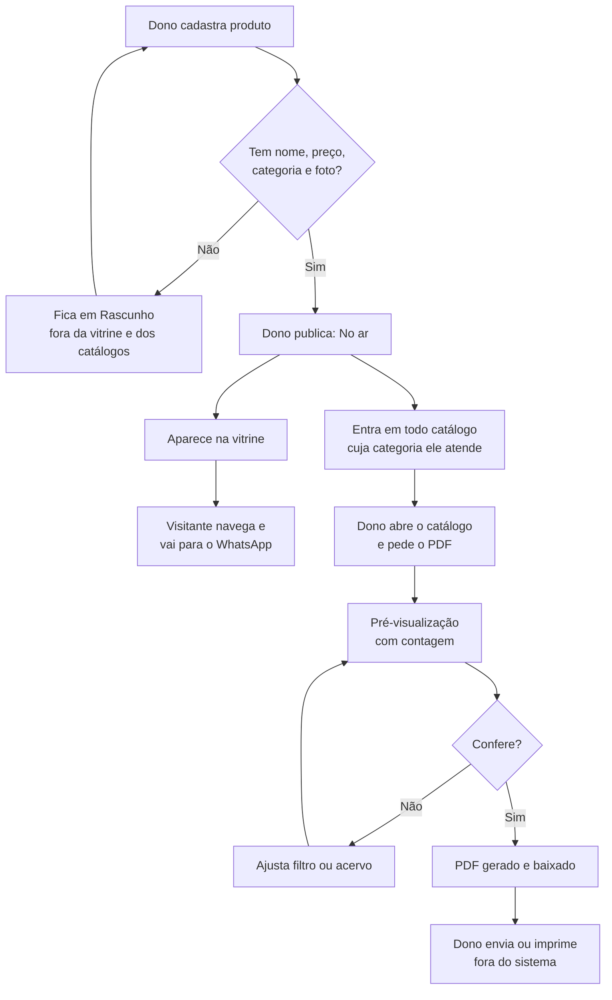
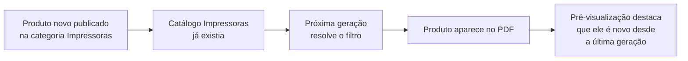
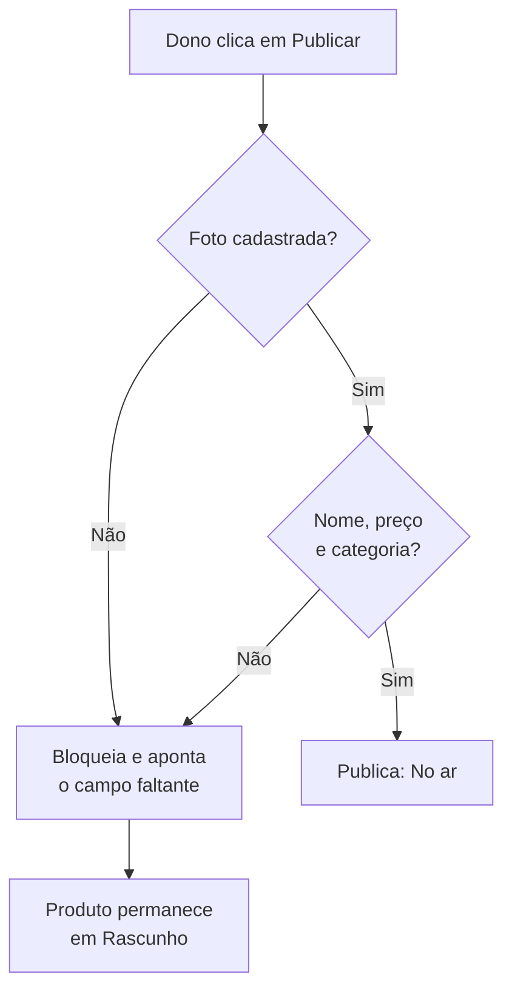
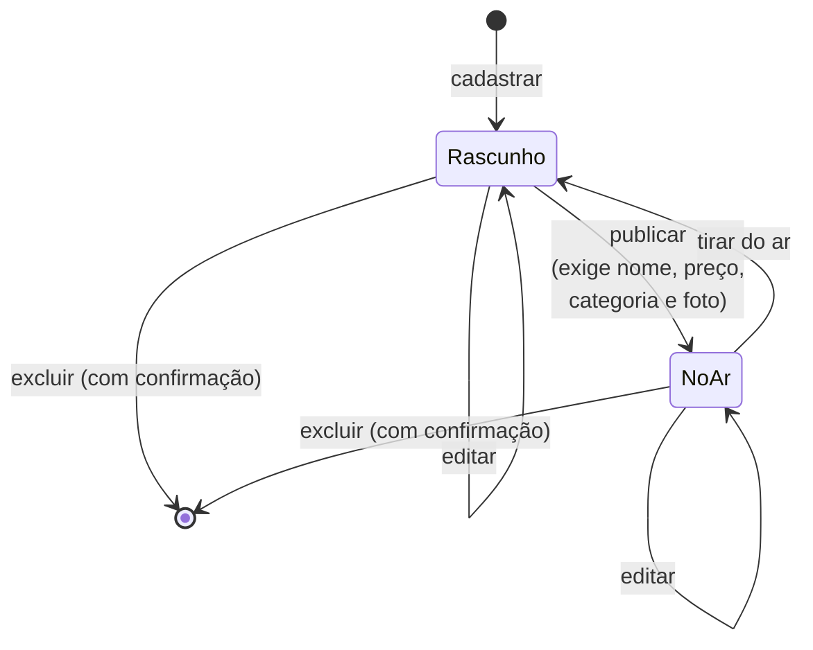
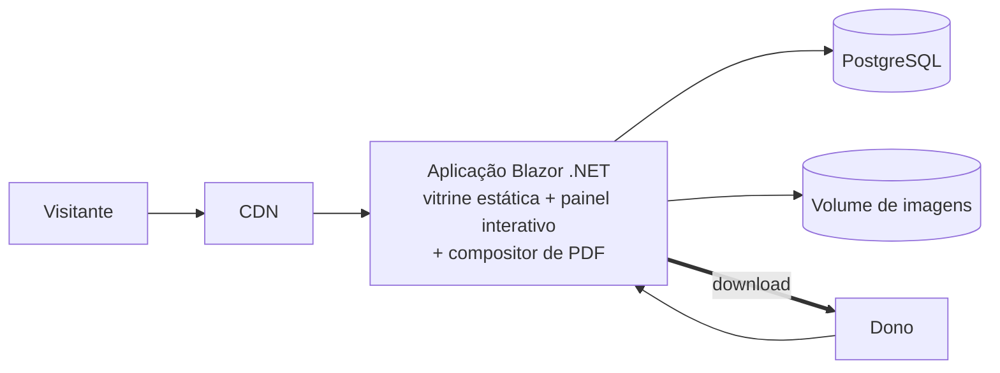

# PRD: Catálogo Virtual

**Cliente/Produto:** Distribuidora de suprimentos e informática (interno)
**Tipo:** Epic
**Autor:** Leanwork
**Data:** 2026-09-14
**Status:** Rascunho

---

## 1. Visão geral

Um sistema com **uma fonte de verdade e dois canais de saída**. O dono do catálogo cadastra seus produtos em um painel privado; a partir desse cadastro o sistema alimenta uma **vitrine pública** — um link que qualquer pessoa abre no celular, navega e usa para chegar ao WhatsApp — e permite **gerar catálogos em PDF** sob demanda, escolhendo categorias, para enviar ou imprimir.

O ponto que amarra tudo: o PDF e a vitrine nunca são cópias do cadastro, são projeções dele. Nada é montado à mão, nada envelhece sozinho.

## 2. Problema e contexto

**Problema:** o catálogo da empresa circula hoje como um PDF montado manualmente. Toda alteração de preço ou de linha de produto obriga a refazer o documento inteiro, reposicionar imagens e redistribuir o arquivo. O custo desse retrabalho faz com que a atualização seja adiada — e o material que chega ao cliente pode estar desatualizado sem nenhum sinal disso.

**Contexto atual:** existe um catálogo real em uso, com 6 páginas, 7 categorias e 36 produtos, analisado em [`../prototype/referencia-layout-pdf.md`](../prototype/referencia-layout-pdf.md). Ele é o gabarito visual do documento que o sistema deve produzir. Não há sistema, planilha estruturada ou ERP por trás — o PDF é o único artefato.

**Impacto de não fazer:** o gargalo permanece nos dois extremos. Quem mantém o material gasta horas de trabalho repetitivo a cada mudança de preço; quem recebe não tem como saber se o preço ainda vale, e não tem onde consultar sozinho sem pedir um arquivo a alguém.

## 3. Objetivo

Eliminar a montagem manual do catálogo, permitindo que o dono mantenha um cadastro único a partir do qual a vitrine pública e os catálogos em PDF sejam gerados sempre com a informação atual.

### Métricas de sucesso

- Tempo entre alterar um preço e o material refletir a mudança: de dias (refazer e redistribuir o PDF) para **minutos** na vitrine e para **a próxima geração** no PDF
- Montagem de um catálogo por categoria: de edição manual de documento para **seleção de categorias e um clique**
- Nenhum catálogo gerado pelo sistema contendo preço desatualizado

## 4. Escopo

### 4.1. Dentro do escopo

- Cadastro de produtos com nome, resumo, descrição, preço, rótulo de preço, categoria e foto
- Cadastro e ordenação de categorias
- Ordenação manual dos produtos dentro de cada categoria, válida para vitrine e PDF
- Ciclo de vida do produto entre **Rascunho** e **No ar**
- Vitrine pública anônima: listagem com busca e filtro por categoria, e página de detalhe do produto
- Contato por WhatsApp, telefone e e-mail a partir da vitrine
- Catálogos salvos como **filtro por categoria**, reutilizáveis
- Pré-visualização e geração de catálogo em PDF, com capa enviada pelo dono
- Tela de configurações: capa do PDF, dados de contato e troca de senha
- Autenticação do usuário único

### 4.2. Fora do escopo

- **Carrinho, pedido, pagamento e frete** — a conversão acontece no WhatsApp, fora do sistema
- **Controle e exibição de estoque** — nenhuma quantidade aparece na vitrine ou no PDF
- **Multiusuário, papéis e permissões** — há um único usuário, o dono
- **Envio pelo sistema** — o PDF é entregue ao dono, que distribui pelas ferramentas dele. Sem disparo de e-mail, integração com mensageria ou rastreamento de envio
- **Editor de layout** — o dono escolhe o que entra no catálogo e fornece a capa pronta, mas não diagrama as páginas de conteúdo
- **Índice de categorias no PDF** — não existe, consequência da capa vir pronta *(RN-38 revogada)*
- **Área logada para o consumidor** — sem cadastro, favoritos ou preço por cliente
- **Conteúdo fiscal e de compra pública** — sem NCM, dispensa de licitação ou cadastro de fornecedor
- **Integração com ERP ou sistema legado** — o cadastro nasce e vive no próprio sistema
- **Multi-catálogo / multi-lojista** — um único catálogo, de uma única empresa
- **Galeria de fotos** — uma foto por produto
- **Armazenamento dos PDFs gerados** — ver RN-35

> Os quatro primeiros itens merecem destaque porque o protótipo de referência do cliente exibe carrinho, estoque e conteúdo de compra pública. Foram descartados por decisão explícita e nenhuma regra deste documento os sustenta.

## 5. Personas e usuários impactados

| Persona | Papel | Como interage com a feature |
|---------|-------|----------------------------|
| **Proprietário** | Dono do catálogo — usuário único e autenticado | Cadastra e mantém produtos e categorias, define a ordem de exibição, monta catálogos por categoria, gera o PDF e o distribui pelos canais dele |
| **Visitante** | Público geral, anônimo, majoritariamente no celular | Abre o link divulgado, navega e filtra o catálogo, consulta a página do produto e prossegue o contato pelo WhatsApp |
| **Recebedor do PDF** | Cliente ou prospect que recebe o arquivo | Lê e imprime o catálogo. Não interage com o sistema — é destinatário do artefato |

## 6. Hierarquia de entrega

- **Epic:** Catálogo Virtual — cadastro único alimentando vitrine e catálogo impresso
  - **Feature 1:** Acervo de produtos e categorias
    - **PBI 1.1:** Cadastro de categorias com nome e ordenação manual
    - **PBI 1.2:** Cadastro de produtos com nome, resumo, descrição, preço e rótulo
    - **PBI 1.3:** Upload da foto do produto com geração das derivadas
    - **PBI 1.4:** Ciclo de vida Rascunho → No ar, com regras de publicação
    - **PBI 1.5:** Ordenação manual dos produtos dentro da categoria
    - **PBI 1.6:** Exclusão de produto e bloqueio de exclusão de categoria com produtos
  - **Feature 2:** Vitrine pública
    - **PBI 2.1:** Listagem com grade, busca por nome e filtro por categoria com contagem
    - **PBI 2.2:** Página de detalhe do produto
    - **PBI 2.3:** Contato por WhatsApp com mensagem pronta, telefone e e-mail
  - **Feature 3:** Catálogos e geração de PDF
    - **PBI 3.1:** Catálogo salvo como filtro por categoria
    - **PBI 3.2:** Pré-visualização do catálogo com contagem e aviso de itens novos
    - **PBI 3.3:** Composição do PDF reproduzindo o gabarito, com capa, índice e paginação
    - **PBI 3.4:** Geração com progresso e entrega do arquivo
  - **Feature 4:** Acesso e configurações
    - **PBI 4.1:** Autenticação do usuário único e proteção das rotas do painel
    - **PBI 4.2:** Tela de configurações com envio da capa do PDF e validação do arquivo
    - **PBI 4.3:** Dados de contato configuráveis, alimentando vitrine e rodapé do PDF
    - **PBI 4.4:** Troca da própria senha

> Esta é uma sugestão de quebra. O Product Owner pode reorganizar conforme prioridade.
>
> **Nota de sequenciamento:** a Feature 1 é pré-requisito real das outras três — sem acervo não há o que exibir nem o que imprimir. As Features 2 e 3 são independentes entre si e podem correr em paralelo. O PBI 4.1 é pré-requisito da Feature 1 em produção, mas não em desenvolvimento; já o **PBI 4.2 é pré-requisito da Feature 3**, porque sem capa configurada não há geração *(RN-65)*.

## 7. Fluxos

### 7.1. Fluxo principal — do cadastro ao material distribuído



O fluxo mostra a assimetria que rege o sistema: **publicar é o único ato que atravessa os dois canais**. Um produto que vai ao ar aparece na vitrine e passa a integrar catálogos existentes no mesmo instante, sem que ninguém precise editá-los.

### 7.2. Fluxo alternativo — produto entra em catálogo sem ação sobre ele



Este é o efeito colateral desejado da ADR-014 e, ao mesmo tempo, o principal risco de uso do sistema. A pré-visualização é a proteção: nenhuma geração acontece sem o dono ver a lista resolvida.

### 7.3. Fluxo de erro — publicação incompleta



A foto é condição de publicação porque a grade de três colunas — tanto no PDF quanto na vitrine — depende dela para não abrir buraco no layout.

## 8. Regras de negócio

### Produto — campos e conteúdo

- **RN-01:** O produto tem os campos: nome, resumo, descrição, preço, rótulo de preço, categoria, foto, posição e situação.
- **RN-02:** O **nome** é obrigatório e aparece em destaque na vitrine, na página de detalhe e na célula do PDF.
- **RN-03:** O **resumo** é opcional, tem limite de **120 caracteres** e é o texto exibido na célula do PDF e no card da listagem *(ADR-016)*. O limite foi fixado em T-04 a partir da medição do gabarito: o texto de produto do catálogo do cliente está em **11,2 pt**, o que acomoda cerca de 34 caracteres por linha na coluna de ~51 mm; em quatro linhas — o máximo observado —, o bloco inteiro comporta ~136 caracteres, dos quais um nome típico consome ~40.
- **RN-04:** Quando o resumo está vazio, a célula do PDF e o card exibem apenas nome e preço. Nada é herdado da descrição nem truncado automaticamente *(ADR-016)*.
- **RN-05:** A **descrição** é opcional, sem limite de comprimento, e é exibida **exclusivamente na página de detalhe** da vitrine. Não aparece no PDF nem na listagem *(ADR-016)*.
- **RN-06:** O **preço** é obrigatório, maior que zero, em reais, com duas casas decimais.
- **RN-07:** O **rótulo de preço** é obrigatório e escolhido de uma lista fechada: `PREÇO` (padrão) ou `PREÇO/UND`. É impresso acima do valor no PDF e exibido na página de detalhe.
- **RN-08:** Cada produto pertence a **exatamente uma** categoria.

### Produto — foto

- **RN-09:** Cada produto tem **uma única foto**. Não há galeria. Enviar uma nova foto substitui a anterior *(ADR-005)*.
- **RN-10:** No envio da foto, o sistema valida o **tipo real do arquivo** (não a extensão), o tamanho e as dimensões, rejeitando o que não for imagem válida.
- **RN-11:** A partir da foto enviada o sistema gera quatro derivadas: três em WebP para a tela (miniatura, cartão e ampliada) e uma em JPEG de **800 px** no lado maior para impressão *(ADR-005)*. O valor deixou de ser premissa em T-04: as fotos do gabarito ocupam **51,3 mm** de largura impressa, onde 800 px resultam em **396 DPI** — acima dos **177 a 267 DPI** que o catálogo em uso pelo cliente entrega hoje.
- **RN-12:** A derivada de impressão é consumida apenas pela geração do PDF e **nunca é exposta publicamente** *(ADR-005)*.
- **RN-13:** As derivadas recebem nomes imutáveis. Substituir a foto gera nomes novos, sem sobrescrever os anteriores *(ADR-005)*.

### Produto — ciclo de vida

- **RN-14:** Todo produto nasce na situação **Rascunho**.
- **RN-15:** Produto em Rascunho **não aparece na vitrine e não entra em nenhum catálogo**, mesmo que atenda ao filtro.
- **RN-16:** Para passar a **No ar**, o produto precisa ter nome, preço, categoria e foto preenchidos. Resumo e descrição não são exigidos *(RN-02, RN-06, RN-08, RN-09)*.
- **RN-17:** A tentativa de publicar um produto incompleto é bloqueada e o sistema indica quais campos faltam.
- **RN-18:** Produto No ar pode voltar a Rascunho a qualquer momento, saindo da vitrine e dos catálogos imediatamente.
- **RN-19:** Publicar um produto o insere, no mesmo instante, em todos os catálogos salvos cuja categoria ele atende, sem nenhuma ação sobre esses catálogos *(ADR-014)*.

### Produto — exclusão e ordenação

- **RN-20:** A exclusão de produto é **definitiva** e exige confirmação explícita. Remove o registro, a foto original e todas as derivadas.
- **RN-21:** Cada produto tem uma **posição** dentro da sua categoria, definida manualmente pelo dono *(ADR-015)*.
- **RN-22:** A posição do produto vale simultaneamente para a ordem no PDF e para a ordenação padrão da vitrine. Não existe ordem específica por catálogo *(ADR-015)*.

### Categoria

- **RN-23:** A categoria tem nome e posição. O nome é obrigatório e **único**.
- **RN-24:** A posição da categoria define a ordem de exibição na vitrine e a **numeração impressa** no PDF *(ADR-015)*.
- **RN-25:** A exclusão de categoria é **bloqueada enquanto houver qualquer produto associado a ela**, em qualquer situação. O sistema informa quantos produtos impedem a exclusão.
- **RN-25.1:** A exclusão de categoria também é **bloqueada enquanto ela integrar algum catálogo salvo**, ainda que a categoria esteja vazia. O sistema nomeia os catálogos que a utilizam. Isso impede que um catálogo fique sem critério resolvível *(RN-28)*.

### Catálogo salvo

- **RN-26:** Um catálogo é composto por **nome** e **uma ou mais categorias**. Nenhum outro critério de filtro existe *(ADR-014)*.
- **RN-27:** O nome do catálogo é obrigatório e único.
- **RN-28:** O catálogo exige pelo menos uma categoria selecionada. Para abranger o acervo inteiro, todas as categorias são selecionadas.
- **RN-29:** **A lista de produtos de um catálogo nunca é persistida.** Salva-se apenas o nome e as categorias escolhidas *(ADR-014)*.
- **RN-30:** Os produtos de um catálogo são resolvidos **no momento da geração**, considerando apenas os que estão No ar *(ADR-014, RN-15)*.
- **RN-31:** A geração do PDF é **obrigatoriamente precedida de pré-visualização**, exibindo a lista resolvida, a contagem de produtos e o número estimado de páginas *(ADR-014)*.
- **RN-32:** A pré-visualização destaca os produtos que passaram a integrar o catálogo **desde a última geração**.
- **RN-33:** O sistema registra a data da última geração de cada catálogo.
- **RN-34:** Excluir um catálogo não afeta produto algum — remove apenas o filtro salvo.

### Catálogo em PDF

- **RN-35:** O arquivo PDF **não é armazenado pelo sistema**. É composto em memória, entregue como download e descartado *(ADR-014)*.
- **RN-36:** O documento é a concatenação de duas partes: a **capa enviada pelo dono** *(RN-62)* e as **páginas de conteúdo compostas pelo sistema** — grade de três colunas, cabeçalho e rodapé repetidos com numeração *(ADR-012, ADR-017)*.
- **RN-37:** O conteúdo da capa é definido inteiramente pelo arquivo que o dono envia. O sistema não escreve nada sobre ela *(ADR-017)*.
- ~~**RN-38:** A capa exibe um índice das categorias presentes no catálogo gerado.~~ **Revogada em 2026-09-14** *(ADR-017)*: com a capa fornecida como arquivo pronto, o sistema não tem como escrever o índice dentro dela, e gerar uma página de índice separada foi descartado. **O documento não tem índice.** Número não reutilizado.
- **RN-39:** A numeração das categorias é **posicional dentro do catálogo gerado**: um catálogo com duas categorias as numera `01` e `02`, independentemente da posição global delas *(ADR-015)*.
- **RN-40:** A ordem das categorias no documento segue a posição global definida no cadastro *(RN-24)*; a ordem dos produtos dentro de cada categoria segue a posição do produto *(RN-21)*.
- **RN-40.1:** A numeração de página impressa no rodapé conta a capa como primeira página, de modo que o número exibido corresponda à posição real da folha no documento.
- **RN-41:** As categorias fluem continuamente: uma página pode conter o fim de uma categoria e o início de outra, e uma categoria pode atravessar páginas sem repetir o título.
- **RN-42:** A célula de um produto **nunca é dividida entre duas páginas** *(ADR-012)*.
- **RN-43:** Cada célula exibe foto, nome, resumo (quando houver) e o par rótulo + preço *(RN-04, RN-07)*.
- **RN-44:** A geração é **síncrona**, com indicação de progresso, e uma de cada vez *(ADR-013)*.
- **RN-45:** Existe um **teto de produtos por catálogo**, validado antes de iniciar a composição. Ultrapassado o teto, a geração é recusada com mensagem explicando o limite *(ADR-013)*.
- **RN-46:** Catálogo cujo filtro não resolve nenhum produto No ar não gera PDF; o sistema informa que não há itens.

### Configurações do portal

- **RN-61:** O painel tem uma tela de **Configurações**, acessível ao usuário autenticado, que reúne o que o dono pode mudar sem depender de nova versão do sistema.
- **RN-62:** A capa do catálogo em PDF é um **arquivo enviado pelo dono** nessa tela. Enviar uma nova substitui a anterior *(ADR-017)*.
- **RN-63:** O arquivo de capa deve ser um PDF com **exatamente uma página**. Arquivo com mais ou menos páginas é recusado, informando quantas foram encontradas.
- **RN-64:** O arquivo de capa deve estar em **orientação retrato**, com proporção compatível com as páginas de conteúdo. Divergência é recusada no envio, não descoberta na geração.
- **RN-65:** **Sem capa configurada, a geração de PDF é recusada**, informando que a capa precisa ser enviada nas Configurações *(ADR-017)*.
- **RN-66:** A tela de Configurações permite ao dono **trocar a própria senha**, informando a senha atual e a nova. É o único caminho de troca previsto no sistema *(RN-59)*.
- **RN-67:** Os **dados de contato** — WhatsApp, telefone e e-mail — são definidos nas Configurações. Alimentam tanto a vitrine *(RN-54)* quanto o rodapé das páginas de conteúdo do PDF, em um único lugar.
- **RN-68:** Alterar os dados de contato reflete na vitrine imediatamente e no próximo PDF gerado.

### Vitrine pública

- **RN-47:** A vitrine é **totalmente anônima**. Não há login, cadastro, carrinho, pedido ou exibição de estoque *(ADR-010)*.
- **RN-48:** A listagem exibe apenas produtos **No ar** *(RN-15)*.
- **RN-49:** A listagem oferece busca por texto, tolerante a acentuação, que procura **exclusivamente no nome do produto** *(ADR-004)*. Resumo e descrição não são pesquisáveis.
- **RN-50:** A listagem oferece filtro por categoria, exibindo **a contagem de produtos de cada uma**.
- **RN-51:** A ordenação padrão da listagem segue a posição global de categoria e produto *(RN-22, RN-24)*.
- **RN-52:** A listagem é paginada.
- **RN-53:** A página de detalhe exibe foto, categoria, nome, descrição completa, rótulo e preço *(RN-05)*.
- **RN-54:** A página de detalhe oferece contato por **WhatsApp, telefone e e-mail**, com os dados vindos das Configurações *(RN-67)*.
- **RN-55:** O contato por WhatsApp abre a conversa com **mensagem pronta contendo o nome do produto**.
- **RN-56:** Todo estado de navegação da vitrine — busca, categoria e página — é representado na URL, de modo que qualquer listagem seja compartilhável por link *(ADR-010)*.

### Acesso

- **RN-57:** O sistema tem **um único usuário**, o dono do catálogo. Não há registro público, convite, papéis ou perfis *(ADR-006)*.
- **RN-58:** Todas as rotas do painel exigem autenticação. Todas as rotas da vitrine são anônimas *(ADR-010)*.
- **RN-59:** Não há recuperação de senha pelo sistema. A redefinição é procedimento operacional com acesso ao servidor *(ADR-006)*.
- **RN-60:** O sistema aplica política de bloqueio por tentativas sucessivas de autenticação malsucedidas *(ADR-006)*.

## 9. Critérios de aceite

```gherkin
Funcionalidade: Cadastro e publicação de produto

  Cenário [CA-01]: Publicar produto completo
    Dado que existe a categoria "Impressoras" (RN-23)
    E que cadastrei o produto "Impressora EPSON L3250" com preço R$ 1.470,00,
      rótulo "PREÇO", categoria "Impressoras" e uma foto (RN-02, RN-06, RN-07, RN-09)
    Quando eu publicar o produto
    Então a situação do produto passa a ser "No ar" (RN-16)
    E o produto aparece na listagem da vitrine (RN-48)

  Cenário [CA-02]: Bloquear publicação de produto sem foto
    Dado que cadastrei um produto com nome, preço e categoria preenchidos
    E que o produto não tem foto (RN-09)
    Quando eu tentar publicar o produto
    Então a publicação é recusada (RN-17)
    E o sistema indica que a foto é obrigatória para publicar (RN-16)
    E o produto permanece em "Rascunho" (RN-14)

  Cenário [CA-03]: Produto em rascunho não aparece em lugar nenhum
    Dado que o produto "SSD ALLTEK 512GB" está em "Rascunho"
    E que existe um catálogo salvo com a categoria desse produto
    Quando um visitante abrir a vitrine
    Então o produto não aparece na listagem (RN-15)
    E quando eu pré-visualizar aquele catálogo
    Então o produto não consta da lista resolvida (RN-30)

  Cenário [CA-04]: Publicar produto sem resumo
    Dado que cadastrei um produto completo com o campo resumo vazio (RN-03)
    Quando eu publicar o produto
    E gerar um catálogo que o contenha
    Então a célula do PDF exibe apenas nome e preço (RN-04)
    E nenhum texto é herdado da descrição (RN-04)

  Cenário [CA-05]: Descrição longa não vaza para o PDF
    Dado que um produto No ar tem descrição com mais de mil caracteres (RN-05)
    E que seu resumo é "Core i5, 16GB, SSD 512GB" (RN-03)
    Quando eu gerar um catálogo que o contenha
    Então a célula do PDF exibe o resumo, e não a descrição (RN-05)
    E quando um visitante abrir a página de detalhe do produto
    Então a descrição completa é exibida integralmente (RN-53)

  Cenário [CA-06]: Rejeitar arquivo que não é imagem
    Dado que estou editando um produto
    Quando eu enviar como foto um arquivo cuja extensão é ".jpg"
      mas cujo conteúdo não é uma imagem (RN-10)
    Então o envio é recusado
    E nenhuma derivada é gerada (RN-11)

  Cenário [CA-07]: Substituir a foto de um produto
    Dado que o produto "Monitor VXPro 19" tem foto cadastrada
    Quando eu enviar uma nova foto (RN-09)
    Então as quatro derivadas são geradas com nomes novos (RN-11, RN-13)
    E a foto anterior deixa de ser exibida na vitrine

  Cenário [CA-08]: Excluir produto definitivamente
    Dado que o produto "Cabo HDMI Ugreen" existe no acervo
    Quando eu solicitar a exclusão
    E confirmar a operação (RN-20)
    Então o produto é removido do acervo
    E a foto e todas as derivadas são removidas (RN-20)

Funcionalidade: Ordenação do acervo

  Cenário [CA-09]: Ordem do produto vale na vitrine e no PDF
    Dado que a categoria "Impressoras" tem os produtos A, B e C nessa ordem (RN-21)
    Quando eu mover o produto C para a primeira posição
    Então a listagem da vitrine passa a exibir C, A, B (RN-51)
    E o próximo PDF gerado imprime C, A, B na seção "Impressoras" (RN-40)

  Cenário [CA-10]: Numeração das categorias é posicional no recorte
    Dado que as categorias globais são, em ordem: Impressoras (1ª),
      Energia (2ª), Tintas (3ª), Redes (6ª) (RN-24)
    E que existe um catálogo salvo apenas com "Tintas" e "Redes" (RN-26)
    Quando eu gerar o PDF desse catálogo
    Então "Tintas" é impressa como "01" e "Redes" como "02" (RN-39)
    E nenhuma página de índice é produzida (RN-38 revogada)

  Cenário [CA-11]: Bloquear exclusão de categoria com produtos
    Dado que a categoria "Redes & Cabeamento" tem 5 produtos associados
    Quando eu tentar excluir a categoria
    Então a exclusão é recusada (RN-25)
    E o sistema informa quantos produtos impedem a operação (RN-25)

  Cenário [CA-32]: Bloquear exclusão de categoria vazia usada por um catálogo
    Dado que a categoria "Softwares & Licenças" não tem nenhum produto
    E que ela integra o catálogo salvo "Informática" (RN-26)
    Quando eu tentar excluir a categoria
    Então a exclusão é recusada (RN-25.1)
    E o sistema nomeia o catálogo "Informática" como impedimento (RN-25.1)

  Cenário [CA-33]: Buscar não encontra texto que está só na descrição
    Dado que existe o produto No ar "Notebook VAIO FE16"
    E que sua descrição contém a palavra "antirreflexo" (RN-05)
    E que nem o nome nem o resumo contêm essa palavra
    Quando um visitante buscar por "antirreflexo" (RN-49)
    Então o produto não consta dos resultados (RN-49)
```

```gherkin
Funcionalidade: Catálogo salvo e geração do PDF

  Cenário [CA-12]: Salvar um catálogo por categoria
    Dado que estou montando um catálogo
    Quando eu informar o nome "Consumíveis" e selecionar as categorias
      "Tintas & Suprimentos" e "Redes & Cabeamento" (RN-26)
    E salvar
    Então o catálogo é gravado com o nome e as duas categorias (RN-26)
    E nenhuma lista de produtos é gravada (RN-29)

  Cenário [CA-13]: Recusar catálogo sem categoria
    Dado que estou montando um catálogo
    Quando eu informar o nome mas não selecionar nenhuma categoria
    E tentar salvar
    Então o salvamento é recusado (RN-28)

  Cenário [CA-14]: Produto novo entra em catálogo existente sem ação sobre ele
    Dado que existe o catálogo "Impressoras" salvo há um mês (RN-26)
    E que ele foi gerado pela última vez em 01/09/2026 (RN-33)
    Quando eu publicar um novo produto na categoria "Impressoras" (RN-19)
    E abrir a pré-visualização do catálogo "Impressoras"
    Então o novo produto consta da lista resolvida (RN-30)
    E ele é destacado como incluído desde a última geração (RN-32)

  Cenário [CA-15]: Preço alterado aparece na geração seguinte
    Dado que o catálogo "Impressoras" foi gerado com um produto a R$ 1.050,00
    Quando eu alterar o preço desse produto para R$ 1.120,00 (RN-06)
    E gerar o PDF do mesmo catálogo novamente
    Então o documento traz R$ 1.120,00 (RN-30)
    E nenhum ajuste no catálogo salvo foi necessário (RN-29)

  Cenário [CA-16]: Pré-visualização precede a geração
    Dado que abri um catálogo salvo
    Quando eu solicitar a geração do PDF
    Então o sistema exibe a lista resolvida com a contagem de produtos
      e a estimativa de páginas antes de compor o documento (RN-31)

  Cenário [CA-17]: Gerar o PDF e receber o arquivo
    Dado que confirmei a pré-visualização de um catálogo com 18 produtos
    Quando a composição terminar
    Então o arquivo é entregue para download (RN-35)
    E o sistema registra a data desta geração (RN-33)
    E nenhum arquivo PDF permanece armazenado no servidor (RN-35)

  Cenário [CA-18]: Recusar catálogo sem produtos publicados
    Dado que todos os produtos das categorias de um catálogo estão em "Rascunho"
    Quando eu solicitar a geração do PDF
    Então a geração é recusada (RN-46)
    E o sistema informa que não há itens para o catálogo (RN-46)

  Cenário [CA-19]: Recusar catálogo acima do teto de itens
    Dado que um catálogo resolve mais produtos do que o teto permitido (RN-45)
    Quando eu solicitar a geração do PDF
    Então a geração é recusada antes de iniciar a composição (RN-45)
    E o sistema informa o limite e a quantidade resolvida (RN-45)

  Cenário [CA-20]: Excluir catálogo não afeta o acervo
    Dado que existe o catálogo "Consumíveis" com produtos resolvidos
    Quando eu excluir o catálogo
    Então o filtro salvo é removido
    E todos os produtos permanecem inalterados no acervo (RN-34)

Funcionalidade: Vitrine pública

  Cenário [CA-21]: Visitante consulta o catálogo sem identificação
    Dado que sou um visitante anônimo
    Quando eu abrir o link da vitrine
    Então a listagem de produtos No ar é exibida (RN-47, RN-48)
    E nenhum login, carrinho ou informação de estoque é apresentado (RN-47)

  Cenário [CA-22]: Buscar produto ignorando acentuação
    Dado que existe o produto No ar "Placa-Mãe Gigabyte A520M K V2"
    Quando um visitante buscar por "placa mae" (RN-49)
    Então o produto consta dos resultados (RN-49)

  Cenário [CA-23]: Filtrar por categoria com contagem
    Dado que a categoria "Periféricos & Acessórios" tem 11 produtos No ar
    Quando um visitante abrir o filtro de categorias
    Então "Periféricos & Acessórios" é exibida com a contagem 11 (RN-50)
    E ao selecioná-la, somente produtos dessa categoria são listados (RN-50)

  Cenário [CA-24]: Compartilhar uma listagem filtrada por link
    Dado que um visitante filtrou por "Impressoras" e está na página 2 (RN-52)
    Quando ele copiar a URL e abri-la em outro dispositivo
    Então a mesma listagem filtrada, na mesma página, é exibida (RN-56)

  Cenário [CA-25]: Ir do produto para o WhatsApp com mensagem pronta
    Dado que um visitante está na página do produto "Notebook VAIO FE16" (RN-53)
    Quando ele acionar o contato por WhatsApp
    Então a conversa é aberta com mensagem pré-preenchida
      contendo o nome do produto (RN-55)

Funcionalidade: Acesso ao painel

  Cenário [CA-26]: Bloquear acesso anônimo ao painel
    Dado que não estou autenticado
    Quando eu tentar abrir qualquer rota do painel
    Então o acesso é negado e a tela de autenticação é apresentada (RN-58)

  Cenário [CA-27]: Bloquear após tentativas malsucedidas
    Dado que informei a senha incorreta sucessivas vezes (RN-60)
    Quando eu tentar autenticar novamente
    Então o acesso é temporariamente bloqueado (RN-60)
```

```gherkin
Funcionalidade: Regras estruturais

  Cenário [CA-28]: Derivada de impressão não é acessível publicamente
    Dado que um produto No ar teve sua foto processada em quatro derivadas (RN-11)
    Quando alguém tentar acessar diretamente a derivada de impressão
      pela mesma origem que serve as imagens da vitrine
    Então o acesso é negado (RN-12)
    E as três derivadas de tela permanecem acessíveis (RN-11)

  Cenário [CA-29]: Tirar produto do ar
    Dado que o produto "Teclado Kross Elegance" está No ar
    E que ele consta de um catálogo salvo
    Quando eu alterar sua situação para "Rascunho" (RN-18)
    Então ele deixa de aparecer na listagem da vitrine (RN-15)
    E deixa de constar da pré-visualização daquele catálogo (RN-30)

  Cenário [CA-30]: Célula de produto não se divide entre páginas
    Dado que um catálogo resolve produtos suficientes para ultrapassar
      o fim de uma página durante a composição
    Quando o PDF for gerado
    Então nenhuma célula de produto aparece partida entre duas páginas (RN-42)
    E o produto que não coube é impresso inteiro na página seguinte (RN-42)

  Cenário [CA-31]: Contato por telefone e e-mail na página do produto
    Dado que um visitante está na página de detalhe de um produto
    Quando ele consultar as opções de contato
    Então telefone e e-mail estão disponíveis além do WhatsApp (RN-54)
```

```gherkin
Funcionalidade: Configurações do portal

  Cenário [CA-34]: Enviar a capa do catálogo
    Dado que estou na tela de Configurações (RN-61)
    Quando eu enviar um PDF de uma única página, em retrato (RN-63, RN-64)
    Então o arquivo é aceito e passa a ser a capa dos catálogos gerados (RN-62)

  Cenário [CA-35]: Recusar capa com número errado de páginas
    Dado que estou na tela de Configurações
    Quando eu enviar um PDF com três páginas (RN-63)
    Então o envio é recusado
    E o sistema informa quantas páginas foram encontradas (RN-63)

  Cenário [CA-36]: Bloquear geração sem capa configurada
    Dado que nenhuma capa foi enviada nas Configurações (RN-62)
    E que existe um catálogo salvo com produtos No ar
    Quando eu solicitar a geração do PDF
    Então a geração é recusada (RN-65)
    E o sistema orienta a enviar a capa nas Configurações (RN-65)

  Cenário [CA-37]: Capa entra no documento sem ser alterada
    Dado que enviei uma capa nas Configurações (RN-62)
    Quando eu gerar o PDF de um catálogo
    Então a primeira página do documento é exatamente a capa enviada (RN-37)
    E nenhuma página de índice existe (RN-38 revogada)
    E as páginas de produtos vêm em seguida (RN-36)

  Cenário [CA-38]: Contato configurado alimenta os dois canais
    Dado que alterei o telefone nas Configurações (RN-67)
    Quando um visitante abrir a página de um produto
    Então o novo telefone é exibido (RN-68)
    E quando eu gerar um PDF
    Então o rodapé das páginas de conteúdo traz o novo telefone (RN-67)

  Cenário [CA-39]: Trocar a própria senha
    Dado que estou autenticado no painel
    Quando eu informar a senha atual e uma nova senha (RN-66)
    Então a senha é alterada
    E a senha anterior deixa de dar acesso (RN-66)
```

> **Cobertura:** as regras RN-01, RN-08, RN-27, RN-36, RN-41, RN-43, RN-57 e RN-59 não têm cenário próprio por serem declarativas — definem estrutura de dados, layout fixo ou unicidade, e são verificadas por inspeção, não por comportamento observável. Todas as demais regras têm ao menos um critério de aceite associado.

## 10. Permissionamento

| Ação | Perfis autorizados | Observação |
|------|-------------------|------------|
| Navegar na vitrine, buscar, filtrar e ver detalhe | Qualquer visitante, anônimo | Sem login em nenhuma hipótese *(RN-47)* |
| Cadastrar, editar, publicar e excluir produto | Dono do catálogo | Usuário único autenticado *(RN-57)* |
| Cadastrar, ordenar e excluir categoria | Dono do catálogo | Exclusão condicionada a não haver produtos *(RN-25)* |
| Criar, editar e excluir catálogo salvo | Dono do catálogo | — |
| Gerar e baixar o PDF | Dono do catálogo | Não há geração pública do documento |

> Não há matriz de perfis porque não há perfis: a autorização é binária — estar autenticado ou não *(ADR-006)*.

## 11. Integrações e dados

### 11.1. Sistemas envolvidos

Nenhum. O sistema não integra com ERP, gateway de pagamento, serviço de e-mail transacional ou mensageria. Os contatos da vitrine (WhatsApp, telefone, e-mail) são **links de saída** — abrem o aplicativo do visitante, sem que o sistema participe da conversa nem registre o contato.

### 11.2. Dados consumidos

Apenas os próprios. O cadastro nasce e vive no sistema; não há importação de planilha nem sincronização com fonte externa.

### 11.3. Dados produzidos / persistidos

| Entidade | Conteúdo | Observação |
|---|---|---|
| **Categoria** | nome, posição | Nome único *(RN-23)* |
| **Produto** | nome, resumo, descrição, preço, rótulo, categoria, posição, situação, referências das derivadas de imagem | Uma foto por produto *(RN-09)* |
| **Catálogo** | nome, categorias selecionadas, data da última geração | **Sem lista de produtos** *(RN-29)* |
| **Configuração** | referência ao arquivo de capa, dados de contato | Registro único, do portal |
| **Usuário** | credencial do dono | Registro único *(RN-57)* |
| **Arquivos de imagem** | original + quatro derivadas por produto | Em volume de disco, fora do banco *(ADR-005)* |
| **Arquivo de capa** | PDF de uma página, enviado pelo dono | Em volume de disco. Único, substituído a cada envio *(RN-62)* |

O PDF gerado **não é uma entidade persistida** *(RN-35)*.

### 11.4. Eventos

Não há eventos, filas ou mensageria. A única propagação relevante é síncrona: uma escrita no painel invalida o cache da vitrine *(ADR-008)*.

## 12. Diagrama de estados



O ciclo tem apenas dois estados, e a transição para **No ar** é a única com pré-condições *(RN-16)*. É também a única com efeito fora do produto: publicar o torna visível na vitrine e o insere em todos os catálogos cuja categoria ele atende *(RN-19)*.

## 13. Arquitetura técnica



Detalhe completo, com as 15 ADRs e os diagramas C4, em [`../architecture/proposta-arquitetural.md`](../architecture/proposta-arquitetural.md). Este PRD não decide arquitetura — apenas referencia as decisões já tomadas.

## 14. Restrições e premissas

### Restrições

- **Stack:** desenvolvimento exclusivamente em .NET, interface em Blazor *(restrição do time)*
- **Custo:** infraestrutura em camada gratuita, sem serviços gerenciados pagos e sem licença de software
- **Tamanho do arquivo:** o PDF precisa ser leve o bastante para envio por WhatsApp — o catálogo de referência pesa 7,3 MB para 36 produtos
- **Layout do PDF:** segue o gabarito fornecido pelo cliente, sem liberdade de diagramação

### Premissas

> ⚠️ **Premissa:** o índice de categorias é exibido na capa em toda geração, inclusive em catálogos de categoria única. Não foi levantado caso em que ele deva ser omitido.

> ⚠️ **Premissa:** o documento não tem contracapa nem página final — encerra na última linha de produtos, como o gabarito.

> ⚠️ **Premissa:** o teto de produtos por catálogo *(RN-45)* será definido por medição durante a construção, e não por escolha de negócio. A proposta arquitetural prevê a calibração no piloto *(ADR-013)*.

> ⚠️ **Premissa:** o limite de comprimento do resumo *(RN-03)* será definido a partir do espaço real da célula na grade de três colunas, aferido no piloto de impressão.

> ⚠️ **Premissa:** um produto No ar sempre tem foto, por força da RN-16. A perda posterior do arquivo de imagem é tratada como **incidente de infraestrutura**, não como estado de produto — recupera-se do backup. Nenhuma tela, nem o documento impresso, prevê produto publicado sem foto. Decidido em 2026-09-14.

## 15. Riscos e dependências

| Tipo | Descrição | Mitigação / Plano |
|------|-----------|-------------------|
| Risco | **Produto entra em catálogo sem o dono perceber.** Consequência direta de RN-19: publicar insere o item em todo catálogo cuja categoria ele atende | Pré-visualização obrigatória com contagem *(RN-31)* e destaque dos itens novos desde a última geração *(RN-32)*. O estado Rascunho *(RN-14)* é a barreira de entrada |
| Risco | **Escopo migrar para e-commerce durante a construção.** O protótipo de referência do cliente exibe carrinho, estoque e conteúdo de compra pública | Não-objetivos explícitos na seção 4.2, com nota apontando nominalmente os elementos descartados |
| Risco | **PDF grande demais para WhatsApp.** O gabarito pesa 7,3 MB para 36 produtos e o peso cresce com o acervo | Derivada de impressão dimensionada pela área real na página, não pela resolução máxima *(RN-11)*. Medir o tamanho final no piloto |
| Risco | **Resumo e descrição divergirem com o tempo.** São dois textos independentes sobre o mesmo produto *(RN-03, RN-05)* | Exibir os dois lado a lado na tela de edição. Nenhuma validação automática é possível — é disciplina de cadastro |
| Risco | **Cadastro travado pela exigência de foto.** RN-16 impede publicar sem foto, o que pode atrasar a entrada de produtos novos | O estado Rascunho permite cadastrar tudo e publicar depois. Se virar atrito real, a regra é revisável |
| Risco | **Exclusão definitiva de produto é irreversível** *(RN-20)* | Confirmação explícita antes de executar. Backup diário do banco e do volume de imagens cobre o erro percebido tarde |
| Risco | **Nenhum registro do que foi enviado a um cliente.** Nem o PDF nem a lista de itens são guardados *(RN-29, RN-35)* | Deixar explícito na interface, no momento do download, que aquele arquivo é o único registro |
| Dependência | **Definição do limite de comprimento do resumo** *(RN-03)* | Depende do piloto de impressão. Bloqueia a validação do campo, não o cadastro |
| Dependência | **Definição do teto de itens por catálogo** *(RN-45)* | Depende da medição de tempo e memória de geração |
| Dependência | **Conteúdo fixo da capa** *(RN-37)* | O texto institucional, os selos e os diferenciais precisam ser confirmados com o cliente antes de irem para o código |

## 16. Questões em aberto

- [ ] Qual o limite de comprimento do resumo, em caracteres? — *responsável: definido no piloto de impressão*
- [ ] Qual o teto de produtos por catálogo? — *responsável: definido na medição de geração*
- [ ] O texto institucional da capa é exatamente o do gabarito, ou muda? — *responsável: cliente*
- [ ] A lista fechada do rótulo de preço tem apenas `PREÇO` e `PREÇO/UND`, ou há outros casos no acervo real? — *responsável: cliente*
- [ ] A vitrine terá tema escuro? O protótipo assume que não — decisão que muda o trabalho de frontend — *responsável: cliente*
- [ ] O que acontece com um catálogo salvo quando a única categoria dele é excluída? A RN-25 bloqueia a exclusão enquanto houver produtos, mas uma categoria vazia pode ser excluída e deixar um catálogo órfão — *responsável: a definir antes da Feature 3*
- [x] ~~Divergência com o protótipo da vitrine sobre filtro por faixa de preço e por marca~~ — **decidido em 2026-09-14**: a vitrine oferece apenas busca por nome e filtro por categoria. Não haverá faixa de preço nem campo marca. Os controles correspondentes do protótipo de referência foram descartados *(RN-49, RN-50)*

## 17. Referências

- [`../architecture/proposta-arquitetural.md`](../architecture/proposta-arquitetural.md) — proposta arquitetural v0.5, com as 15 ADRs referenciadas neste documento
- [`../prototype/referencia-layout-pdf.md`](../prototype/referencia-layout-pdf.md) — análise do gabarito do catálogo impresso
- [`../prototype/assets/referencia-catalogo.pdf`](../prototype/assets/referencia-catalogo.pdf) — catálogo real do cliente, gabarito do documento a ser gerado
- [`../prototype/SPEC-UI-001-catalogo-virtual.md`](../prototype/SPEC-UI-001-catalogo-virtual.md) — especificação de interface, com as 9 telas mapeadas contra as regras e cenários deste documento
- [`../prototype/prototipos/painel.html`](../prototype/prototipos/painel.html) — protótipo navegável do painel
- [`../prototype/prototipos/vitrine.html`](../prototype/prototipos/vitrine.html) — protótipo da vitrine, listagem e detalhe
