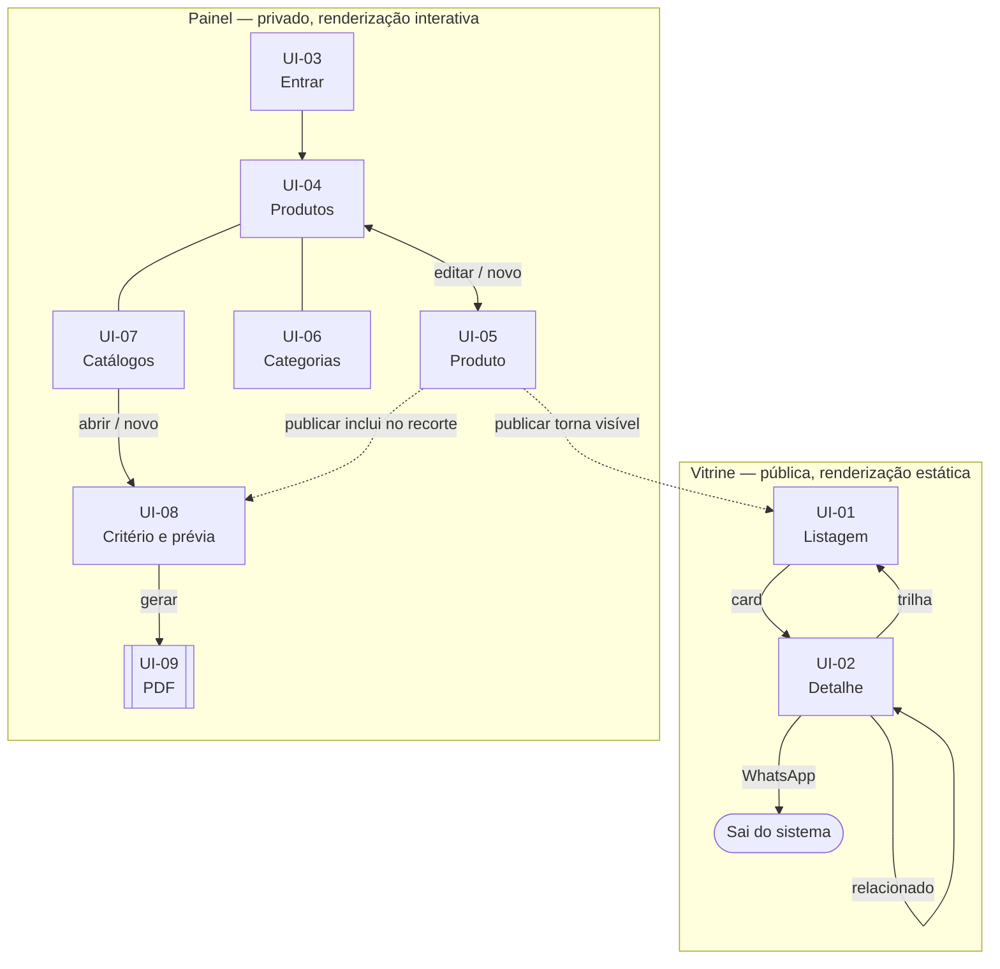

# SPEC-UI-001: Catálogo Virtual

> **PRD de referência:** [`../prds/PRD-001-catalogo-virtual.md`](../prds/PRD-001-catalogo-virtual.md)
> **Arquitetura de referência:** [`../architecture/proposta-arquitetural.md`](../architecture/proposta-arquitetural.md)
> **Modo:** Híbrido
> **Artefatos visuais:**
>
> | Artefato | Arquivo |
> |---|---|
> | Vitrine — UI-01 e UI-02 | [`prototipos/vitrine.html`](prototipos/vitrine.html) |
> | Acesso — UI-03 | [`prototipos/login.html`](prototipos/login.html) |
> | Painel — UI-04 a UI-08 | [`prototipos/painel.html`](prototipos/painel.html) |
> | Documento impresso — UI-09 | [`assets/referencia-catalogo.pdf`](assets/referencia-catalogo.pdf) |
>
> Os três HTML são autocontidos: abrem direto no navegador com duplo clique, sem build, sem servidor e sem dependência externa além das fontes.
>
> A listagem original do cliente (canvas de design com dois artboards) **não** está no repositório: serviu de referência estrutural para UI-01 e foi substituída pelo protótipo alinhado ao PRD.
>
> **Fidelidade:** Alta fidelidade em todas as telas navegáveis; gabarito real no documento impresso
> **Autor:** Leanwork
> **Data:** 2026-09-14
> **Status:** Rascunho

---

## 1. Contexto de interface

**Arquétipo:** duas interfaces distintas no mesmo sistema — **site de catálogo** (público, anônimo, consumo) e **ferramenta interna** (privada, um único operador, manutenção). O documento em PDF é uma terceira saída visual, não interativa.

**Dispositivo alvo:**

| Área | Alvo | Razão |
|---|---|---|
| Vitrine | **Mobile-first**, responsiva | O tráfego vem de link divulgado em rede social, consumido no celular *(PRD seção 2.4)* |
| Painel | **Desktop-first** | Uso de manutenção, em rajadas, por um operador sentado *(PRD seção 2.4)* |
| Documento | Retrato A4 | Gabarito do cliente |

**Stack de frontend:** Blazor Web App em .NET 10, com **modo de renderização definido por área** *(ADR-010)*:

- **Vitrine — renderização estática no servidor.** Sem interatividade no cliente, sem conexão persistente. Toda troca de filtro, busca ou página é uma navegação. Isso restringe o que pode ser especificado: **não existe estado de carregamento no cliente**, e nenhum controle reage sem ida ao servidor
- **Painel — renderização interativa no servidor.** Circuito persistente, com progresso em tempo real e formulários sem recarga

> A distinção acima não é detalhe de implementação: ela **determina quais estados podem existir** em cada tela. Um skeleton de carregamento na vitrine seria especificação impossível de cumprir sem revogar a ADR-010.

**Origem das informações deste documento:**

| Fonte | O que veio dela |
|---|---|
| Protótipo do painel | UI-04 a UI-08: layout, campos, ordenação, prévia, geração e os estados de rascunho, sem foto e itens novos |
| Protótipo do acesso | UI-03: tela completa e os quatro estados |
| Protótipo da vitrine | UI-01 e UI-02: grade, filtro com contagem, paginação, composição do detalhe, bloco de preço, contatos, e os estados de vazio, busca sem resultado, resumo vazio e produto sem foto |
| Protótipo original do cliente | UI-01: estrutura de referência — grade, busca, filtro por categoria com contagem, paginação, rodapé de contato. **Descartados dele**: carrinho, quantidade, estoque, NCM, preço por embalagem e dispensa de licitação *(PRD 4.2)* |
| Gabarito impresso | UI-09: capa, índice, grade de três colunas, cabeçalho, rodapé e numeração |
| PRD | Os estados de erro e validação de UI-05 e UI-06 |
| Arquitetura | Modo de renderização por área, ausência de tema escuro, restrição de imagem |

---

## 2. Tokens de design

Extraídos do protótipo original do cliente e adotados nos demais.

| Token | Valor | Origem |
|---|---|---|
| Fundo | `#f3efe6` | Protótipo do cliente (`--bg`) |
| Superfície | `#fbf9f4` | Protótipo do cliente (`--panel`) |
| Superfície alternativa | `#f7f3ea` | Protótipo do cliente (`--panel-2`) |
| Texto principal | `#0d1b2a` | Protótipo do cliente (`--ink`) |
| Texto secundário | `#6b6759` | Protótipo do cliente (`--muted`) |
| Linha | `#d8d2c5` | Protótipo do cliente (`--border`) |
| Marca / estrutura | `#0c2a4a` | Protótipo do cliente (`--navy`) |
| Ação primária | `oklch(0.62 0.16 38)` ≈ `#c25f37` | Protótipo do cliente (`--accent`) |
| Sucesso / No ar | `oklch(0.55 0.13 148)` ≈ `#3d7d52` | Protótipo do cliente (`--ok`) |
| Atenção / Rascunho | `oklch(0.72 0.15 75)` | Protótipo do cliente (`--warn`) |
| Erro | `oklch(0.55 0.18 25)` | Protótipo do cliente (`--danger`) |
| Fonte de interface | Archivo | Adotada nos protótipos do painel e detalhe |
| Fonte de texto | IBM Plex Sans | Protótipo do cliente |
| Fonte de dados | IBM Plex Mono | Protótipo do cliente — usada em preços, códigos e contagens |
| Raio de borda | 2 / 4 / 6 / 10 px | Protótipo do cliente |

> **Cor semântica é separada da cor de marca.** O navy identifica o sistema; verde, âmbar e vermelho comunicam apenas estado (No ar, Rascunho, erro) e não devem ser usados decorativamente.

> **Não há tema escuro.** O protótipo do cliente é de tema único, e a decisão foi mantida. Consta como questão em aberto no PRD.

---

## 3. Inventário de telas

| ID | Tela | Rota | Persona | Implementa (RN) | Valida (CA) | Origem |
|---|---|---|---|---|---|---|
| UI-01 | Listagem da vitrine | `/` | Visitante | RN-47, RN-48, RN-49, RN-50, RN-51, RN-52, RN-56 | CA-21, CA-22, CA-23, CA-24, CA-33 | Protótipo alinhado ao PRD |
| UI-02 | Detalhe do produto | `/produto/{id}` | Visitante | RN-02, RN-05, RN-07, RN-53, RN-54, RN-55 | CA-05, CA-25, CA-31 | Protótipo |
| UI-03 | Autenticação | `/painel/entrar` | Dono | RN-57, RN-58, RN-59, RN-60 | CA-26, CA-27 | Protótipo |
| UI-04 | Produtos — lista | `/painel/produtos` | Dono | RN-15, RN-21, RN-22, RN-51 | CA-03, CA-09, CA-29 | Protótipo |
| UI-05 | Produto — cadastro e edição | `/painel/produtos/{id}` | Dono | RN-02 a RN-20 | CA-01, CA-02, CA-04, CA-06, CA-07, CA-08, CA-29 | Protótipo |
| UI-06 | Categorias | `/painel/categorias` | Dono | RN-23, RN-24, RN-25, RN-25.1 | CA-10, CA-11, CA-32 | Protótipo |
| UI-07 | Catálogos — lista | `/painel/catalogos` | Dono | RN-26, RN-33, RN-34 | CA-20 | Protótipo |
| UI-08 | Catálogo — critério, prévia e geração | `/painel/catalogos/{id}` | Dono | RN-26 a RN-32, RN-44, RN-45, RN-46 | CA-12 a CA-19 | Protótipo |
| UI-09 | Documento impresso | *(arquivo gerado)* | Recebedor do PDF | RN-36, RN-37, RN-39 a RN-43 | CA-10, CA-30, CA-37 | Gabarito do cliente |
| UI-10 | Configurações do portal | `/painel/configuracoes` | Dono | RN-61 a RN-68 | CA-34, CA-35, CA-38, CA-39 | **Derivada do PRD** |

> **UI-09 não é tela navegável.** Entra no inventário porque tem layout especificado, estados e regras próprias, e porque o plano e o review precisam de um identificador para referenciá-lo. Não tem rota, persona interativa nem estados de erro.

---

## 4. Telas em detalhe

### UI-01 — Listagem da vitrine

**Propósito:** o visitante encontra o produto que procura, sozinho, sem falar com ninguém.

**Rota:** `/` — com busca, categoria e página na URL *(RN-56)*

**Persona:** Visitante, anônimo, majoritariamente no celular

**Regras que se manifestam:**

| Regra | Como aparece na tela |
|---|---|
| RN-48 | Produtos em Rascunho simplesmente não constam da grade — sem marcação, sem espaço reservado |
| RN-49 | Campo de busca no cabeçalho; busca por "placa mae" encontra "Placa-Mãe". **Procura só no nome** — o placeholder do campo não deve prometer mais do que isso |
| RN-50 | Lista de categorias com a contagem de produtos ao lado de cada uma |
| RN-51 | Sem seleção de ordenação pelo usuário: a ordem é a curadoria do dono |
| RN-52 | Paginação numerada ao fim da grade |
| RN-56 | Busca, categoria e página vivem na URL — a listagem é compartilhável por link |

**Estados:**

| Estado | ID | Quando ocorre | O que o visitante vê | Origem |
|---|---|---|---|---|
| Padrão | `UI-01.default` | Há produtos No ar | Grade de cards com foto, categoria, nome, resumo e preço com rótulo | Protótipo |
| Filtrado | `UI-01.filtrado` | Categoria selecionada | Grade restrita, categoria ativa destacada e chip removível | Protótipo |
| Busca sem resultado | `UI-01.buscaSemResultado` | Termo não encontra nada | "Nenhum produto encontrado para *termo*" e caminho de volta ao catálogo completo | Protótipo |
| Vazio | `UI-01.vazio` | Nenhum produto No ar no sistema | Mensagem neutra, sem sugerir erro, com saída para o contato. Estado de primeiro uso | Protótipo |

> **Não há estado de carregamento nem de erro de rede nesta tela.** A renderização é estática no servidor *(ADR-010)*: ou a página chega pronta, ou o navegador exibe seu próprio erro de conexão. Especificar skeleton aqui seria impossível de cumprir.

**Elementos principais:**

- Cabeçalho com marca, busca e acesso ao contato
- Filtro de categorias com contagem — em coluna no desktop, em faixa rolável no celular
- Grade de cards — cada card leva ao detalhe
- Paginação numerada
- Rodapé com WhatsApp, telefone e e-mail

**Navegação:**

- Card → `UI-02`
- Categoria → `UI-01.filtrado` (nova URL)
- Contato do rodapé → sai do sistema

**Observações:** o protótipo original do cliente trazia nesta tela filtro por faixa de preço e por marca. Ambos foram **descartados** por decisão de 2026-09-14 — ver lacuna 1, resolvida. O campo de busca precisa deixar claro, pelo texto de exemplo, que procura apenas no nome: prometer busca ampla e entregar busca por nome é pior que anunciar o escopo real.

---

### UI-02 — Detalhe do produto

**Propósito:** dar ao visitante o que ele precisa para decidir, e levá-lo ao contato.

**Rota:** `/produto/{id}`

**Persona:** Visitante

**Regras que se manifestam:**

| Regra | Como aparece na tela |
|---|---|
| RN-05 | A descrição completa aparece **apenas aqui** — é o único lugar do sistema onde o texto longo é exibido |
| RN-07 | O rótulo (`PREÇO` ou `PREÇO/UND`) é exibido acima do valor, não embutido nele |
| RN-53 | Foto, categoria, nome, descrição, rótulo e preço |
| RN-54 | WhatsApp, telefone e e-mail disponíveis |
| RN-55 | O WhatsApp abre com mensagem pronta contendo o nome do produto |

**Estados:**

| Estado | ID | Quando ocorre | O que o visitante vê | Origem |
|---|---|---|---|---|
| Padrão | `UI-02.default` | Produto No ar com descrição | Foto, nome, descrição completa, preço e contatos | Protótipo |
| Sem descrição | `UI-02.semDescricao` | Descrição vazia | Exibe o resumo no lugar; sem resumo, uma linha neutra informando a ausência | Protótipo |
| Não encontrado | `UI-02.naoEncontrado` | Id inexistente, ou produto em Rascunho *(RN-15)* | Página de não encontrado com caminho de volta ao catálogo | **Derivado do PRD** |

> `UI-02.naoEncontrado` é obrigatório e fácil de esquecer: **um produto despublicado deixa de existir para a vitrine**, e links já compartilhados continuam sendo abertos.

**Elementos principais:**

- Trilha de navegação — Catálogo › Categoria › Produto
- Foto única, grande *(RN-09)*
- Bloco de preço com rótulo
- Botão de WhatsApp em destaque, com telefone e e-mail ao lado
- Produtos da mesma categoria ao final — cada card exibe **resumo**, não descrição

**Navegação:**

- Trilha → `UI-01` ou `UI-01.filtrado`
- Produto relacionado → `UI-02` do outro produto
- Contato → sai do sistema

**Observações:** a mensagem pronta do WhatsApp *(RN-55)* é o único texto do sistema que mistura conteúdo do catálogo com copy fixa. Vale tratá-la como template com um único ponto de substituição.

---

### UI-03 — Autenticação

**Propósito:** dar acesso ao painel ao único usuário do sistema.

**Rota:** `/painel/entrar`

**Persona:** Dono do catálogo

**Regras que se manifestam:**

| Regra | Como aparece na tela |
|---|---|
| RN-57 | Sem link de "criar conta" — não há registro público |
| RN-59 | Sem link de "esqueci minha senha"; em seu lugar, nota explicando que a troca exige acesso ao servidor |
| RN-60 | Após tentativas sucessivas malsucedidas, o acesso é bloqueado temporariamente, com o tempo restante informado |

**Estados:**

| Estado | ID | Quando ocorre | O que o usuário vê | Origem |
|---|---|---|---|---|
| Padrão | `UI-03.default` | Acesso não autenticado | Campos de credencial e botão de entrar | Protótipo |
| Credencial inválida | `UI-03.erroCredencial` | Usuário ou senha incorretos | Mensagem genérica, sem revelar qual campo falhou; ambos os campos marcados | Protótipo |
| Bloqueado | `UI-03.bloqueado` | Tentativas excedidas *(RN-60)* | Aviso com tempo restante; campos e botão desabilitados | Protótipo |
| Enviando | `UI-03.enviando` | Verificação em andamento | Botão em espera e campos travados, impedindo envio duplicado | Protótipo |

**Elementos principais:**

- Painel de apresentação à esquerda, com a marca e o que se faz no sistema — some no celular
- Formulário com usuário, senha e ação de entrar
- Nota fixa sobre redefinição de senha, no lugar onde normalmente ficaria o link de recuperação

**Observações:** duas decisões desta tela são deliberadas e fáceis de reverter por engano na implementação.

A **mensagem de erro é genérica** — "usuário ou senha incorretos" — e não diz qual dos dois falhou. Distinguir entregaria metade da credencial a quem tenta adivinhar.

A **ausência de "esqueci minha senha"** *(ADR-006)* vai surpreender quem esquecer a senha. Por isso a nota ocupa exatamente o lugar onde o link estaria: sem ela, o usuário fica preso sem entender por quê.

---

### UI-04 — Produtos, lista

**Propósito:** ver o acervo inteiro, encontrar um produto e definir a ordem em que ele aparece.

**Rota:** `/painel/produtos`

**Persona:** Dono

**Regras que se manifestam:**

| Regra | Como aparece na tela |
|---|---|
| RN-15 | Produtos em Rascunho aparecem aqui — e **só aqui** — com marcação visual distinta |
| RN-21 | Controles de reposicionamento em cada linha |
| RN-22 | A ordem é única: a tela avisa que reposicionar afeta vitrine e PDF ao mesmo tempo |
| RN-51 | Agrupamento por categoria, na ordem global, com a numeração posicional visível |

**Estados:**

| Estado | ID | Quando ocorre | O que o dono vê | Origem |
|---|---|---|---|---|
| Padrão | `UI-04.default` | Há produtos | Lista agrupada por categoria, com faixa de cabeçalho por grupo | Protótipo |
| Vazio | `UI-04.vazio` | Acervo sem nenhum produto | Chamada para cadastrar o primeiro produto | **Derivado do PRD** |
| Busca sem resultado | `UI-04.buscaSemResultado` | Filtro do painel não encontra nada | Mensagem e caminho para limpar o filtro | **Derivado do PRD** |

**Elementos principais:**

- Faixa de categoria com número posicional, nome e contagem
- Linha de produto: controles de ordem, miniatura, nome, resumo, situação, preço com rótulo, ação de editar
- Miniatura ausente aparece como marcador de falta, não como espaço vazio
- Filtro por situação — todos, No ar, rascunhos

**Navegação:** linha ou "Novo produto" → `UI-05`

**Observações:** os controles de ordem são **setas**, decidido em 2026-09-14 (lacuna 4, resolvida). Arrastar foi descartado por exigir regra para movimentação entre categorias e tratamento próprio de acessibilidade por teclado.

---

### UI-05 — Produto, cadastro e edição

**Propósito:** o formulário onde o produto ganha conteúdo e vai ao ar.

**Rota:** `/painel/produtos/{id}` — apresentado como painel lateral sobre a lista

**Persona:** Dono

**Regras que se manifestam:**

| Regra | Como aparece na tela |
|---|---|
| RN-02, RN-06, RN-08 | Campos obrigatórios marcados |
| RN-03, RN-04 | Resumo com limite de caracteres e aviso de que alimenta PDF e card |
| RN-05 | Descrição sem limite, com aviso de que aparece só no detalhe |
| RN-07 | Rótulo como seleção de lista fechada |
| RN-09 | Um único campo de foto; com foto presente, a ação é "Trocar foto" |
| RN-11 | As quatro derivadas são listadas após o envio |
| RN-16, RN-17 | **A opção "No ar" fica indisponível enquanto faltar campo obrigatório**, com a razão declarada |
| RN-20 | Excluir exige confirmação explícita |

**Estados:**

| Estado | ID | Quando ocorre | O que o dono vê | Origem |
|---|---|---|---|---|
| Novo | `UI-05.novo` | Cadastro em branco | Campos vazios; situação fixa em Rascunho | Protótipo |
| Edição | `UI-05.edicao` | Produto existente | Campos preenchidos | Protótipo |
| Publicação bloqueada | `UI-05.publicacaoBloqueada` | Falta campo obrigatório *(RN-16)* | "No ar" desabilitado e mensagem nomeando o que falta | Protótipo |
| Erro de validação | `UI-05.erroValidacao` | Salvar com campo inválido | Erro junto ao campo, não em faixa no topo | **Derivado do PRD** |
| Enviando foto | `UI-05.enviandoFoto` | Upload e processamento | Progresso; salvar indisponível até terminar | **Derivado do PRD** |
| Erro no upload | `UI-05.erroUpload` | Arquivo inválido *(RN-10)* | Motivo da recusa; foto anterior preservada | **Derivado do PRD** |
| Confirmar exclusão | `UI-05.confirmarExclusao` | Ação de excluir *(RN-20)* | Confirmação que declara ser irreversível e que a foto será removida | **Derivado do PRD** |

**Elementos principais:**

- Três campos de texto com destino declarado *(ADR-016)* — nome, resumo, descrição
- Preço e rótulo lado a lado
- Categoria em seleção única
- Área de foto com as derivadas listadas
- Situação como alternador de dois estados
- Salvar, cancelar e excluir

**Observações:** os três campos de texto são a parte mais sujeita a erro de uso do sistema inteiro. A tela precisa deixar claro **onde cada um aparece** — sem isso, o dono escreverá a especificação completa no resumo e quebrará a grade do PDF.

---

### UI-06 — Categorias

**Propósito:** manter as categorias e a ordem que define a numeração impressa.

**Rota:** `/painel/categorias`

**Persona:** Dono

**Regras que se manifestam:**

| Regra | Como aparece na tela |
|---|---|
| RN-23 | Nome obrigatório e único; nome repetido é recusado |
| RN-24 | Setas de reposicionamento; a numeração `01`…`NN` é exibida ao lado de cada categoria |
| RN-25 | Excluir é recusado quando há produtos, informando quantos |
| RN-25.1 | Excluir é recusado quando algum catálogo usa a categoria, **mesmo vazia**, nomeando os catálogos |

**Estados:**

| Estado | ID | Quando ocorre | O que o dono vê | Origem |
|---|---|---|---|---|
| Padrão | `UI-06.default` | Há categorias | Lista ordenável com número, nome e contagem | Protótipo |
| Vazio | `UI-06.vazio` | Nenhuma categoria | Chamada para criar a primeira — pré-requisito de qualquer produto | **Derivado do PRD** |
| Bloqueada por produtos | `UI-06.bloqueadaPorProdutos` | Excluir categoria com produtos *(RN-25)* | Recusa nomeando a quantidade e o caminho para resolver | **Derivado do PRD** |
| Bloqueada por catálogo | `UI-06.bloqueadaPorCatalogo` | Excluir categoria vazia usada por catálogo *(RN-25.1)* | Recusa nomeando os catálogos que dependem dela | **Derivado do PRD** |
| Nome duplicado | `UI-06.nomeDuplicado` | Nome já existe *(RN-23)* | Erro junto ao campo | **Derivado do PRD** |

> Os dois estados de bloqueio são separados de propósito: a causa é diferente e a saída também. Com produtos, o dono move ou exclui os itens; com catálogo, ele ajusta o catálogo. Uma mensagem única para os dois casos deixaria o usuário sem saber o que fazer.

**Observações:** a numeração exibida aqui é a **global**. Em um catálogo parcial ela é recalculada *(RN-39)* — a tela deve dizer isso, ou o dono vai estranhar ver "Tintas" como `03` aqui e `01` no PDF.

---

### UI-07 — Catálogos, lista

**Propósito:** ver os recortes salvos e quando cada um foi gerado pela última vez.

**Rota:** `/painel/catalogos`

**Persona:** Dono

**Regras que se manifestam:**

| Regra | Como aparece na tela |
|---|---|
| RN-26 | Cada catálogo exibe as categorias que o compõem |
| RN-33 | Data da última geração, ou indicação de que nunca foi gerado |
| RN-34 | Excluir catálogo declara que nenhum produto é afetado |

**Estados:**

| Estado | ID | Quando ocorre | O que o dono vê | Origem |
|---|---|---|---|---|
| Padrão | `UI-07.default` | Há catálogos | Cartões com nome, categorias, contagem atual e última geração | Protótipo |
| Vazio | `UI-07.vazio` | Nenhum catálogo | Chamada para criar o primeiro | **Derivado do PRD** |
| Nunca gerado | `UI-07.nuncaGerado` | Catálogo salvo sem geração | O cartão marca a ausência em vez de exibir data | Protótipo |

**Observações:** a contagem no cartão é **resolvida na hora da exibição** *(RN-30)* e pode mudar entre duas visitas sem ninguém ter mexido no catálogo. É comportamento correto e contraintuitivo — a tela deve deixar claro que o número é de agora.

---

### UI-08 — Catálogo: critério, prévia e geração

> A tela mais importante do sistema. É onde a ADR-014 se materializa e onde o dono tem sua única chance de ver o que vai sair antes de sair.

**Propósito:** definir o recorte, conferir o resultado e gerar o documento.

**Rota:** `/painel/catalogos/{id}`

**Persona:** Dono

**Regras que se manifestam:**

| Regra | Como aparece na tela |
|---|---|
| RN-26, RN-28 | Seleção de categorias; salvar indisponível sem ao menos uma |
| RN-27 | Nome obrigatório e único |
| RN-29 | A tela declara que salva o critério, e não a lista |
| RN-30 | A prévia é recalculada a cada mudança de critério |
| RN-31 | **A prévia precede a geração, sempre** — não há caminho que pule esta etapa |
| RN-32 | Produtos incluídos desde a última geração são destacados |
| RN-39 | A prévia mostra a numeração posicional que sairá no PDF |
| RN-44 | Progresso durante a composição |
| RN-45, RN-46 | Recusa antes de compor, quando acima do teto ou sem itens |

**Estados:**

| Estado | ID | Quando ocorre | O que o dono vê | Origem |
|---|---|---|---|---|
| Padrão | `UI-08.default` | Critério válido com resultado | Critério à esquerda, prévia e contagem à direita | Protótipo |
| Sem categoria | `UI-08.semCategoria` | Nenhuma categoria marcada *(RN-28)* | Salvar e gerar indisponíveis; prévia substituída por orientação | Protótipo |
| Com itens novos | `UI-08.comItensNovos` | Há produtos incluídos desde a última geração *(RN-32)* | Aviso destacado e marcação item a item na prévia | Protótipo |
| Prévia vazia | `UI-08.previaVazia` | Nenhum produto No ar atende ao critério *(RN-46)* | Gerar indisponível, com a razão — inclui o caso de todos estarem em Rascunho | **Derivado do PRD** |
| Acima do teto | `UI-08.acimaDoTeto` | Resultado excede o limite *(RN-45)* | Gerar indisponível, informando limite e quantidade resolvida | **Derivado do PRD** |
| Gerando | `UI-08.gerando` | Composição em andamento *(RN-44)* | Progresso item a item e etapa corrente | Protótipo |
| Concluído | `UI-08.concluido` | Documento pronto | Nome do arquivo, tamanho e ação de baixar | Protótipo |
| Erro na geração | `UI-08.erroGeracao` | Falha durante a composição | Mensagem e possibilidade de repetir; nada parcial é entregue | **Derivado do PRD** |

**Elementos principais:**

- Nome do catálogo
- Seleção de categorias com contagem de produtos No ar em cada uma
- Contagem total, número de categorias e estimativa de páginas
- Prévia agrupada por categoria, na ordem e numeração de impressão
- Ação de gerar, com aviso de que o arquivo não fica salvo *(RN-35)*

**Observações:** o aviso de que o arquivo não é armazenado precisa aparecer **no momento do download**, e não só na tela de critério. É a única oportunidade de informar que aquele arquivo é o único registro daquele envio.

---

### UI-09 — Documento impresso

> Não é tela navegável. Especificado aqui porque tem layout, regras e regiões que o plano e o review precisam referenciar.

**Propósito:** o material que o cliente recebe, lê e imprime.

**Formato:** retrato A4, conforme gabarito

**Persona:** Recebedor do PDF

**Regras que se manifestam:**

| Regra | Como aparece no documento |
|---|---|
| RN-37 | Capa com conteúdo fixo, não editável |
| RN-38, RN-39 | Índice das categorias presentes, numeradas posicionalmente |
| RN-40 | Categorias na ordem global; produtos na ordem do cadastro |
| RN-41 | Categorias em fluxo contínuo, sem quebra forçada |
| RN-42 | Célula de produto nunca dividida entre páginas |
| RN-43 | Cada célula: foto, nome, resumo quando houver, rótulo e preço |
| RN-04 | Sem resumo, a célula mostra apenas nome e preço |

**Regiões:**

| Região | ID | Conteúdo | Origem |
|---|---|---|---|
| Capa | `UI-09.capa` | Título, texto institucional, selos, diferenciais, índice e contato | Gabarito |
| Conteúdo | `UI-09.conteudo` | Faixa de categoria, grade de três colunas, cabeçalho e rodapé com numeração | Gabarito |

**Observações:** o gabarito não tem contracapa nem página final, e nenhum produto sem foto — os dois pontos constam como premissa e lacuna. Medidas exatas de tipografia e espaçamento **não estão neste documento**: precisam ser extraídas do arquivo original na implementação.

---

### UI-10 — Configurações do portal

> **Tela derivada do PRD.** Não foi prototipada.

**Propósito:** reunir o que o dono pode mudar sem depender de uma nova versão do sistema.

**Rota:** `/painel/configuracoes`

**Persona:** Dono

**Regras que se manifestam:**

| Regra | Como aparece na tela |
|---|---|
| RN-62 | Área de envio da capa, com pré-visualização da página atual e ação de substituir |
| RN-63 | Arquivo com número de páginas diferente de um é recusado, informando quantas foram encontradas |
| RN-64 | Arquivo fora de retrato ou com proporção incompatível é recusado no envio |
| RN-66 | Campos de senha atual e nova senha |
| RN-67 | Campos de WhatsApp, telefone e e-mail, com aviso de que alimentam a vitrine **e** o rodapé do PDF |

**Estados:**

| Estado | ID | Quando ocorre | O que o dono vê | Origem |
|---|---|---|---|---|
| Padrão | `UI-10.default` | Configuração completa | Capa atual em miniatura, contatos preenchidos, seção de senha | Derivado do PRD |
| Sem capa | `UI-10.semCapa` | Nenhuma capa enviada ainda | Área de envio em destaque, avisando que **sem capa não há geração** *(RN-65)* | Derivado do PRD |
| Capa recusada | `UI-10.capaRecusada` | Arquivo inválido *(RN-63, RN-64)* | Motivo exato — número de páginas encontrado, ou orientação incompatível. A capa anterior permanece | Derivado do PRD |
| Enviando | `UI-10.enviando` | Envio e validação em andamento | Progresso; ações bloqueadas | Derivado do PRD |
| Senha incorreta | `UI-10.senhaIncorreta` | Senha atual errada na troca *(RN-66)* | Erro junto ao campo; a senha não é alterada | Derivado do PRD |
| Salvo | `UI-10.salvo` | Alteração persistida | Confirmação discreta, sem tirar o dono da tela | Derivado do PRD |

**Elementos principais:**

- Área de envio da capa, com miniatura da página atual
- Campos de contato, agrupados, com o aviso de que servem aos dois canais
- Seção de troca de senha, separada visualmente do resto

**Observações:** `UI-10.semCapa` **não é um estado decorativo**. Ele é a única pista que o dono tem de que a geração de PDF está bloqueada *(RN-65)* — sem esse aviso, ele só descobre ao tentar gerar, em UI-08, e não saberá por quê.

A pré-visualização da capa atual importa mais do que parece: é o que permite conferir que o arquivo certo foi enviado, sem precisar gerar um catálogo para descobrir.

---

## 5. Componentes reutilizáveis

| Componente | Usado em | Descrição | Estados |
|---|---|---|---|
| `MiniaturaProduto` | UI-01, UI-02, UI-04, UI-05, UI-09 | Imagem do produto na derivada adequada ao contexto | comFoto, semFoto |
| `BlocoPreco` | UI-01, UI-02, UI-04, UI-09 | Rótulo *(RN-07)* acima do valor em reais, alinhado por dígito | default |
| `PilulaSituacao` | UI-04, UI-05 | Indicador de Rascunho ou No ar | rascunho, noAr |
| `ControleOrdem` | UI-04, UI-06 | Setas de reposicionamento dentro do grupo | default, noTopo, noFim |
| `FaixaCategoria` | UI-04, UI-08, UI-09 | Número posicional, nome e contagem | default |
| `SeletorCategorias` | UI-08 | Seleção múltipla com contagem por categoria | default, nenhumaSelecionada |
| `CardProduto` | UI-01, UI-02 *(relacionados)* | Foto, nome, resumo e preço | default, semFoto |
| `ContatosVitrine` | UI-01 *(rodapé)*, UI-02 | WhatsApp, telefone e e-mail | default, comMensagemPronta |
| `ConfirmacaoDestrutiva` | UI-05, UI-06, UI-07 | Confirmação de ação irreversível | default, processando |

> `MiniaturaProduto` aparece em cinco lugares consumindo **derivadas diferentes** da mesma foto *(RN-11)*: miniatura no painel, cartão na listagem, ampliada no detalhe e JPEG de impressão no documento. É um componente com seleção de derivada, não quatro componentes.

---

## 6. Fluxo de navegação

As duas setas tracejadas são a regra mais importante do sistema *(RN-19)*: **publicar um produto tem efeito em duas telas que o dono não está olhando.** É por isso que a prévia de UI-08 é obrigatória.

---

## 7. Cobertura do PRD

### Regras de negócio

| RN | Manifesta em | Status |
|---|---|---|
| RN-02, RN-03, RN-06, RN-07, RN-08 | UI-05 | ✅ Coberta |
| RN-04 | UI-05, UI-09 (`.conteudo`), UI-01 | ✅ Coberta |
| RN-05 | UI-05, UI-02 (`.default`, `.semDescricao`) | ✅ Coberta |
| RN-09, RN-10 | UI-05 (`.enviandoFoto`, `.erroUpload`) | ✅ Coberta |
| RN-14, RN-16, RN-17, RN-18, RN-20 | UI-05 (`.publicacaoBloqueada`, `.confirmarExclusao`) | ✅ Coberta |
| RN-15 | UI-01, UI-02 (`.naoEncontrado`), UI-04, UI-08 (`.previaVazia`) | ✅ Coberta |
| RN-21, RN-22 | UI-04 | ✅ Coberta |
| RN-23, RN-24, RN-25, RN-25.1 | UI-06 (`.bloqueadaPorProdutos`, `.bloqueadaPorCatalogo`) | ✅ Coberta |
| RN-26, RN-27, RN-28 | UI-08 (`.semCategoria`) | ✅ Coberta |
| RN-31, RN-32 | UI-08 (`.default`, `.comItensNovos`) | ✅ Coberta |
| RN-33, RN-34 | UI-07 | ✅ Coberta |
| RN-37 a RN-43 | UI-09 | ✅ Coberta |
| RN-44, RN-45, RN-46 | UI-08 (`.gerando`, `.acimaDoTeto`, `.previaVazia`) | ✅ Coberta |
| RN-47 a RN-56 | UI-01, UI-02 | ✅ Coberta |
| RN-57, RN-59, RN-60 | UI-03 | ✅ Coberta |
| RN-01 | — | ⚠️ Estrutura de dados, sem manifestação direta |
| RN-11, RN-12, RN-13 | UI-05 *(parcial — lista as derivadas)* | ⚠️ Processamento de imagem; RN-12 é regra de servidor, sem tela |
| RN-19 | UI-05 → UI-01, UI-08 | ⚠️ Efeito entre telas, não elemento de tela. Visível apenas pela consequência |
| RN-29, RN-30, RN-35 | UI-07, UI-08 *(declarado em texto)* | ⚠️ Regras de persistência; a tela apenas comunica |
| RN-36 | UI-09 | ✅ Coberta |
| RN-58 | UI-03 | ⚠️ Proteção de rota; a tela é a consequência, não a regra |

**Nenhuma regra de interface ficou sem manifestação.** As marcadas com ⚠️ são de dados, servidor ou efeito colateral, e estão declaradas como tal.

### Cenários Gherkin

| CA | Acontece em | Status |
|---|---|---|
| CA-01 | UI-05 → UI-01 | ✅ Coberto |
| CA-02 | UI-05 (`.publicacaoBloqueada`) | ✅ Coberto |
| CA-03 | UI-01, UI-08 | ✅ Coberto |
| CA-04 | UI-05, UI-09 (`.conteudo`) | ✅ Coberto |
| CA-05 | UI-05, UI-02, UI-09 | ✅ Coberto |
| CA-06 | UI-05 (`.erroUpload`) | ✅ Coberto |
| CA-07 | UI-05 (`.enviandoFoto`) | ✅ Coberto |
| CA-08 | UI-05 (`.confirmarExclusao`) | ✅ Coberto |
| CA-09 | UI-04 → UI-01, UI-09 | ✅ Coberto |
| CA-10 | UI-08 *(prévia)*, UI-09 (`.capa`) | ✅ Coberto |
| CA-11 | UI-06 (`.bloqueadaPorProdutos`) | ✅ Coberto |
| CA-32 | UI-06 (`.bloqueadaPorCatalogo`) | ✅ Coberto |
| CA-33 | UI-01 (`.buscaSemResultado`) | ✅ Coberto |
| CA-12, CA-13 | UI-08 (`.default`, `.semCategoria`) | ✅ Coberto |
| CA-14 | UI-08 (`.comItensNovos`) | ✅ Coberto |
| CA-15 | UI-05 → UI-08 → UI-09 | ✅ Coberto |
| CA-16 | UI-08 *(prévia obrigatória)* | ✅ Coberto |
| CA-17 | UI-08 (`.gerando`, `.concluido`) | ✅ Coberto |
| CA-18 | UI-08 (`.previaVazia`) | ✅ Coberto |
| CA-19 | UI-08 (`.acimaDoTeto`) | ✅ Coberto |
| CA-20 | UI-07 | ✅ Coberto |
| CA-21 a CA-24 | UI-01 (`.default`, `.filtrado`, `.buscaSemResultado`) | ✅ Coberto |
| CA-25, CA-31 | UI-02 | ✅ Coberto |
| CA-26, CA-27 | UI-03 (`.default`, `.bloqueado`) | ✅ Coberto |
| CA-28 | — | ⚠️ **Sem tela** — verificação de acesso ao arquivo, sem interface. Validado por teste de servidor |
| CA-29 | UI-05, UI-04, UI-01 | ✅ Coberto |
| CA-30 | UI-09 (`.conteudo`) | ✅ Coberto |

**30 dos 31 cenários têm tela.** O único sem é `CA-28`, que verifica que a derivada de impressão não é acessível publicamente — regra de servidor, corretamente sem interface.

---

## 8. Lacunas e pendências

### Resolvidas

Decididas em 2026-09-14, antes do plano de execução.

| # | Lacuna | Decisão |
|---|---|---|
| 1 | Filtro por faixa de preço e por marca em UI-01 | **Nenhum dos dois.** A vitrine oferece busca por nome e filtro por categoria, e nada além disso. A busca procura **exclusivamente no nome** — resumo e descrição não são pesquisáveis *(RN-49)*. Não haverá campo marca no produto |
| 2 | Produto sem foto em UI-09 | **A RN-16 é suficiente.** Foto é condição de publicação, então produto No ar sempre tem foto. Perda posterior do arquivo é **incidente de infraestrutura**, resolvido por backup — não é estado de produto, e nenhuma tela o prevê |
| 4 | Mecânica de reordenação em UI-04 e UI-06 | **Setas para cima e para baixo**, como no protótipo. Descartado arrastar e soltar, que exigiria regra para arrastar entre categorias e tratamento próprio de acessibilidade por teclado |
| 5 | UI-03 nunca foi prototipada | Prototipada, com os quatro estados, em `prototipos/login.html` |
| 8 | Catálogo órfão | **Bloquear a exclusão da categoria** enquanto ela integrar algum catálogo salvo, mesmo vazia. A RN-25.1 estende a RN-25: além de produtos, catálogos também seguram a categoria. O sistema nomeia quais |

### Em aberto

| # | Lacuna | Impacto | Decisão necessária |
|---|---|---|---|
| 3 | **Medidas do documento impresso não especificadas.** A extração de texto do gabarito preserva estrutura, não tipografia, cores nem espaçamento | A implementação de UI-09 depende de leitura visual do PDF original | Extrair as medidas do arquivo antes de implementar a Feature 3 |
| 6 | **Estados derivados não passaram por validação visual.** Cinco estados vieram do PRD e não do protótipo, concentrados em UI-05 e UI-06 | São justamente os estados onde nascem os bugs de interface | Validar visualmente, ou aceitar que serão desenhados na implementação |
| 7 | **Limite de caracteres do resumo não definido** *(RN-03)*. UI-05 precisa do número para o contador de caracteres | Contador sem limite, ou limite arbitrário que quebra a célula do PDF | Depende do piloto de impressão — pendência herdada do PRD |

> **Nenhuma lacuna bloqueia o plano de execução.** As três restantes se resolvem durante a implementação: a 3 e a 7 dependem de medição no piloto, e a 6 é validação visual de estados que só existem em interação real.

---

## 9. Restrições de interface

- **Renderização estática na vitrine** *(ADR-010)* — nenhum estado que dependa de interatividade no cliente pode ser especificado em UI-01 e UI-02. Filtrar é navegar; não há atualização parcial guiada por JavaScript próprio
- **Renderização interativa no painel** *(ADR-010)* — UI-03 a UI-08 têm circuito persistente. Uma publicação do sistema derruba a sessão, inclusive uma geração em andamento
- **Sem tema escuro** — decisão herdada do protótipo do cliente; consta como questão em aberto no PRD
- **Sem JavaScript próprio** — a interatividade vem do modelo de renderização. Introduzir biblioteca de frontend contraria a ADR-001
- **Mobile-first obrigatório na vitrine** — o tráfego vem de link em rede social *(PRD 2.4)*. A meta de LCP abaixo de 2,5 s em 4G *(arquitetura 3.3)* limita o peso da página
- **Uma foto por produto** *(RN-09)* — nenhuma tela pode pressupor galeria, carrossel ou múltiplas imagens
- **Cor semântica separada da cor de marca** — verde, âmbar e vermelho comunicam apenas situação e erro
